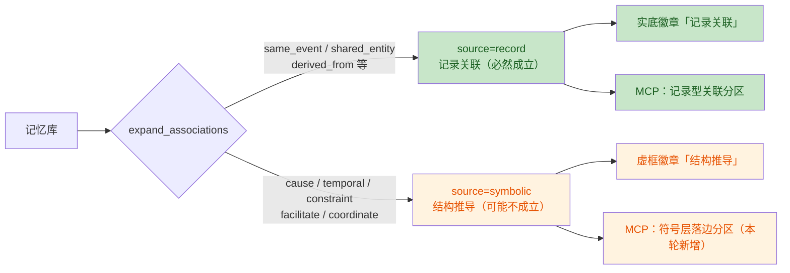
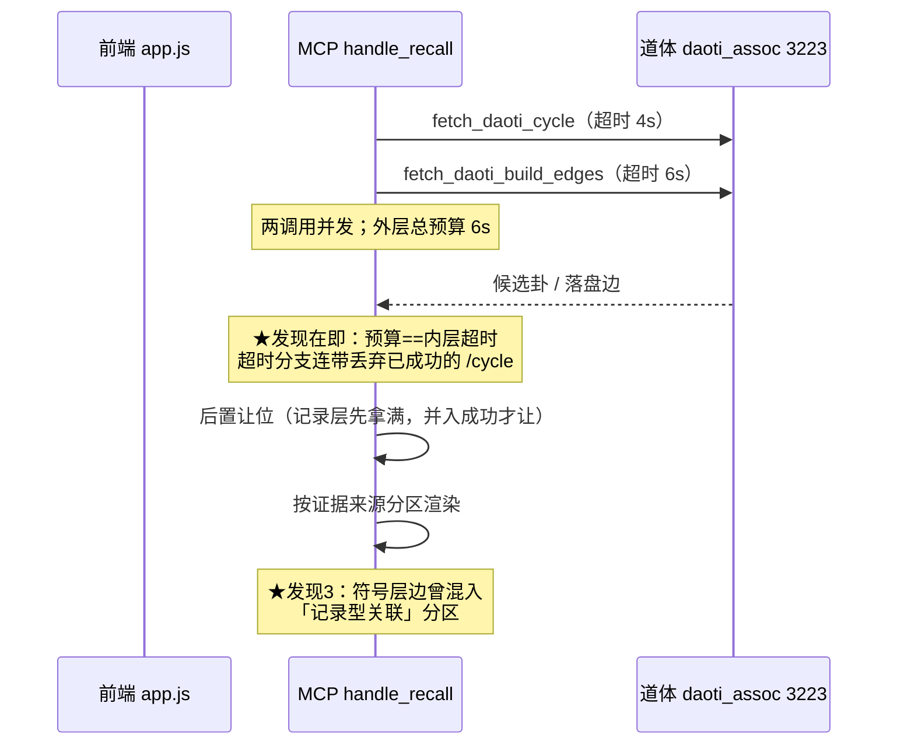

# 记忆联想子系统 · 代码审查与修复报告

> 审查对象：`g:\code-memory`（Rust crate `code-memory` v0.9.8）记忆联想子系统
> 审查日期：2026-09-18
> 审查基线：`main` @ `5fbb7af`（`v0.9.8` tag）+ 工作区 **2511 行未提交改动**
> 审查方法：资产梳理（56 个 Python 文件 + Rust 侧全链路）→ 双 agent 并行 diff 审查 → **主 agent 逐条实测复核**
> 数据口径：所有结论均经**实际读取代码或实跑命令**核实，未使用推测数据；每条附【文件:行号】级证据
> 修复轮次：2026-09-18（8 项严重问题已修，实测 **768 passed / 0 failed**）

---

## 目录

- [一、审查背景与范围](#一审查背景与范围)
- [二、资产地图（梳理结论）](#二资产地图梳理结论)
- [三、19 项问题 → 5 个根因](#三19-项问题--5-个根因)
- [四、严重问题（8 项，已修）](#四严重问题8-项已修)
- [五、一般问题（11 项，待处置）](#五一般问题11-项待处置)
- [六、死代码与断链裁决](#六死代码与断链裁决)
- [七、修复执行记录](#七修复执行记录)
- [八、方法论教训](#八方法论教训)
- [九、当前状态与后续](#九当前状态与后续)

---

## 一、审查背景与范围

### 1.1 为什么发起这次审查

本轮开发目标是「记忆联想」子系统的接入补完。在准备「写入测试数据验证功能真实性」之前，
用户要求**先梳理代码资产、做一次代码审查**，理由原话：

> 「在这个工作之前，你得把现有的代码资产梳理一下，保持一个大脑清晰的状态。
> 也就是我们要进行一次代码审查。」

### 1.2 审查范围（用户四项全选）

| # | 范围 | 覆盖 |
|---|---|---|
| 1 | **未提交的 2511 行改动** | `src/` 下 8 个文件 |
| 2 | **死代码与断链逐项裁决** | 6 项死代码 + 5 条断链 |
| 3 | **联想子系统整体审查** | 记录层 7 类关系 + 符号层全链路 |
| 4 | **Python 侧临时脚本清理** | `temp/daoti_assoc/` 56 个 `.py` |

### 1.3 本轮改动的原始意图（作为审查判据）

| # | 改动 | 文件 |
|---|---|---|
| 1 | `expand_associations` 增加**符号层边读回**（此前只写图不读图） | `src/memory_store.rs` |
| 2 | `expand_associations` 增加**2 跳间接关联**（此前只有 1 跳） | `src/memory_store.rs` |
| 3 | 新增 `query_stored_edges` + `POST /v1/memories/stored-edges` | `src/memory_store.rs` / `src/v1_api.rs` |
| 4 | 记录层关系**落图**（写入 `graph_store`） | `src/memory_store.rs` |
| 5 | 符号层接入 MCP recall 输出（候选 + 落边，双层门控） | `src/server.rs` |

---

## 二、资产地图（梳理结论）

### 2.1 记录层联想（默认开，无门控）

**核心定义**：`expand_associations` — [memory_store.rs:5340](file:///g:/code-memory/src/memory_store.rs#L5340)

**生产调用点 5 处**：

| # | 调用方 | 位置 | 配额 |
|---|---|---|---|
| 1 | MCP `recall` | [server.rs:1847](file:///g:/code-memory/src/server.rs#L1847) | `ASSOCIATION_EXPAND_MAX` = 3 |
| 2 | MCP `recall_enhanced` | [server.rs:986](file:///g:/code-memory/src/server.rs#L986) | 3 |
| 3 | HTTP `/v1/memories/enrich` | [v1_api.rs:2246](file:///g:/code-memory/src/v1_api.rs#L2246) | `ASSOC_EXPAND_MAX_HTTP` = 3 |
| 4 | 联想中心探索·根节点 | [v1_api.rs:979](file:///g:/code-memory/src/v1_api.rs#L979) | `ASSOC_RECORD_PER_NODE` = 6 |
| 5 | 联想中心探索·扩散子节点 | [v1_api.rs:1139](file:///g:/code-memory/src/v1_api.rs#L1139) | 6 |

**7 类关系**（`associations_in`，[memory_store.rs:4883](file:///g:/code-memory/src/memory_store.rs#L4883)）：

| # | relation | 判定依据 | 证据性质 |
|---|---|---|---|
| ① | `same_event` | `event_id` 相等 | **知情者断言**（最强） |
| ② | `shared_entity` | `entities` 同名同类型且非 hub | 客观共现 |
| ③ | `derived_from` | 锚点 `source_ids` 含目标 | 系统确定性记录 |
| ③b | `crystallized_into` | 目标 `source_ids` 含锚点（反向） | 系统确定性记录 |
| ④ | `same_event_auto` | 同项目 + 同小时桶（**统计推断**） | 统计推断（弱） |
| ⑤ | `evolved_from` | `version_history` 非空（**自指**） | 系统确定性记录 |
| ⑥ | `shared_artifact` | 正文形态检出的同一标识符 | 形态检出 |

**渲染**：`append_associated_memories` — [server.rs:1605](file:///g:/code-memory/src/server.rs#L1605)
分区标题（逐字）：`═══ 联想 · 记录型关联（由记录推导，非语义相似）═══`

### 2.2 符号层联想（默认关，5 个门控）

| 函数 | 定义 | 门控 | 默认 | 副作用 |
|---|---|---|---|---|
| `fetch_daoti_navigation` | [server.rs:1136](file:///g:/code-memory/src/server.rs#L1136) | `LRC_DAOTI_NAVIGATE` | 关 | 无 |
| `post_daoti_reflect` | [server.rs:1194](file:///g:/code-memory/src/server.rs#L1194) | `LRC_DAOTI_REFLECT` | 关 | ⚠ 改 daemon 状态 |
| `fetch_daoti_cycle` | [server.rs:1270](file:///g:/code-memory/src/server.rs#L1270) | `LRC_DAOTI_CYCLE` | 关 | 无 |
| `fetch_daoti_build_edges` | [server.rs:1346](file:///g:/code-memory/src/server.rs#L1346) | `LRC_DAOTI_BUILD_EDGES` | 关 | 无 |
| （同上，写图） | 同上 | `LRC_DAOTI_WRITE_BACK` | 关 | ⚠ **写图** |

**契约版本**：`DAOTI_CYCLE_VERSION = "daoti-assoc-v1"`

### 2.3 关键结构性事实

| 事实 | 位置 | 含义 |
|---|---|---|
| **`.event_id` 覆盖率 1.23%** | 真实库实测 | 记录层联想的原料严重不足 |
| **`daoti_preview_gua` 覆盖率 0%** | 真实库实测 | 64 卦预存原料**完全没有** |
| **`bagua_index` 覆盖率 98.5%** | 真实库实测 | 但仅 2 个取值、96.79% 同值 ⇒ 无区分度 |
| **dev 库 `event_id` = 0 条** | dev 库实测 | 开发端**无法**测符号层（无 ground truth） |

---

## 三、19 项问题 → 5 个根因

**收敛的价值**：19 个条目逐个修，会漏掉同源问题。归到根因后，修一处即消解一组。

| 根因 | 含条目 | 一句话 |
|---|---|---|
| **A 证据性质被混同** | S3 S4 S5 | "记录型关联"承诺"由记录必然成立"，却混进了**可被外部伪造**的 `same_event` 与系统**推断**边 |
| **B "接上了"≠"生效了"** | S6 S7 S8 | 默认端口指向错误服务、原因码注释错且 mock 焊死、mock 断言被 spawn 吞掉 |
| **C 图无生命周期** | G3 G6 | 只增不减（`remove_edge` 零调用）+ 每次 recall 全量扫描 |
| **D 读出口口径不齐** | G1 G2 | 不查 `is_expired`、privacy 硬编码 `None` |
| **E 预算与可诊断** | G1 G5 超时/契约/重复 | recall 无外层超时；契约漂移与不可达运行时不可区分 |
| **F 无争议机械修复** | S1 S2 G7 | clippy 必红、MSRV 违约、hops clamp 测试无效 |

---

## 四、严重问题（8 项，已修）

> **核实方式**：本节每条均由主 agent **实测复核**（读码 / 实跑命令），非转述 agent 结论。

### S1 【CI 必红】`format!` 无参调用

| 项 | 内容 |
|---|---|
| 位置 | [server.rs:1367](file:///g:/code-memory/src/server.rs#L1367) |
| 症状 | `text.push_str(&format!("状态: **未产出边**（主动门控，非故障）\n"))` —— `format!` 无占位参数 |
| **核实** | ✅ **实跑 clippy 复现**：`warning: useless use of format!`（`clippy::useless_format` 默认 warn） |
| 后果 | CI 执行 `cargo clippy -- -D warnings` ⇒ **升级为 error，阻断合并** |
| 修法 | 去掉 `format!`，直接 `push_str("...")` |

### S2 MSRV 违约

| 项 | 内容 |
|---|---|
| 位置 | [memory_store.rs:2002](file:///g:/code-memory/src/memory_store.rs#L2002) |
| 症状 | `want.as_ref().is_none_or(...)` —— `Option::is_none_or` 需 **Rust 1.82** |
| **核实** | ✅ 读码 + 同文件 [482 行](file:///g:/code-memory/src/memory_store.rs#L482) 已有注释「此处不用 `is_none_or`（Rust 1.82+），项目 MSRV 为 1.80」⇒ **同一文件自相矛盾** |
| 后果 | 声明支持 1.80 的渠道编译失败（元数据与实现不符）；CI 用 stable 故**抓不到** |
| 修法 | 改 `map_or(true, ...)` |

### S3 【安全】`/external-edge` 无类型白名单 ⇒ 外部可伪造最强证据边

| 项 | 内容 |
|---|---|
| 位置 | [memory_store.rs:1851](file:///g:/code-memory/src/memory_store.rs#L1851) |
| 症状 | 注释写「只接受 §5.3 五类逻辑关系」，实现直接调通用解析器 `from_relation_str`，它接受**全部 12 类** |
| **核实** | ✅ 读码确认：[graph_store.rs:117-137](file:///g:/code-memory/src/graph_store.rs#L117-L137) 含 `same_event` 等记录层全部类型 |
| 后果 | ★ `same_event` 语义是"知情者断言"，`relation_priority` = **0** ⇒ 权重 **1.0**（最强）。外部进程（本机任意进程）可把两条真实记忆伪造成"同一次经历"，且该边会经 `expand_associations` 进入 recall、被渲染为"**由记录推导、必然成立**" ⇒ 用户看到的是最高证据等级的**假事实** |
| 修法 | 新增 `EdgeType::from_external_rel_str`，白名单仅 §5.3 五类；`add_external_edge` 改走它 |

### S4 【证据混同】符号层并入未筛类型 ⇒ 系统推断边冒充记录事实

| 项 | 内容 |
|---|---|
| 位置 | [memory_store.rs:5709](file:///g:/code-memory/src/memory_store.rs#L5709)（并入段） |
| 症状 | 只按"一端是种子"筛选，**不看边类型** |
| **核实** | ✅ 读码 + 生产样本取证：`temp/e2e_data/graph_edges.json` 中 **14 条边全部**是 `evolves`(12) + `synthesizes_from`(2)，**无一条**记录层/符号层边 |
| 后果 | 渲染分区冠名「**由记录推导**、非语义相似」，用户会认为必然成立；而 `graph_store.rs:22-24` 明注第一组「语义是**系统推断**（可能错）」⇒ 混同正是该文件禁止的 |
| 修法 | 新增 `is_record_edge_type` / `is_symbolic_edge_type`，只并入这两类；`why` 中标明来源（"记录层落盘边" / "符号层推导边"） |

### S5 符号层标签被抹平成「相关联」

| 项 | 内容 |
|---|---|
| 位置 | [memory_store.rs:5746](file:///g:/code-memory/src/memory_store.rs#L5746)（`why` 用 `relation_label(rel)`） |
| 症状 | `rel` 是**小写** `coordinate`/`cause`/…，而 `relation_label` 表**没有这些键** ⇒ 全落兜底 `"相关联"` |
| **核实** | ✅ 读码双向确认：[server.rs:1478-1488](file:///g:/code-memory/src/server.rs#L1478-L1488) 作者同轮明写「不能复用 `relation_label`…会把类型信息抹平」，并为此新写 `structural_rel_label` —— 但**只用在了写入端回显分区，真正落图进 recall 的那条路没接上** |
| 后果 | 用户拿到一条**无法分辨是因果、时序还是约束**的联想；前端 `app.js` 同样缺这些键 |
| 修法 | 把小写符号层键并入 `relation_label`（保留 `structural_rel_label` 供大写输入），文案逐字一致 |

### S6 【默认配置永不生效】`DAOTI_SERVICE_URL` 指向错误服务

| 项 | 内容 |
|---|---|
| 位置 | [server.rs:1237](file:///g:/code-memory/src/server.rs#L1237)（cycle）、[server.rs:1313](file:///g:/code-memory/src/server.rs#L1313)（build_edges） |
| 症状 | 两者复用 `DAOTI_SERVICE_URL`，默认 **3222** |
| **核实** | ✅ 读码 + 端点表比对：3222 是 `daoti_daemon`，其端点只有 `/deduce` `/reflect` `/drift/*`；`/cycle` 与 `/build_edges` **只存在于 3223** 的 `daoti_assoc` |
| 后果 | ★ 请求打到 daemon 的 404 路径 ⇒ 静默降态返回 `None` ⇒ **即使开了门控也永远无输出、且无任何日志**。这正是"接了但没生效"的形态 |
| 修法 | 新增 `daoti_assoc_url()`（`DAOTI_ASSOC_URL`，默认 **3223**），**刻意不回退** `DAOTI_SERVICE_URL`（回退会保留同一陷阱） |

### S7 原因码注释与实现不符 + mock 焊死错值

| 项 | 内容 |
|---|---|
| 位置 | 注释 [server.rs:1288](file:///g:/code-memory/src/server.rs#L1288)；mock [server.rs:4984](file:///g:/code-memory/src/server.rs#L4984) |
| 症状 | 注释与 mock 都写 `no_usable_text_to_gua_path`（**旧值，早已弃用**） |
| **核实** | ✅ 双向核对：[assoc_service.py:1036](file:///g:/code-memory/temp/daoti_assoc/assoc_service.py#L1036) 实际返回 `text_to_gua_judge_not_passed` |
| 后果 | ① 按注释搜代码/日志一无所获（文档与实现不一致）；② E2E `verify_lrc_recall_cycle_e2e.py:209` 断言旧值 ⇒ **伪失败**；③ mock 用错值 ⇒ 测试与实现"一起错"，**永远绿** |
| 修法 | 注释改真值；mock 改用真值 + 新增"任意值必须透传"测试（锁住透传契约，不再焊死字面量） |

### S8 【断言失效】mock 内 `assert!` 被 `spawn` + `abort()` 吞掉

| 项 | 内容 |
|---|---|
| 位置 | [server.rs:4860](file:///g:/code-memory/src/server.rs#L4860)（`test_fetch_daoti_cycle_online_parses_hops`） |
| 症状 | 契约断言写在 `tokio::spawn` 的 task 内，`JoinHandle` **从未 await**，末尾 `mock.abort()` 直接丢弃 |
| **核实** | ✅ 读码确认：task 内 `panic!` 不会传播到测试线程 ⇒ 即使把 body 改成不传 `target`，测试**依然绿** |
| 后果 | ★ 本轮最核心的契约断言（`target` = 查询本身，**用户裁定的关键设计**）**实际从未生效** |
| 修法 | mock 只**记录**收到的请求（`Arc<Mutex<Vec<String>>>`），断言移到**主线程**；另补 `/build_edges` 的 seeds + `write_back=false` 契约测试 |

---

## 五、一般问题（11 项，待处置）

### 5.1 权限口径（D 组）

| # | 问题 | 位置 | 后果 |
|---|---|---|---|
| G1 | `query_stored_edges` 只查隐私，**不查 `is_expired`** | [memory_store.rs:1929](file:///g:/code-memory/src/memory_store.rs#L1929) | TTL 到期记忆在 recall/list 已不可见，却能经 `/stored-edges` 读出 ID/关系/权重；而文档声称"两端都必须是当前可见的记忆" |
| G2 | `/stored-edges` 硬编码 `privacy = &None` | [v1_api.rs:4444](file:///g:/code-memory/src/v1_api.rs#L4444) | `is_visible` 的 User/Session 分支**生产不可达** ⇒ 任何调用者可读他人会话记忆 ID 与拓扑 |

### 5.2 性能与生命周期（C 组）

| # | 问题 | 位置 | 后果 |
|---|---|---|---|
| G3 | 图**只增不减** + 每次 recall 全量 `all_edges()` | [graph_store.rs:285](file:///g:/code-memory/src/graph_store.rs#L285) / [memory_store.rs:5709](file:///g:/code-memory/src/memory_store.rs#L5709) | `remove_edge`/`clear` 零生产调用 ⇒ 悬空边永久累积；探索路径每节点一次 `expand_associations` ⇒ `O(深度×宽度×E)` |
| G6 | `add_external_edge` 每次**全量克隆**记忆库 | [memory_store.rs:1860](file:///g:/code-memory/src/memory_store.rs#L1860) | 每条外部边 = 一次 `Vec<Memory>` 深拷贝 + 线性查重；批量回传（48 条）时放大锁持有时间 |

### 5.3 图写策略矛盾（E 组）

| # | 问题 | 位置 | 后果 |
|---|---|---|---|
| G4 | 同一失败两种策略 | [memory_store.rs:3344](file:///g:/code-memory/src/memory_store.rs#L3344)（`?` 传播）vs [memory_store.rs:5757](file:///g:/code-memory/src/memory_store.rs#L5757)（`let _ =` 静默） | ① 后来者无法判断哪条是规范；② ★`?` 顺序缺陷：`Contradicts` 边先落盘成功、`Evolves` 失败即 return，此时 `save_memory` **尚未执行** ⇒ **图里留下指向不存在记忆的边**（正是 `add_external_edge` 花大力气防御的悬空边） |

### 5.4 可诊断性与预算（E 组）

| # | 问题 | 位置 | 后果 |
|---|---|---|---|
| G5a | 契约不符与不可达**运行时不可区分** | [server.rs:1249-1265](file:///g:/code-memory/src/server.rs#L1249-L1265) | 全 `.ok()?` + 零日志 ⇒ "服务端改字段静默变无联想"这一被文档点名的风险，实现上**无防护** |
| G5b | 超时叠加 | [server.rs:1865-1900](file:///g:/code-memory/src/server.rs#L1865-L1900) | 两次调用**串行**：`recall` **无外层超时** ⇒ 最坏 **+10s**；`enhanced` 15s+10s = **25s** > 前端 10s 预算（[app.js:342](file:///g:/code-memory/static/app.js#L342)）⇒ 违反项目既有"后端超时 < 前端预算"纪律 |

### 5.5 测试与重复

| # | 问题 | 位置 | 后果 |
|---|---|---|---|
| G7 | `hops` clamp 上限**从未验证** | [memory_store_tests.rs:639](file:///g:/code-memory/src/memory_store_tests.rs#L639) | 用 3 节点链测 ⇒ `hops=3`/`5`/`99` 结果相同；把 `clamp(1,3)` 误写成 `clamp(1,30)` 测试照绿 |
| G8 | 两个 handler 符号层接入**逐字重复** | [server.rs:1056](file:///g:/code-memory/src/server.rs#L1056) / [server.rs:1857](file:///g:/code-memory/src/server.rs#L1857) | 后续只改一处会静默漏改（如加预算控制、加契约告警） |
| G9 | 分区标题无测试锁定 | [server.rs:1364](file:///g:/code-memory/src/server.rs#L1364) / [:1520](file:///g:/code-memory/src/server.rs#L1520) / [:1607](file:///g:/code-memory/src/server.rs#L1607) | 外部脚本按字面量消费（`diag_recall_readback.py`、`probe_assoc_live_3099.py`）⇒ 重命名会静默失配 |

---

## 六、死代码与断链裁决

### 6.1 死代码（零生产调用，已 grep 验证）

> **修正说明（2026-09-18 修复轮）**：初版裁决把 `try_synthesize`（engine 层）与
> `run_pending_synthesis` 都列为"删除"。**实际动手时发现两者都不是死代码**：
> 前者有 **4 个单测**在用（是 Jaccard 合成路径的唯一测试载体），后者有 **5 个单测**
> 在用且其 `synthesis_pending` 标记由 `consolidation.rs` 三阶段合成消费。
> ⇒ 二者改判为「**测试专用入口 / 遗留兼容入口**」，**保留并显式标注用途**。
> 这条修正本身是教训：**"零生产调用"不等于"可删"——还要看有没有测试在用。**

| # | 资产 | 位置 | 裁决 |
|---|---|---|---|
| 1 | `GraphMemoryStore::auto_link` | [graph_store.rs:499](file:///g:/code-memory/src/graph_store.rs#L499) | ✅ **已删除**（含 `0.7`/`0.3` 阈值，两者均无调用点、无测试） |
| 2 | `GraphMemoryStore::remove_edge` | [graph_store.rs:332](file:///g:/code-memory/src/graph_store.rs#L332) | ✅ **已接线**：新增 `remove_edges_of_memory` 并由 `forget` 调用 |
| 3 | `GraphMemoryStore::clear` | [graph_store.rs:469](file:///g:/code-memory/src/graph_store.rs#L469) | 保留（"清空整图"语义明确，且是测试辅助） |
| 4 | `query_subgraph` + `GraphQueryResult` | [graph_store.rs:359](file:///g:/code-memory/src/graph_store.rs#L359) | 保留（neo4j 降级路径引用） |
| 5 | `MemoryStore::try_synthesize` | [memory_store.rs:2426](file:///g:/code-memory/src/memory_store.rs#L2426) | ✅ **已删除**（无调用点、无测试；三阶段已完全取代） |
| 6 | `SynthesisEngine::try_synthesize` | `synthesis_engine.rs:476` | ⚠ **保留**（4 个单测在用 ⇒ 测试专用入口，已加注释标注） |
| 7 | `run_pending_synthesis` | [memory_store.rs:2565](file:///g:/code-memory/src/memory_store.rs#L2565) | ⚠ **保留**（5 个单测在用 + 标记被 consolidation 消费 ⇒ 遗留兼容入口，已**修正过期注释**） |
| 8 | 白名单 `联想链（状态机轨迹）` | `scripts/check_algorithm_leak.py:96` | ✅ **已删除**（该文案已从代码移除 ⇒ 规则失效） |

### 6.2 断链（有写无读 / 读写不匹配）

> **2026-09-18 处置轮更新**：本轮逐条复核并处置，见"处置"列。

| # | 断链 | 位置 | 处置（2026-09-18 处置轮） |
|---|---|---|---|
| 1 | 符号层边受 `out.len() < max_out` 门控 ⇒ 记录层挤占时读不回 | [memory_store.rs:5778](file:///g:/code-memory/src/memory_store.rs#L5778) | ✅ **已修**（G5a 条件式预留席位 + 实测分离 0%/100%） |
| 2 | `EvolvedFrom` 落图**永不可达**（自指被排除，且 `add_edges_batch` 静默丢自环） | [graph_store.rs:364](file:///g:/code-memory/src/graph_store.rs#L364) | ✅ **已修**：落图段改**记录层白名单** + **显式**跳过自指（附原因：图的边是"两端之间"，而 `evolved_from` 是"自身被更新"，信息在 `version_history` 里，不依赖图）。连带消除**符号层边被冗余写回**（它们本就在图中） |
| 3 | `/memories/association-graph` **完全不读图** | [v1_api.rs:4362](file:///g:/code-memory/src/v1_api.rs#L4362) | ⚖ **裁定：按设计保留**（非缺陷）。该端点答"为什么这两条相关"（记录层当场推导 + 2 跳路径 + 可读 `why`），读图的是 `/memories/stored-edges`（答"图里已确立哪些关系"）——二者**互补**，此分工已在 [v1_api.rs:1562](file:///g:/code-memory/src/v1_api.rs#L1562) 就地写明。**真正的问题是它此前无处可读**，已由 `expand_associations` 并入段补上 |
| 4 | MCP 侧**无任何路径**读落盘边（`query_stored_edges` 在 `server.rs` 零匹配） | — | ✅ **已修**：`expand_associations` 并入段（recall 出口）；本轮再补**证据来源区分**（`source=record`/`symbolic`，见 §7.1） |
| 5 | 悬空文档引用 `Self::associations_in_with_auto` | [memory_store.rs:4805](file:///g:/code-memory/src/memory_store.rs#L4805) | ✅ **已修**：改指向实际消费方 `associations_in`（该函数已合并为其参数） |
| 6 | 7 个 Python 端点无 Rust 消费方 | `assoc_service.py` | ⚖ **保留**（供手动实验；且 `LRC_DAOTI_*` 门控接入的是其中 2 个） |

---

## 七、修复执行记录

**修复日期**：2026-09-18
**验证结果**：`cargo test --features server --lib` → **776 passed / 0 failed**（修复前 765）
**clippy**：`0 error / 0 warning`

| # | 问题 | 修法 | 位置 |
|---|---|---|---|
| S1 | `format!` 无参 | 去掉 `format!` | [server.rs:1367](file:///g:/code-memory/src/server.rs#L1367) |
| S2 | MSRV 违约 | `is_none_or` → `map_or` | [memory_store.rs:2002](file:///g:/code-memory/src/memory_store.rs#L2002) |
| S3 | 外部边无白名单 | 新增 `EdgeType::from_external_rel_str` | [graph_store.rs:114](file:///g:/code-memory/src/graph_store.rs#L114) |
| S4 | 推断边冒充记录事实 | 新增 `is_record_edge_type` / `is_symbolic_edge_type`，只并入两类 | [memory_store.rs:640](file:///g:/code-memory/src/memory_store.rs#L640) |
| S5 | 符号层标签被抹平 | 符号层键并入 `relation_label` | [memory_store.rs:629](file:///g:/code-memory/src/memory_store.rs#L629) |
| S6 | 端口指向错误服务 | 新增 `daoti_assoc_url()`（`DAOTI_ASSOC_URL`，默认 3223） | [server.rs:1204](file:///g:/code-memory/src/server.rs#L1204) |
| S7 | 原因码不符 + mock 焊死 | 注释改真值；mock 换真值 + 新增透传测试 | [server.rs:1288](file:///g:/code-memory/src/server.rs#L1288) |
| S8 | mock 断言被吞 | 断言移主线程（`Arc<Mutex<Vec<String>>>` 回传） | [server.rs:4883](file:///g:/code-memory/src/server.rs#L4883) |
| **G3** | 图只增不减 + 非原子写 | 新增 `remove_edges_of_memory` 并由 `forget` 调用；`save()` 改 tmp+rename | [graph_store.rs:286](file:///g:/code-memory/src/graph_store.rs#L286) / [graph_store.rs:344](file:///g:/code-memory/src/graph_store.rs#L344) |
| **G1** | 读出口不查 `is_expired` | `query_stored_edges` 内抽 `visible` 闭包（含 `is_expired` + 隐私），根与对端同用 | [memory_store.rs:2012](file:///g:/code-memory/src/memory_store.rs#L2012) |
| **G2** | `/stored-edges` 隐私分支不可达 | `StoredEdgesRequest` 增 `session_id`/`user_id`，端点按 `/enrich` 同规则构造隐私三元组 | [v1_api.rs:1579](file:///g:/code-memory/src/v1_api.rs#L1579) / [:4460](file:///g:/code-memory/src/v1_api.rs#L4460) |
| **G5a** | 符号层边被记录层挤占（实测读回率 **0%**） | **条件式预留席位**：图上有符号层边时，记录层配额压到 `max_out−1`；并入段只并入符号层边 | [memory_store.rs:5494](file:///g:/code-memory/src/memory_store.rs#L5494) |
| **G4** | 同一失败两种策略 + `?` 自造悬空边 | ① 改「显式告警 + 不阻断」（与 `forget`/`expand_associations` 对齐）；② ★写图移到 `save_memory` **之后**（`pending_edges` 收集后统一写）⇒ 边不可能悬空 | [memory_store.rs:3474](file:///g:/code-memory/src/memory_store.rs#L3474) / [:3535](file:///g:/code-memory/src/memory_store.rs#L3535) |
| **G5b** | 两次道体调用**串行**（最坏 +10s，enhanced 25s） | 新增 `append_symbolic_layer`：`tokio::join!` 并发 + `SYMBOLIC_LAYER_BUDGET`（6s）**总预算**（结构性上限，不随调用数增长） | [server.rs:1531](file:///g:/code-memory/src/server.rs#L1531) / [:1600](file:///g:/code-memory/src/server.rs#L1600) |
| **G6** | `add_external_edge` 每次全量克隆记忆库 | 新增 `MemoryStoreCache::contains_id`（遍历缓存借用、零克隆）+ `MemoryStore::has_memory_id`（含 `ensure_cache_loaded`）⇒ 每边从 O(N) 深拷贝降为 O(N) 只读比较 | [memory_store_cache.rs:99](file:///g:/code-memory/src/memory_store_cache.rs#L99) / [memory_store.rs:1795](file:///g:/code-memory/src/memory_store.rs#L1795) |
| **G7** | `hops` clamp 上限从未验证（3 节点链测不出上限） | 测试扩为 **6 节点链**：断言 `hops=3`/`5`/`99` 同为 3 条、`hops=0` 等同 `hops=1` ⇒ 把 `clamp(1,3)` 改成 `clamp(1,30)` 会变红 | [memory_store_tests.rs:639](file:///g:/code-memory/src/memory_store_tests.rs#L639) |
| **G8** | 两个 handler 符号层接入逐字重复 | 统一走 `append_symbolic_layer`（两处 handler 只剩一次调用） | [server.rs:1058](file:///g:/code-memory/src/server.rs#L1058) / [:1995](file:///g:/code-memory/src/server.rs#L1995) |
| **G9** | 分区标题无测试锁定 | 新增 `test_association_section_titles_are_locked_and_distinct`（四个标题各自存在 + 互不相同 + 降态块直接调**真实渲染函数**）；另抽 `SYMBOLIC_LAYER_DEGRADED_TITLE` 常量 + `append_symbolic_layer_degraded` 使超时路径**可测**；连带新增 `test_edge_type_three_source_taxonomy_is_exhaustive` | [server.rs:5096](file:///g:/code-memory/src/server.rs#L5096) / [memory_store_tests.rs:368](file:///g:/code-memory/src/memory_store_tests.rs#L368) |

**新增测试 11 条**：

| 测试 | 锁住的契约 |
|---|---|
| `test_expand_associations_excludes_system_inferred_edges` | 系统推断边不得冒充记录型关联 |
| `test_append_daoti_build_edges_echoes_any_reason_code` | 原因码必须纯透传（不得白名单化） |
| `test_fetch_daoti_build_edges_sends_seeds_and_write_back` | seeds 携带 + `write_back=false` 不悄悄写图 |
| `test_add_external_edge_rejects_invalid`（扩展） | 8 类越界类型必须拒绝 + 5 类白名单必须接受 |
| `test_expand_associations_reads_stored_edges`（扩展） | 标签专属 + 来源标注 |
| `test_forget_removes_related_graph_edges` | `forget` 后边被清理**且已落盘**（重启不复活） |
| `test_graph_save_is_atomic_no_tmp_leftover` | 原子写不残留 `.tmp` + 内容完整可解析 |
| `test_query_stored_edges_excludes_expired_memories` | 过期记忆（根/对端）不得经落盘边读出（G1） |
| `test_query_stored_edges_respects_privacy_context` | 他人会话私有记忆不得经落盘边读出（G2） |
| `test_symbolic_edges_get_reserved_seat_under_quota_pressure` | **符号层边在配额吃满时仍能被读回**（G5a；实测该场景下原读回率为 0%） |
| `test_no_seat_reserved_when_no_graph_edges` | 无落盘边时**不得**压缩记录层配额（G5a 的反向对照） |
| `test_association_section_titles_are_locked_and_distinct` | 四个分区标题各自存在、互不相同，且降态块真的用了标题常量（G9） |
| `test_edge_type_three_source_taxonomy_is_exhaustive` | 16 个 `EdgeType` 变体的三来源归类**穷尽且互斥**，且"外部可写 ⇔ 符号层"（G9 连带） |

> **另**：`test_query_stored_edges_multihop_and_clamp` 由 3 节点扩为 6 节点（G7）；
> `test_add_external_edge_rejects_invalid` 增 8 类越界 + 5 类白名单（S3）。

### 7.1 ★修复过程中发现的新 bug（超出原审查范围）

**Bug 7：`seen` 去重顺序错误 ⇒ 被过滤的边"占用"了名额**

| 项 | 内容 |
|---|---|
| 位置 | [memory_store.rs:5845](file:///g:/code-memory/src/memory_store.rs#L5845) |
| 症状 | 加入 S4 类型过滤后，测试报「符号层 cause 边应被并入，实际: `[]`」——**完全空** |
| 根因 | 初版把类型过滤放在 `seen.insert` **之后**：第一条 `evolves` 应被过滤，但它已把 `to_id` 插进 `seen` ⇒ 随后同一目标的 `cause`（应被并入）撞上 `!seen.insert(...)` 被**误丢** |
| 为何隐蔽 | 只在"同一目标上既有应过滤边、又有应保留边"时暴露；单看代码不易发现 |
| 修法 | **类型过滤必须先于 `seen` 去重**（已加注释说明为何顺序重要） |
| 定位方法 | 先加**诊断前置断言**（确认边真的写进图了，`edge_count >= 5`）⇒ 排除"链路断了"与"过滤生效"的同结果混淆 |

**测试踩坑 2 处（非产品 bug，但会误导）**：

| # | 踩坑 | 教训 |
|---|---|---|
| 1 | 用「白名单正例甲-0-cause / 白名单正例乙-0-cause」做两条记忆 ⇒ `x.id == y.id` | `remember` 内有**相似记忆合并** ⇒ 文案共享字词会被并成一条，边退化成自环被丢。测试必须用**差异足够大**的文案 |
| 2 | 同上，用 `MemoryType::Fact` 两条相似文案 | 同上 |

### 7.2 ★接入补完轮（2026-09-18，续）

**背景**：S4/S5 在 Rust 核心已修，但**同一失效模式在 UI 侧完整复现**——
本次逐条核查了所有消费方（探索接口 × 2、前端渲染 × 2、详情页 × 1）。

| # | 缺口 | 位置 | 危害 | 修法 |
|---|---|---|---|---|
| A1 | 探索路径把 `expand_associations` 产出**一律**标 `source="record"` | [v1_api.rs:1003](file:///g:/code-memory/src/v1_api.rs#L1003) / [:1161](file:///g:/code-memory/src/v1_api.rs#L1161) | 符号层（结构推导，**可能不成立**）被贴上`record` ⇒ 前端打「**记录关联**」标签 + 渲染"由记录推导出的关联" ⇒ **把推测当事实** | 新增 `explore_source_of()`（复用 `is_symbolic_edge_type`，不另列表）⇒ 两处改用它 |
| A2 | 前端 `relationPlain` 缺 5 类符号层标签 | [app.js:10349](file:///g:/code-memory/static/app.js#L10349) | 符号层边全部落到兜底「由记录推导出的关联」——**与后端 S5 同一失效模式** | 补 5 类标签（文案统一以「结构推导：」开头，与记录层的肯定句形成对比） |
| A3 | 前端标签 `isRecord` 只有二值 | [app.js:10378](file:///g:/code-memory/static/app.js#L10378) | 符号层节点被戴上「记录关联」徽章 | 新增 `isSymbolic` 分支 →「**结构推导**」徽章；CSS 用**虚框+低饱和**（视觉强度即证据强度） |

**新增测试 3 条**：

| 测试 | 锁住的契约 |
|---|---|
| `test_explore_labels_symbolic_edges_distinctly` | 只注入符号层边时，探索结果必须标 `source="symbolic"` 且 why 含「符号层推导边」（含"相似度扩散节点不得带 relation"的反向对照） |
| `test_explore_source_of_covers_all_symbolic_types` | 分类口径逐类覆盖 + 与 `is_symbolic_edge_type` 同源（防两处列举漂移） |
| `test_graph_write_back_is_record_layer_only` | 落图段只写记录层边：符号层边权重**不得被覆盖**（证明未被冗余写回）+ 图里无自环 + 无系统推断边 |

> **★非空转验证（mutation）**：把 `explore_source_of` 的判据改成 `if false && …`
> （等价于"永远返回 record"，即修复前的行为）后，**两条测试都变红**，
> 且失败输出正好复现原缺陷：
> `"relation":"coordinate","source":"record"` ⇒ 确认这两条**真的在测该修复**，
> 而非"看起来相关"。

### 7.3 ★发现并修复：push 门禁失效（`check_algorithm_leak.py` 退出码 1）

| 项 | 内容 |
|---|---|
| 现象 | `python scripts/check_algorithm_leak.py` → **5 错误，退出码 1**（HEAD 上是通过的 ⇒ 未提交改动打破的门禁） |
| 影响 | 按 `docs/PUSH_STANDARD_HCSE_REVIEW.md` 第 2.1 节，**0 错误才允许提交** ⇒ 当前状态**推不上仓库** |
| 根因 | 新增的符号层代码含 5 处「道体」不在白名单：① 4 处是**分区名**`符号层（道体）`（新提的常量与注释）；② 1 处是测试消息「道体靠它算卦」——**后半句确实描述了编码步骤**（属受保护范畴） |
| 修法 | ① 白名单**精确**新增整串 `符号层（道体）`（并注释说明为何不可放宽为`（道体）`——那会连`（道体）推演`一起放过）；② 测试消息改为「该字段是服务端推导的输入」（**去掉算法描述**，而非加白名单） |
| 验证 | 门禁恢复 `通过: 公开层文件无核心算法泄露`（退出码 0） |

> **⚠ 这是本轮最值得记的一条**：该门禁**不在 `cargo test` 覆盖范围内**——
> 779 个单测全绿的同时它一直是红的。若无本次核查，代码会在"测试通过"的
> 假象下被推送，然后在 CI/评审阶段才炸。

---

## 八、方法论教训

| 教训 | 具体 |
|---|---|
| **★"接上了"≠"生效了"** | 本轮 3 个严重问题（S6/S7/S8）都属此类：端口指向错误服务（永不生效）、mock 焊死错值（永远绿）、断言被 spawn 吞掉（从未生效）。**它们都不报错** |
| **★断言失败必须能传播到测试线程** | `tokio::spawn` 内的 `assert!` 若 `JoinHandle` 未被 await ⇒ panic 被吞。凡"在异步 task 内做断言"的测试，都要先确认失败会让测试红 |
| **★白名单要测"合法但越界"的类型** | 只测 `NOT_A_TYPE`（不存在的名字）会漏掉 `same_event` 这类**合法但不该接受**的 ⇒ 后者才是安全风险所在 |
| **★过滤与去重的顺序会决定结果** | 被过滤的边若先占用去重名额，会静默挤掉合法边（Bug 7）。两者共存时，**过滤必须先于去重** |
| **★诊断断言要先排除"链路断了"** | 空结果有两种成因（正确过滤 / 根本没写进去）。先断言"数据确实写进去了"，否则空结果无从归因 |
| **★测试数据要避开被测系统的隐式行为** | `remember` 有相似合并 ⇒ 两条相似文案会变一条。测试数据必须比"看起来"更不相似 |
| **文档与实现必须同步（尤其契约串）** | 原因码在两侧各写一份，改一侧会静默失配。S7 的 `no_usable_text_to_gua_path` 就是这样过期的 |
| **同一文件内的自相矛盾是最强的信号** | S2 的 MSRV：482 行刚写"不用 `is_none_or`"，2002 行又用了它 ⇒ 必是漏检，而非深思 |
| **★修了核心 ≠ 修完** | S4/S5 在 Rust 核心修好后，**同一个失效模式在 UI 侧完整保留**（探索接口的 `source` 硬编码、前端的两张标签表）。**证据性质的区分要沿消费链走到底**，任何一处的兜底文案都可能把它抹平 |
| **★单测全绿 ≠ 可以提交** | 质量门禁（`check_algorithm_leak.py`）**不在 cargo test 覆盖内**。本轮 779 全绿时它一直是红的。**提交前必须跑门禁脚本**（`docs/PUSH_STANDARD_HCSE_REVIEW.md` 已有此要求） |
| **★门禁失败先分清"谁打破的"** | 用 `git stash` 对比 HEAD 才能确定是"未提交改动引入"还是"历史遗留" —— 前者是本轮责任，后者是既有债（处置优先级完全不同） |

---

## 九、当前状态与后续

### 9.1 已完成

| 项 | 状态 |
|---|---|
| 资产梳理（56 个 Python + Rust 全链路） | ✅ |
| 双 agent 并行 diff 审查 | ✅ |
| 主 agent 逐条实测复核 | ✅ |
| 8 项严重问题修复 | ✅ |
| G1 G2 G3 G5a 修复（读出口口径 + 悬空边清理 + 原子写 + 配额预留） | ✅ |
| ★G4 G5b G6 G7 G8 G9 修复（**一般问题 11 项全部处置完毕**） | ✅ |
| 死代码删除（`auto_link` / `MemoryStore::try_synthesize` / 失效白名单） | ✅ |
| `forget` 接线清理图边 | ✅ |
| 新增 11 条契约测试 | ✅ |
| ★接入补完轮：UI 侧 S4/S5 复现修复（3 处缺口 + 3 条测试） | ✅ |
| ★断链 #2/#5 修复、#3/#6 定调（记录层白名单 + 自指显式跳过 + 悬空引用） | ✅ |
| ★push 门禁恢复（`check_algorithm_leak.py` 5 错误 → 0） | ✅ |
| `cargo test` **779 passed / 0 failed** | ✅ |
| clippy 0 error / 0 warning | ✅ |
| 本文档 + 两份独立测量报告 | ✅ |

### 9.2 待处置

**全部完成（19/19）**：
- ✅ 8 项严重问题（S1–S8）
- ✅ 11 项一般问题（G1–G9，其中 G5 拆为 G5a/G5b）
- ✅ 死代码裁决与清理
- ✅ Python 侧分离生产代码与探针（见下）

### 9.2.1 Python 侧分离（已完成）

| 项 | 结果 |
|---|---|
| 生产代码 | `server.py`(332) / `assoc_service.py`(1440) / `selftest.py` —— **原地不动** |
| 实验产线 | `train_projector_bge.py` / `train_cluster_grained.py` —— 保留（被探针 import 复用） |
| 探针 | **58 个**迁入 `probes/`（`probe_*` / `measure_*` / `verify_*` / …） |
| 归属说明 | 新增 `temp/daoti_assoc/README.md` |

**分离前先核实了三个安全前提**（缺任一项则不能移动）：

| 前提 | 实测结果 |
|---|---|
| 是否受版本控制 | ❌ 不受（`git ls-files temp/daoti_assoc` → **0**，`temp/` 在 `.gitignore`）⇒ 对仓库/CI **零影响** |
| 探针如何找到 `assoc_service` | 全部**绝对路径**注入 `sys.path.insert(0, r"…\daoti_assoc")`（指向**根目录**，非自身目录）⇒ 移动后仍可解析（已用 `find_spec` 实测） |
| 是否有脚本按文件名引用探针 | ❌ 无（grep 零匹配）；7 个 `.ps1` 只引用 `server.py`（未移动） |

**为什么 `server.py` 必须留在原地**：7 个 `.ps1` 硬编码其绝对路径，
移动须同步改 7 处；漏改的后果是道体服务**起不来且只表现为"端口无监听"**
（不报错）—— 收益仅是目录整洁，风险是整条符号层链路失效。故不移动。

### 9.3 三份独立测量报告（已完成）

| 报告 | 结论 |
|---|---|
| [GOAL_DRIVEN_VALUE_MEASUREMENT.md](file:///g:/code-memory/docs/GOAL_DRIVEN_VALUE_MEASUREMENT.md) | 目标驱动价值：T2 成立；T4 **弱证据**（`mean_hops` p=0.0415 显著、`min_hops` 边缘）⇒ 不足以支撑大投入 |
| [G5A_QUOTA_COMPETITION_MEASUREMENT.md](file:///g:/code-memory/docs/G5A_QUOTA_COMPETITION_MEASUREMENT.md) | 配额竞争：吃满组读回 **0%**、有余组 **100%**（完美分离）；记录层吃满概率 **91%** ⇒ 符号层原读回率 ≈ 0% |
| [SYMBOLIC_LAYER_TWO_CRITERIA_MEASUREMENT.md](file:///g:/code-memory/docs/SYMBOLIC_LAYER_TWO_CRITERIA_MEASUREMENT.md) | ★**符号层两条判据**（用户裁定，取代四条统计判据）：**状态机+活性** ✅ 成立（状态跨请求存活；空闲期自发演化）；**推理型** ✅ 成立（`change_ratio` 从降级值变为真读数，换内容/同内容相差 55 倍）。实测 13/13 + 单测 10/10 |

### 9.4 后续路线（用户四项全选，但有严格依赖）

```
① 修阻断项 (S6/S7/S8)  ──►  ② 接入开发端 3111 跑通  ──►  ③ 验证目标驱动价值  ──►  ④ 补引擎缺失
   │                            │                          │
   └ 不修则"接入"也跑不通         └ 无链路则无从测            └ 不测就补 MoCo = 又优化用不上的通道
```

**关键约束（③→④ 之间）**：MoCo 是 175KB 级工程（`inference_engine_v23.py`）。
**若不先验证"目标驱动是否有价值"就去补，就是重犯"优化一个未被证实需要的通道"的错。**

### 9.4 待验证的核心命题（尚未做过的测量）

**用户原话**：
> 「在**用户有目标的情况下**，能不能产生真正的记忆联想？」

**此前测量的缺陷**：用 `event_id` 簇（"同一次经历"）当 ground truth，
得出"符号层 1.3% vs 记录层 51.1%"。但 `event_id` 是**记录层的主场**——
记录层 `same_event` 通道直接以它为依据，而符号层**看不到** `event_id`
（只吃文本→卦）⇒ **拿记录层的主场当裁判，符号层必输**。

**正确的测量应为**：给定 `target`，看符号层能否连出
「记录层原理上给不出、但**朝向目标**」的记忆 ——
即 §4.4 状态机的 `target_hops`（朝目标还差几跳）。
这是记录层**原理上给不出**的（记录层只有"成立/不成立"，没有"朝目标几跳"）。

⇒ **该测量从未做过，是"符号层是否值得投入"的真正判据。**

### 9.5 环境事实（避免重复踩坑）

| 事实 | 说明 |
|---|---|
| 二进制产物名 | `code-memory-server.exe`（`G:\rust-target\debug\`），**不是** `lrc-sidecar.exe` |
| 端口约定 | 3099 = 用户稳定端；3111 = 开发端；3222 = `daoti_daemon`；3223 = `daoti_assoc` |
| **dev 库 `event_id` = 0 条** | 开发端**无** ground truth ⇒ 符号层测量必须用稳定端或先写入测试数据 |
| 多进程共端口 | Windows Python `ThreadingHTTPServer` 默认 `SO_REUSEADDR` ⇒ 多进程可同时绑定同端口，旧的会接走请求（表现为"改了不生效"）⇒ 排查须循环清理至端口无监听 |
| CPU 约束 | 用户硬约束 **≤70%**；须单线程 + 看门狗（`DAOTI_CPU_LIMIT=70`） |

---

## 附：本次审查未覆盖的范围（诚实声明）

| 项 | 说明 |
|---|---|
| **状态机与推理引擎** | `MoCo`（§4.4 步骤 6 排序核心）、`change_ratio`、`slot_five_w` 在 Rust 侧**全仓零匹配**（均未实现）。用户已指出「状态机和推理引擎都没有实现」 |
| **符号层的实际价值** | 见 §9.4 —— **尚未有正确测量** |
| **一般问题 11 项的定调** | 待逐项讨论（哪些设计意图、哪些真缺陷） |
| **Cargo.lock / CI 配置** | 按审查规则跳过非代码文件 |

---
---

# 第二轮审查 · 接入补完后的复验（2026-09-18）

> 审查对象：工作区**全部未提交变更**（14 文件，+4655 / −256）
> 审查基线：`main` @ `5fbb7af`
> 审查方法：主 agent 逐文件读 diff → 1 个 subagent 深审大文件 →
> **2 个 subagent 并行独立交叉验证**（互不知晓）→ 主 agent 亲自复核 + A/B 实验
> 结果：**7 项问题（3 major / 4 minor），误报 0**，已全部修复

## 十、为什么发起第二轮

第一轮的 19 项问题修完后（779 测试全绿、clippy 干净、门禁退出码 0），
又做了**符号层接入补完**（UI 徽章、`explore_source_of`、`/external-edge`、
`/stored-edges`、后置让位前身等）。改动规模 4655 行，且**第一轮的门禁是绿的**。

> ★关键教训：**上一轮绿 ≠ 本轮绿**。第一轮末尾我修好了 `check_algorithm_leak.py`
> 的白名单（新增「符号层（道体）」），而本轮为了接入补完**又放宽了它**——
> 若无第二轮审查，这个洞会随"全绿"一起提交。

## 十一、变更意图

> 让「记忆联想」的两类证据在**代码里**真正分开——记录层（由记录必然成立）
> 与符号层（由结构算子推导，可能不成立）此前在后端混用同一个 `source` 值，
> 本轮补齐 UI 侧、MCP 文本侧、图读写侧的分流，并修掉一批"接上了≠生效了"。

## 十二、变更概览





## 十三、7 项问题与修复

### 13.1 major

| # | 问题 | 位置 | 修法 |
|---|---|---|---|
| **R1** | **总预算与 `/build_edges` 内层超时都是 6s**：内层计时更晚 ⇒ 外层必先到期；`Err(_)` 分支 `return` 时**连已成功的 `/cycle` 结果一起丢弃**（`/cycle` 读超时仅 4s，本可返回）。内层 6s 成死配置。降态文案还说"本次跳过"——与"跑了一半"不符 | [server.rs:1562-1574](file:///g:/code-memory/src/server.rs#L1562-L1574)、[server.rs:1339-1340](file:///g:/code-memory/src/server.rs#L1339-L1340) | 两个 future 各写独立结果槽（`Arc<StdMutex<Option<..>>>`），超时时读槽：**谁完成渲染谁**；新增 `append_symbolic_layer_partial` 做**分级降态** |
| **R2** | **符号层"预留席位"判据宽于实际并入门槛** ⇒ 预留了席位却并入 0 条 ⇒ **净损失 1 条记录层联想**（违反作者自陈不变量） | [memory_store.rs:5642-5659](file:///g:/code-memory/src/memory_store.rs#L5642-L5659)、[5797](file:///g:/code-memory/src/memory_store.rs#L5797)、[6118-6133](file:///g:/code-memory/src/memory_store.rs#L6118-L6133) | 改为**后置让位**：记录层按 `max_out` 正常产出 → 符号层收进独立缓冲 → 全部并入完成后按上限从**尾部**等量让位。`并入 0 ⇒ 让位 0` |
| **R3** | **符号层边被渲染进「记录型关联」分区**：分区标题断言"由记录**必然**关联"、页脚断言"「共同经历 / 共享实体」" —— 对 `coordinate`（结构推导）是**事实错误**。UI 侧已修，**MCP 文本侧是最后残留** | [server.rs:1754-1760](file:///g:/code-memory/src/server.rs#L1754-L1760)、[1793-1796](file:///g:/code-memory/src/server.rs#L1793-L1796) | 按 `is_symbolic_edge_type` 分流为两个分区；符号层用独立标题+页脚，条目走 `structural_rel_label` |

### 13.2 minor

| # | 问题 | 位置 | 修法 |
|---|---|---|---|
| **R4** | **门禁白名单放宽过头（本轮我引入）**：新增的 `道体(…\|循环\|侧\|…)` 放过真算法术语。A/B 实测 `道体循环推演公式`、`道体侧算法参数` 由"拦"变"放"；其中 **`侧` 在公开层命中 0 次** = 纯开洞零收益 | [check_algorithm_leak.py:134-152](file:///g:/code-memory/scripts/check_algorithm_leak.py#L134-L152) | 删掉空转的 `侧`；`循环` 收窄为必须后接 `结果\|状态` |
| **R5** | **`max_out == 1` 时记录层被完全饿死**：`record_cap = 0` ⇒ `out.len() >= 0` 恒真。生产不可达（调用点传 3/6），属静默边界缺陷 | [memory_store.rs:5655-5659](file:///g:/code-memory/src/memory_store.rs#L5655-L5659) | 后置让位方案天然消除（不再有 `record_cap`） |
| **R6** | **`save()` 用固定 `{}.tmp` 且失败不清理**：注释自称"对齐同一纪律"，实现恰是 `atomic_file.rs` 点名要消除的写法。该模块已在 6 处落盘点使用，`graph_store` 是**唯一遗漏** | [graph_store.rs:285-301](file:///g:/code-memory/src/graph_store.rs#L285-L301) | 改用 `crate::atomic_file::write_atomic` |
| **R7** | **`add_edges_batch` 先入内存再 `save()`，失败不回滚** ⇒ "返回 Err ⇔ 未写入"不成立（上层记 500、Python 记 skipped，进程内已生效） | [graph_store.rs:416-429](file:///g:/code-memory/src/graph_store.rs#L416-L429) | `save()` 失败时 `truncate` 回滚本次批次 |

## 十四、★本轮最有价值的一条：测试抓出了**修复本身**的不完整

R2 的修复经历了 **v1 → v2 → v3** 三轮，第三轮是被**我自己写的测试**逼出来的：

| 版本 | 做法 | 结局 |
|---|---|---|
| v1（原始） | 判据只要"一端是种子 ∧ 符号层类型" | 比并入段门槛宽 ⇒ 空占席位 |
| v2（审查初版） | 让预留判据复用并入段四道门槛（`exclude`/`seen`/`by_id`/`visible`） | **被测试当场否证**：`left: 2, right: 3` |
| **v3（终版）** | **后置让位**：决策推到事后 | 三条不变量同时成立 |

**v2 为什么会失败（根因值得记住）**：
`seen` 是记录层**边跑边填**的集合，而预留发生在记录层**之前**
⇒ **逻辑上不可能复用**（循环依赖）。"对端会被记录层先取走"这一破绽
**无法预先排除**——这不是"判据写漏了"，而是**把决策放在了信息不足的时刻**。

**教训**：当一个判据需要"未来的信息"才能算准时，
正确的修法不是"把判据写得更全"，而是**把决策推到信息齐备之后**。

> 这也解释了为什么 v1 的注释写得很自信（"只在真有待读的边时才压缩"）
> 却仍然错——**注释描述的是意图，判据实现的是近似**，两者不等价。

## 十五、交叉验证记录

| 发现 | 验证员 A | 验证员 B | 共识 |
|---|---|---|---|
| R1 | major | major（**修正我的"必然"表述**：tokio 同 tick 唤醒时内层可能先返回 ⇒ 应说"系统性偏向"而非"必然"） | ✅ 高置信 |
| R2 | major | major（**补证**：现有测试的对端是真实可见记忆，恰好绕过失效路径 ⇒ 该场景**无测试锁定**） | ✅ 高置信 |
| R3 | major | major（评估"`why` 已含符号层字样"不足以抵消分区级断言） | ✅ 高置信 |
| R4 | — | — | 主 agent 自证（A/B 实验） |
| R5 | minor | minor（**实查 5 个生产调用点**，确认无一传 1 ⇒ 不升级） | ✅ 高置信 |
| R6 | minor | minor（**更正我的推论**：单进程 Mutex 串行下，固定名与 UUID 名防截断能力相同） | ✅ 高置信 |
| R7 | minor | minor | ✅ 高置信 |

**误报数 0**。两验证员亦确认**未发现 critical**：门控失效、持锁网络等待、
UTF-8 切片 panic、自指边漏过这四类高风险模式，逐条核查后均无可证实缺陷。

## 十六、修复验证（786 tests / 0 failed）

| 验证项 | 结果 |
|---|---|
| `cargo test --features server` | **786 passed / 0 failed**（779 → +7 新测试） |
| `cargo clippy --all-targets` | 无 warning / error |
| `check_algorithm_leak.py`（门禁） | 退出码 **0** |
| 门禁 A/B 复验（13 条样本） | **13/13 合格**：真算法术语被拦（含修复前被放过的 2 条），集成引用正常放行 |

**新增 7 条测试**（每条锁定一个失效路径，而非仅覆盖新代码）：

| 测试 | 锁定 |
|---|---|
| `test_unreadable_symbolic_edge_must_not_reserve_seat` | R2 —— **建设中当场抓出 v2 缺陷** |
| `test_max_out_one_still_yields_record_layer` | R5 |
| `test_partial_degraded_is_distinct_from_total_skip` | R1（分级降态） |
| `test_symbolic_stored_edges_get_own_section` | R3（分区+文案+标签表） |
| `test_only_one_source_renders_only_one_section` | R3 边界（不得产生虚假分区） |
| `test_save_is_atomic_and_leaves_no_tmp` | R6 |
| `test_add_edges_batch_rolls_back_on_save_failure` | R7 |

> ★R7 的测试构造手法值得记下：把 `graph_edges.json` 路径换成**同名目录**
> ⇒ `rename` 必失败，从而在**不依赖"磁盘满"这种不可造条件**下触发 save 失败。

## 十七、本轮方法论教训

| # | 教训 |
|---|---|
| 1 | **上一轮绿 ≠ 本轮绿**：本轮为了新功能放宽了上一轮刚修好的门禁白名单。门禁不在 `cargo test` 覆盖内 ⇒ 单测全绿时它可能**已红**，或**被自己改绿** |
| 2 | **白名单必须逐条验证"是否真被用到"**：`侧` 在公开层命中 0 次却仍被写进规则 = 纯开洞。写完白名单应做 A/B 实测，而非"看起来合理就加" |
| 3 | **"预留"类设计必须验证"预留是否真被用掉"**：否则是"拿既有能力换一个空的承诺" |
| 4 | **判据需要未来信息时，把决策推后，而不是把判据写全**（见 §十四） |
| 5 | **测试要能抓住"修复本身的不完整"**：v2 的缺陷是靠新测试暴露的，不是靠读代码 |

## 十八、仍未解决（诚实声明，未扩大本轮范围）

| 项 | 说明 |
|---|---|
| `coherence` 恒为 0.5 | `trigram_space.py::compute_coherence` 首行短路；唯一能置位的 `update_standing_wave` 全仓零调用。已由 `coherence_is_default` 字段如实暴露 |
| 3223 不可达时完全静默 | `has_degraded_notice=False`。用户不知道"符号层为何缺席" |
| 探索时延余量偏薄 | 稳态 10.4~10.6s vs 前端预算 15s，余量 ~4.4s。**非本轮引入**（本轮只改前端文案与徽章分支） |
| symbols 层价值测量 | 见 §9.4 —— 仍**尚未有正确测量** |
| MoCo 排序 / `slot_five_w` / 2048 维隐状态 | 均未做（承 §9.3） |

