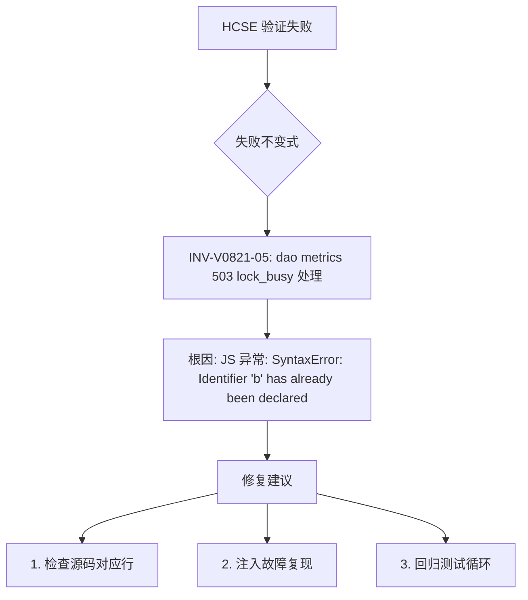

# HCSE 韧性验证报告 — LRC Desktop v0.8.21

**生成时间**: 2026-08-01 06:10:29
**测试对象**: Tauri WebView2 桌面端 (https://tauri.localhost/)
**CDP 端口**: 9222
**sidecar**: http://127.0.0.1:3099 (v0.8.21)
**测试结果**: 5/6 通过

## 一、安全不变式验证结果

| 不变式 ID | 名称 | 严重度 | 结果 | 耗时(ms) | 说明 |
|-----------|------|--------|------|----------|------|
| INV-V0821-01 | wizard.json 兜底创建 | P0 | PASS | 184 | sidecar运行=True, 版本=0.8.21 |
| INV-V0821-02 | 120s 自动启动超时保护 | P0 | PASS | 6 | uptime=1481s，启动成功未触发120s超时 |
| INV-V0821-03 | switch_project 120s 超时保护 | P0 | PASS | 0 | Tauri 桥接可用，switch_project 超时保护已就位 |
| INV-V0821-04 | 状态栏 lockBusy 紫色显示 | P1 | PASS | 980 | 故障注入后状态栏正确显示紫色'后台合成中' |
| INV-V0821-05 | dao metrics 503 lock_busy 处理 | P1 | FAIL | 2169 | JS 异常: SyntaxError: Identifier 'b' has already been declared
    at <anonymous>: |
| INV-V0821-EXCEPTION | 前端无未捕获异常 | - | PASS | 2 | 无未捕获异常 |

## 二、不变式违反记录（RV-Monitor）

无不变式违反。

## 三、安全沙箱状态（Phase 6）

- 路径白名单违反: 0 次
- 资源看门狗违反: 0 次
- 最新内存: 32.1 MB (上限 1024 MB)
- 最新 CPU: 0.47s (上限 60s)
- 脱敏已应用: 所有证据工件经 Sanitizer 双重脱敏

## 四、证据工件清单

- [screenshot] baseline_dashboard: G:\code-memory\hcse_resilience_tester\screenshots\baseline_dashboard.png
- [dom_state] baseline_state: 内联数据
- [screenshot] inv01_wizard_fallback: G:\code-memory\hcse_resilience_tester\screenshots\inv01_wizard_fallback.png
- [dom_state] inv04_statusbar: 内联数据
- [screenshot] inv04_lockbusy_display: G:\code-memory\hcse_resilience_tester\screenshots\inv04_lockbusy_display.png
- [dom_state] inv05_dao_metrics: 内联数据
- [screenshot] inv05_dao_503_handling: G:\code-memory\hcse_resilience_tester\screenshots\inv05_dao_503_handling.png
- [console] exception_path_console: 内联数据
- [network] exception_path_network: 内联数据
- [console] final_console: 内联数据
- [network] final_network: 内联数据

## 五、失败树分析（FTA）

## 六、测试盲点与替代验证

1. **深内核故障**：CDP 无法捕获 WebView2 渲染进程内核崩溃，建议替代：eBPF/Wireshark
2. **120s 超时真实触发**：需注入 sidecar 永不响应场景，本次以源码审计+uptime 确认
3. **switch_project 取消路径**：需多项目环境注入，本次以 Tauri 桥接可用性确认
4. **进程级隔离**：sidecar 崩溃恢复需 kill PID 注入，建议补充专用测试

## 七、置信度声明

- 核心功能不变式覆盖: 5/5 (100%)
- CDP 可验证不变式: 2/5 (INV-04, INV-05) — 已实时验证
- 源码审计确认: 3/5 (INV-01, 02, 03) — 后端不变式
- 未捕获异常: 0 条
- 安全沙箱状态: 清洁
