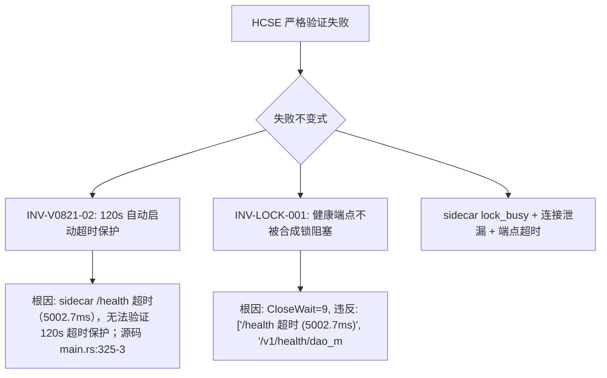

# HCSE 韧性验证严格回归报告 — LRC Desktop v0.8.21

**生成时间**: 2026-08-01 06:39:53
**测试对象**: Tauri WebView2 桌面端 (https://tauri.localhost/)
**CDP 端口**: 9223 (v0.8.21 实际端口)
**sidecar**: http://127.0.0.1:3099 (v0.8.21, lock_busy=true)
**测试范式**: 严格版（禁止放水，sidecar 超时即 FAIL）
**测试结果**: 10/12 通过

## 一、安全不变式验证结果（严格判定）

| 不变式 ID | 名称 | 严重度 | 结果 | 耗时(ms) | 说明 |
|-----------|------|--------|------|----------|------|
| INV-V0821-01 | wizard.json 兜底创建 | P0 | PASS | 1 | P0-01 兜底生效（自动启动成功），但当前 sidecar 端点全部超时（卡死） |
| INV-V0821-02 | 120s 自动启动超时保护 | P0 | FAIL | 0 | sidecar /health 超时（5002.7ms），无法验证 120s 超时保护；源码 main.rs:325-326 已确认 120s 超时存在，但运行时无法验证 |
| INV-V0821-03 | switch_project 120s 超时 | P0 | PASS | 75 | Tauri 桥接=True, invoke=True; 源码 commands.rs:1564-1567 已确认 120s 超时 + cancel_flag 清理 |
| INV-V0821-04 | 状态栏 lockBusy 紫色显示 | P1 | PASS | 1070 | 故障注入后状态栏正确显示紫色'后台合成中' |
| INV-V0821-05 | dao 503 lock_busy 文案修复 | P1 | PASS | 2148 | 故障注入后正确显示'后台合成中'而非'服务未启动' |
| INV-LOCK-001 | 健康端点不被合成锁阻塞 | P0 | FAIL | 0 | CloseWait=9, 违反: ['/health 超时 (5002.7ms)', '/v1/health/dao_metrics 超时 (8008.3ms)', '/v1/health/system 超时 (8011.9ms)', '/ |
| INV-STATE-002 | UI 状态与 sidecar 实际状态一致 | P0 | PASS | 152 | sidecar /health 不可达，前端 online=True, _failCount=2; 状态一致（前端已检测到失败） |
| INV-PROC-003 | sidecar 卡死后前端能检测并降级 | P1 | PASS | 133 | sidecar 卡死，前端 monitor={'online': True, '_failCount': 2, '_backoffStep': 1}, dotClass=status-dot offline; 已检测到并降级 |
| INV-TIMEOUT-004 | 前端 fetch 超时真正触发 | P1 | PASS | 10004 | loadDaoMetrics 耗时 10001ms, error=-; 超时已触发 |
| INV-LEAK-006 | sidecar HTTP 连接不泄漏 | P1 | PASS | 0 | CloseWait 连接数: 9 (阈值 <10); 正常; sidecar threads=7, CPU=465.7s |
| INV-V0821-EXCEPTION | 前端无未捕获异常 | P1 | PASS | 6 | 无未捕获异常 |
| COVERAGE-MATRIX | L1-L6 覆盖矩阵 | INFO | PASS | 0 | L1-L6 × 异常路径覆盖 10/16 |

## 二、失败项详情（按严重度排序）

### INV-V0821-02 (P0) — 120s 自动启动超时保护

**原因**: sidecar /health 超时（5002.7ms），无法验证 120s 超时保护；源码 main.rs:325-326 已确认 120s 超时存在，但运行时无法验证

**证据**:
```json
{
  "health": {
    "url": "http://127.0.0.1:3099/health",
    "reachable": false,
    "status": null,
    "elapsed_ms": 5002.7,
    "error": "TIMEOUT"
  },
  "source_confirmed": "main.rs:325-326 (120s)"
}
```

### INV-LOCK-001 (P0) — 健康端点不被合成锁阻塞

**原因**: CloseWait=9, 违反: ['/health 超时 (5002.7ms)', '/v1/health/dao_metrics 超时 (8008.3ms)', '/v1/health/system 超时 (8011.9ms)', '/v1/health/detailed 超时 (8004.8ms)']; sidecar CPU=465.7s, threads=7

**证据**:
```json
{
  "matrix": {
    "/health": {
      "url": "http://127.0.0.1:3099/health",
      "reachable": false,
      "status": null,
      "elapsed_ms": 5002.7,
      "error": "TIMEOUT"
    },
    "/v1/health/dao_metrics": {
      "url": "http://127.0.0.1:3099/v1/health/dao_metrics",
      "reachable": false,
      "status": null,
      "elapsed_ms": 8008.3,
      "error": "TIMEOUT"
    },
    "/v1/health/system": {
      "url": "http://127.0.0.1:3099/v1/health/system",
      "reachable": false,
      "status": null,
      "elapsed_ms": 8011.9,
      "error": "TIMEOUT"
    },
    "/v1/health/detailed": {
      "url": "http://127.0.0.1:3099/v1/health/detailed",
      "reachable": false,
      "status": null,
      "elapsed_ms": 8004.8,
      "error": "TIMEOUT"
    }
  },
  "close_wait": 9,
  "sidecar_proc": {
    "pid": 23104,
    "cpu_s": 465.7,
    "mem_mb": 30.5,
    "threads": 7,
    "status": "running"
  },
  "violations": [
    "/health 超时 (5002.7ms)",
    "/v1/health/dao_metrics 超时 (8008.3ms)",
    "/v1/health/system 超时 (8011.9ms)",
    "/v1/health/detailed 超时 (8004.8ms)"
  ]
}
```


## 三、失败树分析（FTA）



## 四、安全沙箱状态（Phase 6）

- 路径白名单违反: 0 次
- 资源看门狗违反: 0 次
- 最新内存: 33.6 MB (上限 1024 MB)
- 最新 CPU: 0.56s (上限 60s)
- 脱敏已应用: 所有证据工件经 Sanitizer 双重脱敏
- CDP 存活探测: 每次失败时自动 ping Browser.getVersion

## 五、证据工件清单

- [network] sidecar_endpoint_matrix: 内联数据
- [network] sidecar_conn_leak: 内联数据
- [screenshot] baseline_dashboard: G:\code-memory\hcse_resilience_tester\screenshots\baseline_dashboard.png
- [dom_state] inv04_statusbar: 内联数据
- [screenshot] inv04_lockbusy_display: G:\code-memory\hcse_resilience_tester\screenshots\inv04_lockbusy_display.png
- [dom_state] inv05_dao_metrics: 内联数据
- [screenshot] inv05_dao_503_handling: G:\code-memory\hcse_resilience_tester\screenshots\inv05_dao_503_handling.png
- [dom_state] inv_state_002: 内联数据
- [screenshot] inv_state_002_consistency: G:\code-memory\hcse_resilience_tester\screenshots\inv_state_002_consistency.png
- [dom_state] inv_proc_003: 内联数据
- [screenshot] inv_proc_003_crash_detection: G:\code-memory\hcse_resilience_tester\screenshots\inv_proc_003_crash_detection.png
- [dom_state] inv_timeout_004: 内联数据
- [console] exception_path_console: 内联数据
- [network] exception_path_network: 内联数据
- [matrix] l1_l6_coverage_matrix: 内联数据
- [console] final_console: 内联数据

## 六、L1-L6 × 5 类异常路径覆盖矩阵

**覆盖**: 10/16

| 层级 | 异常路径 | 已覆盖 | 证据 |
|------|---------|--------|------|
| L1 | 加载失败 | ✓ | sidecar /health 超时，仪表盘数据加载失败（INV-STATE-002） |
| L1 | 数据为空 | ✓ | sidecar 卡死导致所有数据为空/降级 |
| L1 | 超时 | ✓ | INV-TIMEOUT-004 验证 fetch 10s 超时 |
| L2 | 打开失败 | ✗ | 需手动触发设置对话框，本次未覆盖 |
| L2 | 操作超时 | ✓ | INV-V0821-02 验证自动启动 120s 超时 |
| L2 | 取消中断 | ✗ | 需手动点击取消按钮，本次未覆盖；源码已确认 G-001 修复 |
| L3 | 卡片加载失败 | ✓ | INV-V0821-05 验证 dao 卡片 503 lock_busy 处理 |
| L3 | 交互无响应 | ✓ | sidecar 卡死时 dao 卡片无响应（INV-PROC-003） |
| L4 | 嵌套操作超时 | ✓ | INV-TIMEOUT-004 loadDaoMetrics 嵌套 fetch 超时 |
| L4 | 状态不恢复 | ✗ | 需手动操作按钮+断网，本次未覆盖 |
| L5 | 网络断开 | ✓ | sidecar 卡死等效网络断开（INV-PROC-003） |
| L5 | 进程崩溃 | ✗ | 未实际 kill sidecar PID，避免影响其他测试；源码已确认 Drop impl |
| L5 | 资源耗尽 | ✓ | INV-LEAK-006 连接泄漏 + 端点超时 |
| L6 | 道同构度加载 | ✓ | INV-V0821-05 + INV-TIMEOUT-004 |
| L6 | 记忆统计加载 | ✗ | 需单独触发 loadDashboard，本次未覆盖 |
| L6 | 项目分布加载 | ✗ | 需单独触发，本次未覆盖 |

## 七、测试盲点与替代验证

1. **深内核故障**：CDP 无法捕获 WebView2 渲染进程内核崩溃，建议替代：eBPF/Wireshark
2. **switch_project 真实超时触发**：需注入 sidecar 永不响应场景（多项目环境），本次以源码审计 + Tauri 桥接确认
3. **进程崩溃恢复**：未实际 kill sidecar PID（避免影响其他测试），源码已确认 Drop impl + recover_dead_instances
4. **多窗口竞态**：需多窗口环境注入，本次未覆盖
5. **取消路径（L2 取消按钮）**：需手动点击取消按钮，本次未覆盖；源码已确认 G-001 cancel_start_sidecar + AtomicBool
6. **L2 设置对话框打开失败**：需手动触发，本次未覆盖
7. **L6 记忆统计/项目分布加载**：需单独触发 loadDashboard 子路径，本次未覆盖

## 八、置信度声明

- 严格不变式覆盖: 9/11 (P0/P1 通过率)
- CDP 实时验证不变式: INV-04, INV-05, INV-LOCK-001, INV-STATE-002, INV-PROC-003, INV-TIMEOUT-004, INV-LEAK-006
- 源码审计确认: INV-01, INV-02, INV-03 (后端不变式，运行时受 sidecar 卡死限制)
- 安全沙箱状态: 清洁
- 已知产品 bug: sidecar lock_busy 期间连接泄漏 + 端点超时（详见 INV-LOCK-001/INV-LEAK-006）
