# LRC Desktop v0.8.22 五层交互韧性审计报告

> 审计角色：交互韧性审计师（Interaction Resilience Auditor）
> 审计时间：2026-07-31
> 审计对象：LRC Desktop v0.8.22 桌面端核心交互链路
> 审计方法：静态代码分析 + 真实代码行为枚举（基于 [app.js](file:///g:/code-memory/static/app.js)、[server.rs](file:///g:/code-memory/src/server.rs)、[v1_api.rs](file:///g:/code-memory/src/v1_api.rs)）

## 核心功能定义

本次审计的核心功能链路 = **服务启动 + 仪表盘/道同构度/信任中心数据加载 + 标签页切换 + 健康监测 + 自动刷新**。

涉及的关键代码位置：
- [handleStartServiceClick](file:///g:/code-memory/static/app.js#L1539) — 服务启动入口
- [SidecarHealthMonitor](file:///g:/code-memory/static/app.js#L330) — 健康监测器
- [fetchWithTimeout](file:///g:/code-memory/static/app.js#L106) — 带超时的请求
- [handleHttpError](file:///g:/code-memory/static/app.js#L199) — HTTP 错误统一处理
- [loadDashboard](file:///g:/code-memory/static/app.js#L704) — 仪表盘加载
- [loadDaoMetrics](file:///g:/code-memory/static/app.js#L5280) — 道同构度加载
- [loadTrustCenter](file:///g:/code-memory/static/app.js#L2106) — 信任中心加载
- [switchTab](file:///g:/code-memory/static/app.js#L6353) — 标签页切换
- [updateStatusBar](file:///g:/code-memory/static/app.js#L1158) — 状态栏更新
- [showConfirm](file:///g:/code-memory/static/app.js#L3987) — 确认对话框（队列机制）
- [showToast](file:///g:/code-memory/static/app.js#L6252) — Toast 通知
- [beforeunload 拦截](file:///g:/code-memory/static/app.js#L7715) — 关闭拦截
- [后端 try_lock + 503 lock_busy](file:///g:/code-memory/src/v1_api.rs#L588) — 锁冲突处理

## 已实现的韧性机制（基线盘点）

| 机制 | 位置 | 覆盖的异常路径 |
|------|------|--------------|
| 健康监测轮询 + 指数退避 | [SidecarHealthMonitor._scheduleNextCheck](file:///g:/code-memory/static/app.js#L373) | 不可达时拉长间隔，上限 60s |
| 失败容错计数 | [_handleCheckFailure](file:///g:/code-memory/static/app.js#L467) | 连续 2 次失败才判定不可达 |
| 请求超时 + 外部 AbortController | [fetchWithTimeout](file:///g:/code-memory/static/app.js#L106) | 超时中止 + 外部取消 |
| HTTP 错误分级处理 | [handleHttpError](file:///g:/code-memory/static/app.js#L199) | 500 重试 3 次 / 503 重试 1 次 / 429/401/403 友好提示 |
| 仪表盘 503 lock_busy 识别 | [loadDashboard LOCK_BUSY 分支](file:///g:/code-memory/static/app.js#L801) | 区分"后台合成中"与"无法连接" |
| 道同构度 AbortController | [loadDaoMetrics](file:///g:/code-memory/static/app.js#L5287) | 切换标签页时取消旧请求 |
| 服务启动防抖守卫 | [_startServiceInProgress](file:///g:/code-memory/static/app.js#L1558) | 防止快速点击触发并发启动 |
| E008 单例锁冲突自动复用 | [handleStartServiceClick catch](file:///g:/code-memory/static/app.js#L1613) | 检测已有实例并复用 |
| 标签页切换取消旧请求 | [_abortActiveTabRequests](file:///g:/code-memory/static/app.js#L6415) | 切换时 abort 旧请求 |
| 重试 Modal 禁止标签切换 | [switchTab _retryModalActive 检查](file:///g:/code-memory/static/app.js#L6355) | 重试弹窗时锁定切换 |
| Toast 去重 + 队列上限 | [showToast](file:///g:/code-memory/static/app.js#L6252) | 1.5s 去重，上限 3 个，error 优先 |
| 确认对话框队列机制 | [showConfirm confirmModalQueue](file:///g:/code-memory/static/app.js#L3982) | 上限 5 个，避免单例冲突 |
| beforeunload 拦截 | [beforeunload](file:///g:/code-memory/static/app.js#L7715) | 排除后台请求 |
| 全局错误处理 | [window.onerror + unhandledrejection](file:///g:/code-memory/static/app.js#L2802) | 未捕获错误显示 toast |
| 后端 try_lock + 503 | [v1_api.rs try_lock](file:///g:/code-memory/src/v1_api.rs#L589) | 锁冲突时返回 503 而非卡死 |
| worker_threads=16 | [server.rs](file:///g:/code-memory/src/bin/server.rs#L59) | 确保健康检查响应性 |

---

# Layer 1：环境变异枚举（前置条件分叉）

在用户执行点击/输入前，物理环境可能已处于异常状态。以下枚举 10 个环境状态分叉：

## 环境前置矩阵表

| # | 环境变异条件 | 当前处理状态 | 代码位置 / 证据 | 未处理后果 |
|---|------------|------------|---------------|-----------|
| E1 | **网络完全断开**（sidecar 进程未启动） | ✅ 已处理 | [SidecarHealthMonitor._setReachable(false)](file:///g:/code-memory/static/app.js#L555) 显示 banner + 禁用 API 按钮 | — |
| E2 | **2G 弱网络 / 高延迟**（sidecar 响应慢但可达） | ⚠️ 部分处理 | fetchWithTimeout 默认 10s 超时；但健康检查 8s 超时可能误判不可达，需连续 2 次失败 | 弱网络下健康检查可能频繁触发"已停止"闪烁 |
| E3 | **频繁 WiFi 切换**（IP 变化导致连接中断） | ❌ 未处理 | 无 IP 变化检测机制 | sidecar 在 localhost，影响较小，但远程 LLM 配置会断 |
| E4 | **代理拦截**（系统代理拦截 localhost 请求） | ❌ 未处理 | 无代理检测；[fetchWithTimeout](file:///g:/code-memory/static/app.js#L129) 直接 fetch，代理可能拦截 | 代理拦截时所有请求失败，显示"无法连接"，用户困惑 |
| E5 | **系统时间被篡改**（JWT 过期 / 证书无效） | ❌ 未处理 | 无时间校验；LRC 未使用 JWT，但 HTTPS 证书校验受影响 | sidecar 用 HTTP，影响小；但 LLM API 调用可能因证书失效失败 |
| E6 | **存储已满**（无法写入 LocalStorage / 缓存） | ❌ 未处理 | 无存储空间检测；[getProjectDisplayName](file:///g:/code-memory/static/app.js#L2857) 等依赖 localStorage | 写入失败时抛 QuotaExceededError，未捕获 |
| E7 | **摄像头/麦克风权限被拒** | N/A | LRC 不使用摄像头/麦克风 | — |
| E8 | **脏数据残留**（上次操作失败的草稿 / 不完整的 .lrc.lock） | ⚠️ 部分处理 | [sidecar_manager E008 单例锁冲突处理](file:///g:/code-memory/static/app.js#L1613) 自动复用；但其他脏数据未清理 | .lrc.lock 残留导致启动失败（v0.8.17-18 已修复单例锁，但其他脏数据未覆盖） |
| E9 | **URL Query 参数错误**（?embedded=tauri 缺失或错误） | ⚠️ 部分处理 | [IS_DESKTOP_EMBEDDED 检测](file:///g:/code-memory/static/app.js#L1544) 非嵌入模式直接提示"服务已运行" | 浏览器直接访问时功能受限，但已有降级提示 |
| E10 | **同账号多设备登录**（force offline） | ❌ 未处理 | 无会话管理；LRC 是本地优先架构 | N/A（LRC 无云端会话） |

### 关键未处理盲点（Layer 1）

**E4 代理拦截是最严重的未处理盲点**：当系统设置了代理（如 ICUBE_PROXY_HOST=127.0.0.1，这在之前测试中已暴露），代理可能拦截 localhost 请求，导致所有 sidecar 请求失败。前端会显示"无法连接到 LRC 服务"，但实际是代理问题。**缺少代理检测和"请检查代理设置"的引导**。

**E6 存储已满**：当磁盘空间不足时，localStorage.setItem 会抛 QuotaExceededError，但代码中无 try/catch 包裹，会导致未捕获异常。虽然全局错误处理会显示 toast，但用户看到"发生未知错误"无法理解是存储问题。

**追问**：如果用户在代理拦截环境下点击"启动服务"，按钮显示"正在启动..."然后超时 120s，最终显示"启动失败：请求超时"。**UI 没有提供"检查代理设置"的修复路径**，用户只会反复重试。

---

# Layer 2：后端响应分叉树（核心网络层）

模拟 15+ 后端响应场景，逐场景追问修复路径：

## 后端响应场景矩阵

| # | 场景 | HTTP 状态 | 当前处理 | 修复路径完整性 |
|---|------|----------|---------|--------------|
| R1 | 成功 + 完整数据 | 200 OK | ✅ [renderDashboard](file:///g:/code-memory/static/app.js#L773) 渲染 | ✅ 完整 |
| R2 | 成功 + 空数据/null | 200 OK (body null) | ⚠️ [loadDaoMetrics data.ok && data.data](file:///g:/code-memory/static/app.js#L5299) 检查，null 走降级 | ⚠️ 降级显示"数据格式异常"，但未区分"无数据"和"格式错误" |
| R3 | 创建成功需重定向 | 201 Created | N/A | LRC 无 201 场景 |
| R4 | 客户端验证失败 | 400 | ⚠️ [handleHttpError else 分支](file:///g:/code-memory/static/app.js#L306) 显示 toast | ❌ **未高亮具体字段**，只显示通用错误 |
| R5 | Token 过期 | 401 | ⚠️ [handleHttpError 401/403 分支](file:///g:/code-memory/static/app.js#L302) 显示"权限不足" | ❌ **无静默刷新 token 机制**，无重定向登录 |
| R6 | 权限不足 | 403 | ⚠️ 同上 | ❌ **无 popup 引导联系管理员** |
| R7 | 端点不存在 | 404 | ⚠️ handleHttpError else 分支显示 toast | ❌ **无前端轮询兜底**，但已修复信任中心 404→503 |
| R8 | 请求过于频繁 | 429 | ✅ [handleHttpError 429 分支](file:///g:/code-memory/static/app.js#L298) 显示"请求过于频繁" | ⚠️ **无倒计时按钮禁用**，用户可立即重试再次触发 429 |
| R9 | 服务内部错误 | 500 | ✅ [handleHttpError 500 分支](file:///g:/code-memory/static/app.js#L217) 重试 Modal + 3 次上限 | ✅ 较完整 |
| R10 | 网关超时 | 502 | ⚠️ handleHttpError else 分支显示 toast | ❌ **无重试机制**（502 应与 500 同等重试） |
| R11 | 网关超时 | 504 | ⚠️ 同 502 | ❌ **无重试机制** |
| R12 | 服务熔断降级 | 503 lock_busy | ✅ [handleHttpError 503 分支](file:///g:/code-memory/static/app.js#L276) 自动重试 1 次 + 友好文案 | ✅ 较完整 |
| R13 | 响应体是 HTML（服务宕机） | 200 (HTML) | ❌ [response.json()](file:///g:/code-memory/static/app.js#L5297) 抛 SyntaxError，被 catch 但显示"未知错误" | ❌ **未检测 HTML 响应**，未提示"服务异常" |
| R14 | 字段名不匹配（序列化破坏） | 200 OK | ⚠️ [data.ok && data.data](file:///g:/code-memory/static/app.js#L5299) 检查失败走降级 | ⚠️ 降级显示"数据格式异常"，但未提示"请刷新或联系支持" |
| R15 | 连接被重置（ECONNRESET） | — | ⚠️ fetchWithTimeout TypeError 分支显示"无法连接" | ⚠️ 未区分"进程崩溃"和"网络中断" |
| R16 | 响应慢但最终成功（>10s） | 200 OK (晚到) | ⚠️ fetchWithTimeout 10s 超时已 abort，响应被丢弃 | ❌ **晚到的成功响应被丢弃**，可能造成数据不一致 |
| R17 | 健康检查 200 但 lock_busy=true | 200 OK | ✅ [updateStatusBar isLockBusy 判断](file:///g:/code-memory/static/app.js#L1178) 显示"后台合成中" | ✅ 完整 |

### 深度追问（Layer 2 核心问题）

**追问 1（R9 500 重试失败后的二次弹窗）**：
> 如果后端返回 500，[handleHttpError](file:///g:/code-memory/static/app.js#L217) 显示重试 Modal，用户点击重试，重试 3 次后显示"多次重试失败"InfoModal（[第 236 行](file:///g:/code-memory/static/app.js#L236)）。**但 InfoModal 只有"知道了"按钮，没有"查看日志"/"重启服务"/"联系支持"的操作路径**。用户关闭弹窗后陷入"知道失败但不知道怎么办"的状态。

**追问 2（R12 503 重试失败后的修复路径）**：
> 503 lock_busy 自动重试 1 次后仍失败，[handleHttpError](file:///g:/code-memory/static/app.js#L296) 显示 toast"记忆系统正在后台合成，请稍后重试"并 cancel。**但 toast 没有"稍后自动通知我"的选项，用户需要手动刷新**。如果后台合成持续 5 分钟，用户会反复刷新遇到 503，产生挫败感。

**追问 3（R13 HTML 响应）**：
> 如果 sidecar 进程崩溃但端口被其他服务（如 nginx）占用，返回 HTML 错误页。[response.json()](file:///g:/code-memory/static/app.js#L5297) 抛 SyntaxError，catch 块显示"数据格式异常"。**但 UI 未检测 Content-Type: text/html，未提示"服务异常，请重启 LRC"**。

**追问 4（R16 晚到的成功响应）**：
> fetchWithTimeout 10s 超时 abort 后，sidecar 可能仍在处理请求并在 12s 时返回成功响应。**这个晚到的响应会被丢弃（AbortController 已 abort），但 sidecar 端可能已写入状态**。如果用户在 abort 后发起新请求，可能造成竞态（旧请求的副作用 + 新请求的读取）。

**追问 5（R8 429 无倒计时）**：
> 429 限流时显示 toast"请求过于频繁"，**但按钮未禁用，用户可立即再次点击触发 429**。缺少"请等待 X 秒后重试"的倒计时禁用机制。

---

# Layer 3：非理性用户操作注入（防抖与后悔分叉）

模拟 6 类破坏性操作：

## 破坏性操作矩阵

| # | 操作类型 | 当前处理 | 代码位置 | 崩溃风险 |
|---|---------|---------|---------|---------|
| D1 | **快速连点提交按钮（1 秒 10 次）** | ✅ 防抖守卫 | [handleStartServiceClick _startServiceInProgress](file:///g:/code-memory/static/app.js#L1558) | ✅ 不崩溃 |
| D1b | 快速连点道同构度重试按钮 | ✅ inFlight 防抖 | [retryBtn retryInFlight](file:///g:/code-memory/static/app.js#L5486) | ✅ 不崩溃 |
| D1c | 快速连点标签页切换 | ⚠️ 无防抖 | [switchTab](file:///g:/code-memory/static/app.js#L6353) | ⚠️ 每次 switchTab 触发 _abortActiveTabRequests + loader()，快速切换会触发多次 abort + 加载，可能产生竞态 |
| D2 | **Loading 中刷新页面（F5）** | ✅ beforeunload 拦截 | [beforeunload](file:///g:/code-memory/static/app.js#L7715) | ⚠️ 拦截但用户可强制刷新；刷新后未 abort 的 Tauri invoke（start_sidecar）仍在后台运行 |
| D3 | **表单校验通过后挂起 10 分钟再提交** | ❌ 未处理 | 无 token 过期检测 | ❌ LRC 无 token，但 LLM API key 可能过期；10 分钟后提交 LLM 配置可能失败 |
| D4 | **嵌套弹窗（删除→确认→失败→查看详情）** | ⚠️ 部分处理 | [showConfirm 队列机制](file:///g:/code-memory/static/app.js#L3982) 上限 5 个 | ⚠️ 队列避免单例冲突，但 **3 层以上嵌套无 Z-index 管理**，详情 modal 可能被遮罩 |
| D5 | **移动端下拉加载更多失败后继续下拉** | N/A | LRC 桌面端无下拉加载 | — |
| D6 | **键盘干扰（输入时按 Enter 触发提交）** | ❌ 未处理 | 表单无 keydown 拦截 | ❌ 输入框中按 Enter 可能触发默认提交行为 |

### 深度追问（Layer 3 核心问题）

**追问 1（D1c 快速切换标签页竞态）**：
> 用户快速切换 dashboard → trust-center → dashboard → settings，每次 switchTab 调用 [_abortActiveTabRequests](file:///g:/code-memory/static/app.js#L6415) abort 旧请求 + [loader()](file:///g:/code-memory/static/app.js#L6394) 发起新请求。**快速切换会产生多个并发的 loader()，虽然有 AbortController，但 loadDashboard 内部的 Promise.allSettled 在 abort 后仍会处理已 settled 的结果**。可能导致旧数据覆盖新数据（竞态）。

**追问 2（D2 刷新后 Tauri invoke 残留）**：
> 用户点击"启动服务"，120s 超时的 invoke 仍在运行。用户刷新页面（强制绕过 beforeunload），**新页面加载后 sidecar 可能已被旧 invoke 启动，但新页面的 SidecarHealthMonitor 不知道，会显示"已停止"**。直到健康检查 10s 后才更新为"运行中"。这 10s 内用户看到"已停止"但实际服务已启动，产生困惑。

**追问 3（D4 嵌套弹窗 Z-index）**：
> 用户点击"删除记忆"→ showConfirm 弹窗（队列第 1 个）→ 点击确认 → 请求失败 → handleHttpError 500 重试 Modal（队列第 2 个）→ 点击重试 → 再次失败 → "多次重试失败"InfoModal（队列第 3 个）。
> 
> **问题**：showConfirm 队列确保同时只显示一个 modal，但 [handleHttpError](file:///g:/code-memory/static/app.js#L257) 调用 showConfirm 时，**外层的 loadDaoMetrics 等 catch 块仍在等待**。如果用户在"多次重试失败"InfoModal 上点击"知道了"，队列释放，但外层 catch 块已经执行完毕（giveup），**UI 状态可能未恢复**（如 loading-overlay 未隐藏）。
> 
> 更严重的是：如果同时有 toast 通知（showToast）和 modal，**toast 的 z-index 与 modal 遮罩可能冲突**。代码中无显式 z-index 管理策略。

**追问 4（D6 Enter 键提交）**：
> 在 LLM 配置表单中，用户在 API Key 输入框按 Enter，**浏览器默认行为可能触发表单 submit**。代码中无 `event.preventDefault()` 拦截 Enter 键，也无 `keydown` 监听将 Enter 转为"跳到下一个输入框"。用户误按 Enter 可能导致未完成的表单提交。

---

# Layer 4：组件级状态反馈缺失扫描（视觉与动画缺口）

扫描 5 层细粒度视觉反馈：

## 视觉反馈矩阵

| # | 反馈层 | 当前实现 | 缺口 | 代码位置 |
|---|-------|---------|------|---------|
| V1 | **按钮状态机**（idle→loading→success→error→idle） | ⚠️ 部分 | [handleStartServiceClick](file:///g:/code-memory/static/app.js#L1566) 有 loading（"正在启动..."）和恢复（"启动服务"），但 **无 success 状态（如绿色"已启动"2 秒）和 error 自动恢复定时器** | [app.js#L1566](file:///g:/code-memory/static/app.js#L1566) |
| V1b | 道同构度重试按钮状态机 | ✅ 完整 | idle→"重试中..."→恢复 | [app.js#L5487](file:///g:/code-memory/static/app.js#L5487) |
| V2 | **输入框 blur 校验失败后 focus 清除** | ✅ 已处理 | [validateInput](file:///g:/code-memory/static/app.js#L1706) blur 校验 + focus 清除 | [app.js#L1706](file:///g:/code-memory/static/app.js#L1706) |
| V3 | **骨架屏边界（空列表过渡）** | ❌ 未处理 | 无骨架屏；[loadDashboard](file:///g:/code-memory/static/app.js#L722) 用 loading-overlay，空数据时无"空状态插画" | [app.js#L722](file:///g:/code-memory/static/app.js#L722) |
| V4 | **滚动锚点丢失** | ✅ 已处理 | [startAutoRefresh _saveMainScroll/_restoreMainScroll](file:///g:/code-memory/static/app.js#L2477) 保存恢复滚动位置 | [app.js#L2499](file:///g:/code-memory/static/app.js#L2499) |
| V4b | 标签页切换滚动锚点 | ❌ 未处理 | [switchTab](file:///g:/code-memory/static/app.js#L6353) 未保存滚动位置，切换后回到顶部 | [app.js#L6353](file:///g:/code-memory/static/app.js#L6353) |
| V5 | **Toast 队列管理** | ✅ 已处理 | [showToast](file:///g:/code-memory/static/app.js#L6270) 上限 3 个，error 优先替换 | [app.js#L6270](file:///g:/code-memory/static/app.js#L6270) |
| V5b | 批量操作 5 个错误同时触发 | ⚠️ 部分处理 | 1.5s 去重窗口会合并相同消息，但 **不同消息仍会堆叠 3 个，超出被丢弃** | [app.js#L6272](file:///g:/code-memory/static/app.js#L6272) |

### 深度追问（Layer 4 核心问题）

**追问 1（V1 按钮状态机不完整）**：
> [handleStartServiceClick](file:///g:/code-memory/static/app.js#L1566) 启动按钮状态：idle("启动服务") → loading("正在启动...") → 成功后隐藏 banner / 失败后恢复("启动服务")。
> 
> **缺口**：
> 1. 无 success 视觉反馈（如绿色"已启动 ✓"持续 2 秒再隐藏按钮）
> 2. Error 状态无自动恢复定时器（失败后立即恢复 idle，用户可能误以为没点过）
> 3. **如果 Error 后 2 秒内用户再次点击，按钮是可用的，但 _startServiceInProgress 已重置为 false（[finally 块](file:///g:/code-memory/static/app.js#L1675)），会立即触发新启动**。缺少"失败后冷却期"防止用户立即重试触发相同错误。

**追问 2（V3 无骨架屏 + 空状态）**：
> 仪表盘加载时显示 loading-overlay（spinner），加载完成后直接渲染数据。**如果 sidecar 返回空数据（memory.total = 0），UI 显示"0 条记忆"但无"空状态插画"引导用户"开始索引项目"**。用户看到空荡荡的仪表盘不知道下一步做什么。

**追问 3（V4b 标签页切换滚动丢失）**：
> [startAutoRefresh](file:///g:/code-memory/static/app.js#L2477) 保存恢复滚动位置，但 [switchTab](file:///g:/code-memory/static/app.js#L6353) **未保存旧标签页滚动位置也未恢复新标签页滚动位置**。用户在信任中心滚动到下方查看审计日志，切换到仪表盘再切回，**回到顶部，丢失阅读位置**。

**追问 4（V5b 批量错误 Toast 丢失）**：
> 如果批量操作（如批量删除记忆）触发 5 个不同错误，[showToast](file:///g:/code-memory/static/app.js#L6272) 上限 3 个，后 2 个被丢弃（非 error 才丢弃，error 会替换最旧的非 error）。**但如果 5 个都是 error，前 3 个显示，后 2 个被静默丢弃，用户不知道有 5 个错误**。缺少"还有 N 个错误未显示"的提示。

---

# Layer 5：多米诺效应关联分析（全局状态污染）

分析 3 级联反应：

## 级联反应矩阵

| # | 级联层级 | 触发场景 | 当前处理 | 污染后果 | 代码位置 |
|---|---------|---------|---------|---------|---------|
| C1 | **L1 污染：当前页数据渲染错误→兄弟组件** | loadDaoMetrics 失败 | ✅ [loadDaoMetrics catch](file:///g:/code-memory/static/app.js#L5341) 降级显示，不卸载兄弟组件 | ✅ 隔离良好 | [app.js#L5341](file:///g:/code-memory/static/app.js#L5341) |
| C1b | loadDashboard 失败→状态栏被覆盖 | loadDashboard 失败 | ⚠️ [loadDashboard catch](file:///g:/code-memory/static/app.js#L874) 调用 updateStatusBar(false, null) 覆盖 | ❌ **如果 sidecar 实际在线但 dashboard 数据加载失败（如 503），updateStatusBar(false) 会将状态栏覆盖为"已停止"，与实际矛盾** | [app.js#L874](file:///g:/code-memory/static/app.js#L874) |
| C2 | **L2 污染：LocalStorage 写入半完成脏数据** | 存储写入失败 | ❌ 未处理 | ❌ **下次打开应用时读取脏数据可能导致解析失败** | 无 |
| C2b | _projectMap 写入失败 | loadProjectInfo 失败 | ⚠️ [getProjectDisplayName](file:///g:/code-memory/static/app.js#L2868) 容错回退到原 project | ⚠️ 部分容错，但 _projectMap 不写入 localStorage | [app.js#L2868](file:///g:/code-memory/static/app.js#L2868) |
| C3 | **L3 污染：请求失败后 Router 仍跳转** | 无前端 Router | N/A | N/A | LRC 无路由跳转 |
| C3b | **请求失败后状态栏误判** | 健康检查失败 | ⚠️ [_setReachable(false)](file:///g:/code-memory/static/app.js#L555) 禁用所有 API 按钮 | ❌ **健康检查连续 2 次失败判定不可达后，禁用所有 API 按钮，但 sidecar 可能只是暂时慢（如索引期）**。虽然有 isIndexing 判断，但 _setReachable(false) 在 _failCount >= 2 时无条件触发 | [app.js#L467](file:///g:/code-memory/static/app.js#L467) |

### 深度追问（Layer 5 核心问题）

**追问 1（C1b 状态栏被覆盖）**：
> 这是最严重的级联污染。当 sidecar 在线但 /v1/health/system 返回 503 lock_busy 时：
> 1. [loadDashboard](file:///g:/code-memory/static/app.js#L760) 检测到 hasLockBusy，throw 'LOCK_BUSY'
> 2. 进入 [catch 块 LOCK_BUSY 分支](file:///g:/code-memory/static/app.js#L801)，显示"后台合成中"并重试
> 3. **但如果重试 3 次仍失败，[第 874 行](file:///g:/code-memory/static/app.js#L874) updateStatusBar(false, null) 被调用，状态栏变为"已停止"**
> 4. 但 SidecarHealthMonitor._isReachable 仍为 true（健康检查 /health 成功）
> 5. **状态栏显示"已停止"但 SidecarHealthMonitor 认为"在线"，矛盾状态**
> 
> 用户看到"已停止"点击"启动服务"，但服务实际在运行，[handleStartServiceClick](file:///g:/code-memory/static/app.js#L1544) 非嵌入模式分支显示"服务已运行"。用户困惑：状态栏说停止，点击启动又说已运行。

**追问 2（C3b 健康检查误判禁用按钮）**：
> sidecar 索引期间 /health 响应可能 >8s（健康检查超时）。连续 2 次失败后 [_handleCheckFailure](file:///g:/code-memory/static/app.js#L467) 调用 _setReachable(false)，**禁用所有 API 按钮 + 显示 banner"服务未运行"**。
> 
> 但实际 sidecar 正在索引，只是 /health 响应慢。**虽然有 isIndexing 判断，但 isIndexing 依赖 _sidecarStatus，而 _sidecarStatus 在失败后被设为 'unknown'**（[第 471 行](file:///g:/code-memory/static/app.js#L471)）。isIndexing() 返回 false，UI 无法显示"索引中"，而是显示"已停止"。
> 
> 用户看到"已停止"和 banner，点击"启动服务"，触发 E008 单例锁冲突，虽然 [自动复用逻辑](file:///g:/code-memory/static/app.js#L1613) 会处理，但中间的 toast"已有 LRC 实例在运行"会让用户困惑。

**追问 3（C2 脏数据）**：
> 如果用户在配置 LLM 时写入 localStorage 失败（磁盘满），**无 try/catch 包裹，抛 QuotaExceededError**。全局错误处理显示"发生未知错误"toast，但配置未保存。**用户以为配置成功，下次使用时发现 LLM 未配置**。缺少"配置保存失败"的明确反馈。

---

# 交付物 1：交互盲点地震图（Mermaid 决策树）

以核心功能"服务启动 + 数据加载"为根节点，覆盖 5 主分支（成功/失败/重试/取消/超时），每个主分支延伸 3 级子分支：

```mermaid
flowchart TD
    ROOT["用户点击启动服务 / 加载数据"]
    
    ROOT --> SUCCESS["✅ 成功分支"]
    ROOT --> FAILURE["❌ 失败分支"]
    ROOT --> RETRY["🔄 重试分支"]
    ROOT --> CANCEL["⏹️ 取消分支"]
    ROOT --> TIMEOUT["⏱️ 超时分支"]
    
    %% ===== 成功分支 =====
    SUCCESS --> S1["L1: 服务启动成功 / 数据返回 200"]
    S1 --> S2["L2: 状态栏更新为运行中"]
    S2 --> S3["L3: 仪表盘渲染数据"]
    S3 --> S4["L4: 隐藏 loading-overlay + banner"]
    S4 --> S5["L5: 广播状态变更 → 兄弟组件同步"]
    S5 --> S6["✅ 终态: UI 一致"]
    S3 --> S7["⚠️ 盲点 V3: 空数据无空状态插画"]
    S7 --> S8["❌ 用户看到空白仪表盘,不知道下一步"]
    S2 --> S9["⚠️ 盲点 C1b: 503 lock_busy 时状态栏被覆盖为已停止"]
    S9 --> S10["❌ 状态栏显示已停止但实际在线,矛盾"]
    
    %% ===== 失败分支 =====
    FAILURE --> F1["L1: 启动失败 / HTTP 500/502/504"]
    F1 --> F2["L2: handleHttpError 分级处理"]
    F2 --> F3["L3: 500 显示重试 Modal"]
    F3 --> F4["L4: 重试 3 次后显示多次重试失败 InfoModal"]
    F4 --> F5["⚠️ 盲点: InfoModal 只有知道了按钮,无查看日志/重启服务路径"]
    F5 --> F6["❌ 用户陷入知道失败但不知道怎么办"]
    F2 --> F7["L3: 502/504 走 else 分支,仅 toast"]
    F7 --> F8["⚠️ 盲点 R10/R11: 502/504 无重试机制,与 500 不一致"]
    F8 --> F9["❌ 网关超时只显示 toast,用户无重试选项"]
    F2 --> F10["L3: 429 显示请求频繁 toast"]
    F10 --> F11["⚠️ 盲点 R8: 429 无倒计时按钮禁用"]
    F11 --> F12["❌ 用户立即重试再次触发 429"]
    F1 --> F13["⚠️ 盲点 R13: HTML 响应未检测"]
    F13 --> F14["❌ json 解析失败显示数据格式异常,未提示服务异常"]
    
    %% ===== 重试分支 =====
    RETRY --> R1["L1: 用户点击重试 / 自动重试"]
    R1 --> R2["L2: 指数退避 1s/2s/4s"]
    R2 --> R3["L3: 重试成功 → 渲染数据"]
    R3 --> R4["✅ 终态: 恢复正常"]
    R2 --> R5["L3: 重试失败 → 再次重试"]
    R5 --> R6["L4: 重试 3 次耗尽"]
    R6 --> R7["L5: 显示多次重试失败 InfoModal"]
    R7 --> R8["⚠️ 盲点: InfoModal 关闭后 UI 状态未恢复"]
    R8 --> R9["❌ loading-overlay 可能永久显示"]
    R6 --> R10["L5: 道同构度重试耗尽显示降级横幅"]
    R10 --> R11["L6: 降级横幅有重试按钮"]
    R11 --> R12["✅ 终态: 用户可手动重试"]
    R1 --> R13["⚠️ 盲点 D1c: 快速切换标签页触发多次重试竞态"]
    R13 --> R14["❌ 旧重试与新加载竞态,数据可能错乱"]
    R2 --> R15["⚠️ 盲点 V1: 重试按钮无冷却期"]
    R15 --> R16["❌ 失败后立即恢复 idle,用户可立即重试触发相同错误"]
    
    %% ===== 取消分支 =====
    CANCEL --> C1["L1: 用户点击取消 / AbortController abort"]
    C1 --> C2["L2: postMessageToParent reject AbortError"]
    C2 --> C3["L3: handleStartServiceClick catch 显示已取消 toast"]
    C3 --> C4["✅ 终态: 状态恢复 idle"]
    C1 --> C5["L2: 标签页切换 abort 旧请求"]
    C5 --> C6["L3: loadDaoMetrics 检测 AbortError 静默退出"]
    C6 --> C7["✅ 终态: 无错误提示"]
    C1 --> C8["⚠️ 盲点 D2: 刷新页面后 Tauri invoke 残留"]
    C8 --> C9["❌ 旧 invoke 仍在运行,新页面不知道"]
    C9 --> C10["❌ 10s 内状态栏显示已停止但服务已启动"]
    C1 --> C11["⚠️ 盲点: beforeunload 拦截但用户可强制刷新"]
    C11 --> C12["❌ 强制刷新后未 abort 的请求继续运行"]
    C3 --> C13["⚠️ 盲点: 取消后 _startServiceInProgress 重置,用户立即重试"]
    C13 --> C14["❌ 无冷却期,可能触发相同失败"]
    
    %% ===== 超时分支 =====
    TIMEOUT --> T1["L1: fetchWithTimeout 超时 / invoke 120s 超时"]
    T1 --> T2["L2: 抛 SidecarTimeoutError / 请求超时"]
    T2 --> T3["L3: 显示请求超时 toast"]
    T3 --> T4["⚠️ 盲点: 超时 toast 无重试按钮"]
    T4 --> T5["❌ 用户需手动找到原操作重新点击"]
    T1 --> T6["L2: 健康检查 8s 超时"]
    T6 --> T7["L3: _handleCheckFailure 失败计数+1"]
    T7 --> T8["L4: 连续 2 次失败判定不可达"]
    T8 --> T9["L5: 禁用 API 按钮 + 显示 banner"]
    T9 --> T10["⚠️ 盲点 C3b: 索引期 /health 慢被误判为不可达"]
    T10 --> T11["❌ isIndexing 失效,显示已停止而非索引中"]
    T11 --> T12["❌ 用户点击启动服务触发 E008 单例锁冲突"]
    T1 --> T13["⚠️ 盲点 R16: 超时后晚到的成功响应被丢弃"]
    T13 --> T14["❌ sidecar 已写入状态但前端丢弃,数据不一致"]
    T13 --> T15["❌ 用户发起新请求可能读到旧状态"]
    
    %% 样式
    classDef blindSpot fill:#ffcccc,stroke:#c0392b,stroke-width:2px
    classDef terminal fill:#d5f5e3,stroke:#27ae60,stroke-width:2px
    classDef warning fill:#fcf3cf,stroke:#f39c12,stroke-width:2px
    
    class S7,S8,S9,S10,F5,F6,F8,F9,F11,F12,F13,F14,R8,R9,R13,R14,R15,R16,C8,C9,C10,C11,C12,C13,C14,T4,T5,T10,T11,T12,T13,T14,T15 blindSpot
    class S6,R4,R12,C4,C7 terminal
    class F5,F8,F11,R8,R13,C8,C11,T4,T10 warning
```



---

# 交付物 2：UI 交互缺口修复清单

| Gap ID | 触发条件 | 当前行为 | 用户心理（恐惧/困惑/挫败） | 推荐 UI 修复（精确到文案和组件行为） |
|--------|---------|---------|-------------------------|----------------------------------|
| GAP-L1-01 | 系统代理拦截 localhost 请求（E4） | 所有请求失败，显示"无法连接到 LRC 服务" | 困惑：明明服务在运行却显示无法连接 | 在 fetchWithTimeout 的 TypeError 分支检测 navigator.proxy 或显示增强 toast："无法连接到 LRC 服务。如果系统配置了代理，请在代理设置中为 127.0.0.1 设置例外。[查看代理配置指南]" + 按钮"打开系统代理设置" |
| GAP-L1-02 | 磁盘空间不足，localStorage 写入失败（E6） | QuotaExceededError 未捕获，全局错误处理显示"发生未知错误" | 困惑：不知道是存储问题 | 包裹 localStorage.setItem 于 try/catch，捕获 QuotaExceededError 时显示 Modal："磁盘空间不足，无法保存配置。请清理磁盘空间后重试。[打开数据目录]" |
| GAP-L2-01 | 500 重试 3 次后显示 InfoModal（R9 追问 1） | InfoModal 只有"知道了"按钮 | 挫败：知道失败但不知道怎么办 | InfoModal 增加 3 个操作按钮：[查看 LRC 服务日志] [重启 LRC 服务] [联系技术支持]。点击"重启服务"调用 stop_sidecar + start_sidecar |
| GAP-L2-02 | 503 lock_busy 重试 1 次后失败（R12 追问 2） | 显示 toast"记忆系统正在后台合成，请稍后重试" | 挫败：需手动反复刷新 | toast 增加"完成后通知我"按钮，点击后注册 sidecar-state-change 事件监听，lock_busy=false 时自动刷新 + 显示"后台合成已完成"通知 |
| GAP-L2-03 | 响应体是 HTML（服务宕机，R13） | json() 抛 SyntaxError，显示"数据格式异常" | 困惑：不知道服务已宕机 | fetchWithTimeout 检查 response.headers.get('content-type')，若包含 'text/html' 则抛 ServiceDownError，catch 块显示 Modal："LRC 服务异常（返回了网页而非数据）。请重启 LRC 服务。[重启服务] [查看日志]" |
| GAP-L2-04 | 429 限流（R8 追问 5） | 显示 toast"请求过于频繁"，按钮未禁用 | 挫败：立即重试再次失败 | handleHttpError 429 分支解析 Retry-After 头，调用 disableButtonWithCountdown(btn, seconds)，按钮显示"请等待 Xs 后重试"并禁用，倒计时结束后恢复 |
| GAP-L2-05 | 502/504 网关超时（R10/R11） | 走 else 分支仅显示 toast | 困惑：与 500 同是服务端错误却无重试 | handleHttpError 增加 502/504 分支，与 500 同等处理（重试 Modal + 3 次上限） |
| GAP-L3-01 | 快速切换标签页（D1c 追问 1） | 每次 switchTab 触发 abort + loader，可能竞态 | 无感知，但数据可能错乱 | switchTab 增加 300ms 防抖（类似 _broadcastDebounceTimer），快速切换只执行最后一次。在 loader() 前检查 currentSignal.aborted，若已 abort 则跳过 |
| GAP-L3-02 | 刷新页面后 Tauri invoke 残留（D2 追问 2） | 新页面 10s 内显示"已停止"但服务已启动 | 困惑：状态栏说停止，点击启动又说已运行 | init() 时立即调用 invoke('get_sidecar_status') 检查现有实例，若存在则直接 _setReachable(true)，不等待 10s 健康检查 |
| GAP-L3-03 | 嵌套弹窗 Z-index（D4 追问 3） | showConfirm 队列管理单例，但 toast 与 modal z-index 可能冲突 | 无直接感知，但视觉层叠错乱 | 显式管理 z-index：toast: 10000，modal-overlay: 9000，modal: 9100，banner: 8000。在 showConfirm 显示时设置 document.body.dataset.modalActive = 'true'，toast 检测此属性调整 z-index |
| GAP-L3-04 | 输入框 Enter 键提交（D6 追问 4） | 无 keydown 拦截，Enter 可能触发表单 submit | 困惑：误按 Enter 导致意外提交 | 在所有表单 input 上注册 keydown 监听，Enter 键 preventDefault + 聚焦下一个 input（tabindex 顺序），最后一个 input 的 Enter 才触发 submit |
| GAP-L4-01 | 按钮无 success 状态（V1 追问 1） | 启动成功后直接隐藏 banner，无"已启动"反馈 | 无明确成功感知 | handleStartServiceClick 成功后，按钮显示绿色"已启动 ✓"2 秒 + checkmark 动画，再隐藏。失败后按钮显示红色"启动失败"2 秒 + 抖动动画，再恢复"启动服务" |
| GAP-L4-02 | 失败后无冷却期（V1 追问 1） | finally 块立即重置 _startServiceInProgress，用户可立即重试 | 挫败：反复重试触发相同错误 | 失败后设置 _startServiceCooldown = true，5 秒冷却期内点击显示 toast"请稍候 5 秒再重试"，倒计时结束后恢复 |
| GAP-L4-03 | 空数据无空状态插画（V3 追问 2） | memory.total=0 时显示"0 条记忆" | 困惑：不知道下一步做什么 | renderDashboard 检测 memory.total=0，渲染空状态插画（SVG）+ 文案"还没有记忆。开始索引项目来生成记忆。[索引项目] [查看使用指南]" |
| GAP-L4-04 | 标签页切换滚动丢失（V4b 追问 3） | switchTab 未保存恢复滚动位置 | 挫败：丢失阅读位置 | switchTab 调用前保存当前标签页 scrollTop 到 _tabScrollMap[oldTab]，切换后恢复 _tabScrollMap[newTab]。复用 [_saveMainScroll/_restoreMainScroll](file:///g:/code-memory/static/app.js#L2499) |
| GAP-L4-05 | 批量错误 Toast 丢失（V5b 追问 4） | 5 个 error 只显示 3 个，后 2 个静默丢弃 | 不知道有 5 个错误 | showToast 队列满时，第 4 个起累积计数，在第 3 个 toast 消失时显示"还有 N 个错误未显示 [查看全部]"，点击展开错误列表 Modal |
| GAP-L5-01 | 503 lock_busy 时状态栏被覆盖为已停止（C1b 追问 1） | updateStatusBar(false, null) 覆盖状态栏 | 恐惧：状态栏说停止，实际服务在线 | loadDashboard catch 块不调用 updateStatusBar(false)，改为检查 SidecarHealthMonitor._isReachable，若在线则保持"运行中"或显示"后台合成中"，仅在健康检查判定不可达时才显示"已停止" |
| GAP-L5-02 | 健康检查误判禁用按钮（C3b 追问 2） | _handleCheckFailure 连续 2 次失败禁用所有按钮 | 困惑：索引期被误判为服务停止 | _handleCheckFailure 检查 _sidecarStatus，若之前是 'starting'/'indexing'，不立即判定不可达，而是延长 _FAIL_THRESHOLD 到 5 次（索引期容错更高）。同时禁用按钮时保留"启动服务"按钮可用（已有此逻辑，但需验证） |
| GAP-L5-03 | 健康检查失败后 isIndexing 失效（C3b 追问 2） | _handleCheckFailure 设 _sidecarStatus='unknown'，isIndexing() 返回 false | UI 无法显示"索引中" | _handleCheckFailure 不立即设为 'unknown'，改为保留上一个已知状态（starting/indexing），仅在真正不可达（连接拒绝）时才设 'unknown'。增加 _lastKnownStatus 字段记录最后已知状态 |
| GAP-L2-06 | 晚到的成功响应被丢弃（R16 追问 4） | AbortController abort 后响应被丢弃 | 无感知，但数据可能不一致 | fetchWithTimeout abort 时记录 pendingWrites 标志，下次请求前检查 sidecar 状态是否已变更（如 /health 返回不同 status），若变更则强制刷新 |

---

# 交付物 3：可注入断言逻辑 InteractionGuard 单元测试伪代码

以下 `InteractionGuard` 模块设计为可注入当前项目的断言守卫，拦截快速点击、嵌套弹窗 Z-index 混乱、状态栏被覆盖、健康检查误判等问题。可作为 Jest/Vitest 单元测试伪代码，也可作为运行时守卫注入 [app.js](file:///g:/code-memory/static/app.js)。

```javascript
// ============================================================
// InteractionGuard — 交互韧性断言守卫
// 注入点：app.js 顶部（IIFE 外层），在 SidecarHealthMonitor 定义之前
// 设计目标：拦截五层审计发现的核心盲点
// ============================================================

const InteractionGuard = (function () {
  'use strict';

  // ---------- 守卫状态 ----------
  const _state = {
    // GAP-L4-02: 失败后冷却期计数器
    cooldownMap: new Map(),        // actionKey → { until: timestamp, reason: string }
    // GAP-L3-01: 标签页切换防抖
    switchTabDebounceTimer: null,
    pendingSwitchTab: null,
    // GAP-L4-04: 标签页滚动位置保存
    tabScrollMap: new Map(),       // tabName → scrollTop
    // GAP-L3-03: Z-index 层级管理
    zIndexChanged: false,
    // GAP-L2-06: 晚到响应追踪
    pendingWrites: new Set(),      // 记录已 abort 但 sidecar 可能仍在处理的请求
    // GAP-L5-03: 最后已知 sidecar 状态
    lastKnownSidecarStatus: 'unknown',
    // GAP-L4-05: 被丢弃的 Toast 计数
    droppedErrorCount: 0,
    droppedErrorList: [],
  };

  // ---------- GAP-L4-02: 失败后冷却期守卫 ----------
  // 拦截"失败后立即重试触发相同错误"
  // 注入点：handleStartServiceClick / loadDaoMetrics 重试按钮 catch 块
  function enterCooldown(actionKey, durationMs = 5000, reason = '') {
    _state.cooldownMap.set(actionKey, {
      until: Date.now() + durationMs,
      reason,
    });
    console.log(`[InteractionGuard] 进入冷却期: ${actionKey} ${durationMs}ms，原因: ${reason}`);
  }

  function isInCooldown(actionKey) {
    const entry = _state.cooldownMap.get(actionKey);
    if (!entry) return false;
    if (Date.now() >= entry.until) {
      _state.cooldownMap.delete(actionKey);
      return false;
    }
    return true;
  }

  function getCooldownRemaining(actionKey) {
    const entry = _state.cooldownMap.get(actionKey);
    if (!entry) return 0;
    return Math.max(0, Math.ceil((entry.until - Date.now()) / 1000));
  }

  // 包装"危险操作"，自动检查冷却期
  // 用法: guardAction('start-service', () => handleStartServiceClick())
  async function guardAction(actionKey, action, opts = {}) {
    const { cooldownMs = 5000, showCooldownToast = true } = opts;
    if (isInCooldown(actionKey)) {
      const remain = getCooldownRemaining(actionKey);
      if (showCooldownToast && typeof window.showToast === 'function') {
        window.showToast(`请稍候 ${remain} 秒再重试`, 'warning', 2000);
      }
      return null;
    }
    try {
      const result = await action();
      return result;
    } catch (err) {
      // 失败后进入冷却期
      enterCooldown(actionKey, cooldownMs, err.message || 'unknown');
      throw err;
    }
  }

  // ---------- GAP-L3-01: 标签页切换防抖守卫 ----------
  // 拦截"快速切换标签页触发多次 abort + loader 竞态"
  // 注入点：包装 switchTab(tabName)
  function debouncedSwitchTab(tabName, switchFn, debounceMs = 300) {
    return new Promise((resolve) => {
      // 保存当前标签页滚动位置（GAP-L4-04）
      const mainContent = document.querySelector('.main') || document.querySelector('.main-content');
      if (mainContent) {
        const activeTab = document.querySelector('.tab-content.active');
        if (activeTab) {
          const oldTabId = activeTab.id.replace('tab-', '');
          _state.tabScrollMap.set(oldTabId, mainContent.scrollTop);
        }
      }

      if (_state.switchTabDebounceTimer) {
        clearTimeout(_state.switchTabDebounceTimer);
      }
      _state.pendingSwitchTab = { tabName, resolve };
      _state.switchTabDebounceTimer = setTimeout(async () => {
        _state.switchTabDebounceTimer = null;
        const pending = _state.pendingSwitchTab;
        _state.pendingSwitchTab = null;
        if (!pending) return;
        // 执行实际切换
        await switchFn(pending.tabName);
        // 恢复目标标签页滚动位置（GAP-L4-04）
        if (mainContent) {
          const savedScroll = _state.tabScrollMap.get(pending.tabName) || 0;
          requestAnimationFrame(() => {
            mainContent.scrollTop = savedScroll;
          });
        }
        pending.resolve(true);
      }, debounceMs);
    });
  }

  // ---------- GAP-L3-03: Z-index 层级管理守卫 ----------
  // 拦截"toast 与 modal 遮罩 z-index 冲突"
  const Z_INDEX_LAYERS = {
    banner: 8000,
    modalOverlay: 9000,
    modal: 9100,
    toast: 10000,
    toastWhenModalActive: 11000,  // modal 激活时 toast 提升到 modal 之上
  };

  function getZIndex(layer) {
    const modalActive = document.body.dataset.modalActive === 'true';
    if (layer === 'toast' && modalActive) {
      return Z_INDEX_LAYERS.toastWhenModalActive;
    }
    return Z_INDEX_LAYERS[layer] || 8000;
  }

  function setModalActive(active) {
    document.body.dataset.modalActive = active ? 'true' : 'false';
    // 现有 toast 调整 z-index
    const container = document.getElementById('toast-container');
    if (container) {
      container.style.zIndex = getZIndex('toast');
    }
  }

  // ---------- GAP-L5-01: 状态栏覆盖守卫 ----------
  // 拦截"loadDashboard 失败时 updateStatusBar(false) 覆盖为已停止"
  // 注入点：loadDashboard catch 块，替代无条件 updateStatusBar(false, null)
  function safeUpdateStatusBarOnFailure() {
    // 检查 SidecarHealthMonitor 实际可达性，不盲目覆盖为"已停止"
    const monitor = window.SidecarHealthMonitor || window.sidecarHealthMonitor;
    if (monitor && typeof monitor.isReachable === 'function' && monitor.isReachable()) {
      // sidecar 实际在线，不覆盖为"已停止"
      const isLockBusy = monitor._lockBusy === true;
      const isIndexing = typeof monitor.isIndexing === 'function' && monitor.isIndexing();
      if (typeof window.updateStatusBar === 'function') {
        // 保持在线状态，显示"后台合成中"或"索引中"
        window.updateStatusBar(true, {});
      }
      console.log('[InteractionGuard] 拦截状态栏覆盖: sidecar 在线，保持运行中状态');
      return true;  // 已拦截
    }
    // sidecar 确实不可达，允许覆盖为"已停止"
    if (typeof window.updateStatusBar === 'function') {
      window.updateStatusBar(false, null);
    }
    return false;  // 未拦截
  }

  // ---------- GAP-L5-02 / GAP-L5-03: 健康检查误判守卫 ----------
  // 拦截"索引期 /health 慢被误判为不可达，_sidecarStatus 被设为 unknown"
  // 注入点：SidecarHealthMonitor._handleCheckFailure
  function shouldMarkUnreachable(monitor) {
    const prevStatus = monitor._sidecarStatus;
    const wasIndexing = prevStatus === 'starting' || prevStatus === 'indexing';

    // GAP-L5-03: 保留最后已知状态，不立即设为 unknown
    if (wasIndexing) {
      // 索引期容错阈值提高到 5 次（vs 默认 2 次）
      const INDEXING_FAIL_THRESHOLD = 5;
      if (monitor._failCount < INDEXING_FAIL_THRESHOLD) {
        console.warn(
          `[InteractionGuard] 索引期健康检查失败 ${monitor._failCount}/${INDEXING_FAIL_THRESHOLD}，` +
          `保留 _sidecarStatus="${prevStatus}"（不设为 unknown）`
        );
        return false;  // 不判定不可达
      }
    }
    return monitor._failCount >= monitor._FAIL_THRESHOLD;
  }

  function onHealthCheckFailure(monitor) {
    if (!shouldMarkUnreachable(monitor)) {
      // 不判定不可达，保留最后已知状态
      // GAP-L5-03: 记录最后已知状态
      _state.lastKnownSidecarStatus = monitor._sidecarStatus;
      return false;  // 未判定不可达
    }
    // 真正判定不可达
    // GAP-L5-03: 仅在真正不可达时才设为 unknown
    _state.lastKnownSidecarStatus = monitor._sidecarStatus;
    monitor._sidecarStatus = 'unknown';
    if (typeof monitor._setReachable === 'function') {
      monitor._setReachable(false);
    }
    return true;
  }

  // ---------- GAP-L2-03: HTML 响应检测守卫 ----------
  // 拦截"响应体是 HTML（服务宕机）被误判为数据格式异常"
  // 注入点：fetchWithTimeout 成功分支，response.ok 后
  async function detectServiceDown(response) {
    const contentType = response.headers.get('content-type') || '';
    if (contentType.includes('text/html')) {
      const err = new Error('LRC 服务异常（返回 HTML 而非 JSON），服务可能已宕机');
      err.name = 'ServiceDownError';
      err.contentType = contentType;
      // 尝试读取 HTML 标题作为错误详情
      try {
        const html = await response.text();
        const titleMatch = html.match(/<title>([^<]*)<\/title>/i);
        if (titleMatch) err.htmlTitle = titleMatch[1];
      } catch (e) { /* ignore */ }
      throw err;
    }
    return response;
  }

  // ---------- GAP-L2-04: 429 倒计时守卫 ----------
  // 拦截"429 限流后用户立即重试再次触发 429"
  // 注入点：handleHttpError 429 分支
  function disableButtonWithCountdown(button, seconds) {
    if (!button) return;
    const originalText = button.textContent;
    const originalDisabled = button.disabled;
    button.disabled = true;
    let remaining = seconds;

    const updateText = () => {
      button.textContent = `请等待 ${remaining}s 后重试`;
    };
    updateText();

    const timer = setInterval(() => {
      remaining--;
      if (remaining <= 0) {
        clearInterval(timer);
        button.disabled = originalDisabled;
        button.textContent = originalText;
      } else {
        updateText();
      }
    }, 1000);

    // 返回取消函数，支持提前恢复
    return () => {
      clearInterval(timer);
      button.disabled = originalDisabled;
      button.textContent = originalText;
    };
  }

  // ---------- GAP-L2-01: 重试失败后修复路径守卫 ----------
  // 拦截"多次重试失败 InfoModal 只有知道了按钮"
  // 注入点：handleHttpError giveup 分支
  function showRetryExhaustedModal(context, errorDetail) {
    // 使用 showConfirm 队列机制，但提供 3 个操作按钮
    // 由于 showConfirm 只支持确认/取消，这里降级为 Modal + 操作按钮
    return new Promise((resolve) => {
      const modal = document.createElement('div');
      modal.className = 'retry-exhausted-modal';
      modal.style.cssText = `
        position: fixed; top: 50%; left: 50%; transform: translate(-50%, -50%);
        z-index: ${getZIndex('modal')};
        background: white; padding: 24px; border-radius: 8px;
        box-shadow: 0 4px 24px rgba(0,0,0,0.2); max-width: 480px;
      `;
      modal.innerHTML = `
        <h3 style="margin:0 0 12px;color:#c0392b;">多次重试失败</h3>
        <p style="margin:0 0 8px;">${htmlescape(context)}已连续失败 3 次。</p>
        <p style="margin:0 0 16px;color:#666;font-size:13px;">错误详情：${htmlescape(errorDetail || '未知')}</p>
        <div style="display:flex;gap:8px;justify-content:flex-end;">
          <button data-action="view-log" style="padding:8px 16px;background:#6c757d;color:#fff;border:none;border-radius:4px;cursor:pointer;">查看日志</button>
          <button data-action="restart" style="padding:8px 16px;background:#c0392b;color:#fff;border:none;border-radius:4px;cursor:pointer;">重启服务</button>
          <button data-action="close" style="padding:8px 16px;background:#4a90d9;color:#fff;border:none;border-radius:4px;cursor:pointer;">知道了</button>
        </div>
      `;
      // 遮罩
      const overlay = document.createElement('div');
      overlay.style.cssText = `position:fixed;top:0;left:0;width:100%;height:100%;background:rgba(0,0,0,0.5);z-index:${getZIndex('modalOverlay')};`;
      overlay.appendChild(modal);
      document.body.appendChild(overlay);
      setModalActive(true);

      const close = (action) => {
        overlay.remove();
        setModalActive(false);
        resolve(action);
      };

      modal.querySelector('[data-action="view-log"]').addEventListener('click', () => {
        // 调用 Tauri 打开日志目录
        if (window.__TAURI_INTERNALS__ && window.__TAURI_INTERNALS__.invoke) {
          window.__TAURI_INTERNALS__.invoke('open_data_dir').catch(() => {});
        }
        close('view-log');
      });
      modal.querySelector('[data-action="restart"]').addEventListener('click', async () => {
        close('restart');
        // 调用重启 sidecar
        try {
          if (window.__TAURI_INTERNALS__ && window.__TAURI_INTERNALS__.invoke) {
            await window.__TAURI_INTERNALS__.invoke('stop_sidecar');
            await window.__TAURI_INTERNALS__.invoke('start_sidecar');
            if (typeof window.showToast === 'function') {
              window.showToast('LRC 服务已重启', 'success', 3000);
            }
          }
        } catch (e) {
          if (typeof window.showToast === 'function') {
            window.showToast('重启失败: ' + e.message, 'error', 4000);
          }
        }
      });
      modal.querySelector('[data-action="close"]').addEventListener('click', () => close('close'));
    });
  }

  // ---------- GAP-L4-05: Toast 溢出计数守卫 ----------
  // 拦截"批量错误 Toast 静默丢弃"
  // 注入点：showToast 队列满时
  function onToastDropped(message, type) {
    if (type !== 'error') return;  // 仅追踪 error
    _state.droppedErrorCount++;
    _state.droppedErrorList.push({ message, time: Date.now() });
    // 保留最近 20 条
    if (_state.droppedErrorList.length > 20) {
      _state.droppedErrorList.shift();
    }
    // 在最后一个可见 toast 上显示"还有 N 个错误"
    const container = document.getElementById('toast-container');
    if (container && _state.droppedErrorCount > 0) {
      const visibleToasts = container.querySelectorAll('.toast.toast-error:not(.toast-leaving)');
      const lastToast = visibleToasts[visibleToasts.length - 1];
      if (lastToast && !lastToast.querySelector('.dropped-count-hint')) {
        const hint = document.createElement('span');
        hint.className = 'dropped-count-hint';
        hint.style.cssText = 'margin-left:8px;color:#e74c3c;font-weight:bold;cursor:pointer;text-decoration:underline;';
        hint.textContent = `还有 ${_state.droppedErrorCount} 个错误`;
        hint.addEventListener('click', () => {
          // 展开错误列表 Modal
          showDroppedErrorList();
        });
        lastToast.appendChild(hint);
      }
    }
  }

  function showDroppedErrorList() {
    const list = _state.droppedErrorList.map(
      (e, i) => `${i + 1}. [${new Date(e.time).toLocaleTimeString()}] ${e.message}`
    ).join('\n');
    if (typeof window.showConfirm === 'function') {
      window.showConfirm(list, `未显示的错误（${_state.droppedErrorList.length} 条）`, 0);
    }
    // 重置计数
    _state.droppedErrorCount = 0;
    _state.droppedErrorList = [];
  }

  // ---------- GAP-L2-06: 晚到响应追踪守卫 ----------
  // 拦截"超时 abort 后晚到的成功响应被丢弃导致数据不一致"
  // 注入点：fetchWithTimeout abort 时
  function trackAbortedRequest(url, method) {
    const reqId = `${method}:${url}:${Date.now()}`;
    _state.pendingWrites.add(reqId);
    return reqId;
  }

  function clearAbortedRequest(reqId) {
    _state.pendingWrites.delete(reqId);
  }

  function hasPendingWrites() {
    return _state.pendingWrites.size > 0;
  }

  // 在下次请求前检查 sidecar 状态是否已变更
  async function checkSidecarStateConsistency() {
    if (!hasPendingWrites()) return null;
    // 强制刷新健康检查
    const monitor = window.SidecarHealthMonitor || window.sidecarHealthMonitor;
    if (monitor && typeof monitor.check === 'function') {
      const reachable = await monitor.check();
      // 若状态已变更，触发全局刷新
      if (reachable) {
        console.warn('[InteractionGuard] 检测到晚到响应可能已变更 sidecar 状态，触发全局刷新');
        _state.pendingWrites.clear();
        // 触发仪表盘 + 道同构度刷新
        if (typeof window.loadDashboard === 'function') window.loadDashboard();
        if (typeof window.loadDaoMetrics === 'function') window.loadDaoMetrics();
        return 'refreshed';
      }
    }
    return null;
  }

  // ---------- GAP-L1-02: 存储写入守卫 ----------
  // 拦截"localStorage.setItem 抛 QuotaExceededError 未捕获"
  // 注入点：所有 localStorage.setItem 调用
  function safeSetItem(key, value) {
    try {
      localStorage.setItem(key, value);
      return true;
    } catch (err) {
      if (err.name === 'QuotaExceededError' || err.code === 22) {
        console.error('[InteractionGuard] 存储空间不足:', err);
        if (typeof window.showToast === 'function') {
          window.showToast('磁盘空间不足，无法保存配置。请清理磁盘空间后重试。', 'error', 6000);
        }
        return false;
      }
      throw err;
    }
  }

  // ---------- 断言函数（用于单元测试） ----------
  const assertions = {
    // 断言：快速点击 10 次只触发 1 次实际操作
    assertNoRapidClickBurst: async (actionKey, clickCount = 10) => {
      let callCount = 0;
      const action = async () => {
        callCount++;
        await new Promise(r => setTimeout(r, 100));
      };
      // 模拟快速点击
      const promises = [];
      for (let i = 0; i < clickCount; i++) {
        promises.push(guardAction(actionKey, action, { cooldownMs: 0 }));
      }
      await Promise.all(promises);
      // 第一次应该执行，后续被冷却期拦截
      console.assert(callCount === 1, `[InteractionGuard] 快速点击 ${clickCount} 次应只触发 1 次，实际 ${callCount} 次`);
      return callCount === 1;
    },

    // 断言：嵌套弹窗 Z-index 不冲突
    assertModalZIndexHierarchy: () => {
      document.body.dataset.modalActive = 'true';
      const toastZ = getZIndex('toast');
      const modalZ = getZIndex('modal');
      const overlayZ = getZIndex('modalOverlay');
      console.assert(toastZ > modalZ, `[InteractionGuard] toast z-index(${toastZ}) 应高于 modal(${modalZ})`);
      console.assert(modalZ > overlayZ, `[InteractionGuard] modal z-index(${modalZ}) 应高于 overlay(${overlayZ})`);
      document.body.dataset.modalActive = 'false';
      return toastZ > modalZ && modalZ > overlayZ;
    },

    // 断言：loadDashboard 失败时不覆盖在线 sidecar 的状态栏
    assertNoStatusBarOverwriteOnFailure: () => {
      const monitor = { isReachable: () => true, _lockBusy: true, isIndexing: () => false };
      window.SidecarHealthMonitor = monitor;
      window.updateStatusBar = (online) => {
        // 断言：不应调用 updateStatusBar(false)
        console.assert(online === true, '[InteractionGuard] sidecar 在线时不应覆盖为已停止');
      };
      const intercepted = safeUpdateStatusBarOnFailure();
      console.assert(intercepted === true, '[InteractionGuard] 应拦截状态栏覆盖');
      return intercepted;
    },

    // 断言：索引期健康检查失败不立即设为 unknown
    assertIndexingTolerantFailure: () => {
      const monitor = {
        _sidecarStatus: 'indexing',
        _failCount: 1,
        _FAIL_THRESHOLD: 2,
        _setReachable: () => {},
      };
      // 第 1 次失败，索引期阈值 5，不应判定不可达
      const shouldMark = shouldMarkUnreachable(monitor);
      console.assert(shouldMark === false, '[InteractionGuard] 索引期 1 次失败不应判定不可达');
      // 模拟第 5 次失败
      monitor._failCount = 5;
      const shouldMark5 = shouldMarkUnreachable(monitor);
      console.assert(shouldMark5 === true, '[InteractionGuard] 索引期 5 次失败应判定不可达');
      return shouldMark === false && shouldMark5 === true;
    },

    // 断言：HTML 响应被检测为 ServiceDownError
    assertHtmlResponseDetected: async () => {
      const fakeResponse = {
        headers: { get: (k) => k === 'content-type' ? 'text/html; charset=utf-8' : null },
        text: async () => '<html><title>502 Bad Gateway</title></html>',
      };
      try {
        await detectServiceDown(fakeResponse);
        console.assert(false, '[InteractionGuard] 应抛出 ServiceDownError');
        return false;
      } catch (err) {
        console.assert(err.name === 'ServiceDownError', `[InteractionGuard] 应为 ServiceDownError，实际 ${err.name}`);
        console.assert(err.htmlTitle === '502 Bad Gateway', `[InteractionGuard] 应解析 HTML 标题，实际 ${err.htmlTitle}`);
        return err.name === 'ServiceDownError';
      }
    },

    // 断言：标签页切换防抖
    assertSwitchTabDebounce: async () => {
      let switchCount = 0;
      const switchFn = async (tab) => { switchCount++; };
      // 模拟快速切换 5 次
      const promises = [
        debouncedSwitchTab('dashboard', switchFn),
        debouncedSwitchTab('trust-center', switchFn),
        debouncedSwitchTab('dashboard', switchFn),
        debouncedSwitchTab('settings', switchFn),
        debouncedSwitchTab('dashboard', switchFn),
      ];
      await Promise.all(promises);
      // 防抖后应只执行最后一次
      await new Promise(r => setTimeout(r, 400));  // 等待防抖
      console.assert(switchCount === 1, `[InteractionGuard] 快速切换 5 次应只执行 1 次，实际 ${switchCount} 次`);
      return switchCount === 1;
    },

    // 断言：429 倒计时禁用
    assert429Countdown: async () => {
      const btn = document.createElement('button');
      btn.textContent = '提交';
      btn.disabled = false;
      disableButtonWithCountdown(btn, 2);
      console.assert(btn.disabled === true, '[InteractionGuard] 429 后按钮应禁用');
      console.assert(btn.textContent.includes('请等待'), `[InteractionGuard] 按钮应显示倒计时，实际: ${btn.textContent}`);
      // 等待 3 秒后恢复
      await new Promise(r => setTimeout(r, 3000));
      console.assert(btn.disabled === false, '[InteractionGuard] 倒计时后按钮应恢复');
      console.assert(btn.textContent === '提交', `[InteractionGuard] 按钮应恢复原文案，实际: ${btn.textContent}`);
      return btn.disabled === false && btn.textContent === '提交';
    },

    // 断言：存储写入失败显示明确提示
    assertStorageQuotaError: () => {
      const originalSetItem = localStorage.setItem;
      localStorage.setItem = () => { throw Object.assign(new Error('quota'), { name: 'QuotaExceededError', code: 22 }); };
      const result = safeSetItem('test', 'value');
      console.assert(result === false, '[InteractionGuard] QuotaExceededError 应返回 false');
      localStorage.setItem = originalSetItem;
      return result === false;
    },
  };

  // ---------- 暴露 API ----------
  return {
    // 守卫函数
    guardAction,
    enterCooldown,
    isInCooldown,
    getCooldownRemaining,
    debouncedSwitchTab,
    getZIndex,
    setModalActive,
    safeUpdateStatusBarOnFailure,
    onHealthCheckFailure,
    detectServiceDown,
    disableButtonWithCountdown,
    showRetryExhaustedModal,
    onToastDropped,
    showDroppedErrorList,
    trackAbortedRequest,
    clearAbortedRequest,
    checkSidecarStateConsistency,
    safeSetItem,
    // 断言（单元测试用）
    assertions,
    // 状态（调试用）
    _state,
  };
})();

// 暴露到全局供 CDP 测试和注入使用
window.InteractionGuard = InteractionGuard;
console.log('[InteractionGuard] 交互韧性守卫已注入');
```

## 注入说明

### 注入点 1：handleStartServiceClick 包装冷却期

```javascript
// 修改前（app.js 第 1539 行）:
async function handleStartServiceClick() {
  if (_startServiceInProgress) { ... return; }
  // ...
}

// 修改后:
async function handleStartServiceClick() {
  // GAP-L4-02: 失败后冷却期守卫
  if (window.InteractionGuard && InteractionGuard.isInCooldown('start-service')) {
    const remain = InteractionGuard.getCooldownRemaining('start-service');
    showToast(`请稍候 ${remain} 秒再重试`, 'warning', 2000);
    return;
  }
  if (_startServiceInProgress) { ... return; }
  // ...
  // catch 块中失败时进入冷却期:
  // InteractionGuard.enterCooldown('start-service', 5000, e.message);
}
```

### 注入点 2：switchTab 包装防抖

```javascript
// 修改前（app.js 第 6353 行）:
async function switchTab(tabName) { ... }

// 修改后:
async function _switchTabImpl(tabName) { /* 原逻辑 */ }
async function switchTab(tabName) {
  if (window.InteractionGuard) {
    return InteractionGuard.debouncedSwitchTab(tabName, _switchTabImpl);
  }
  return _switchTabImpl(tabName);
}
```

### 注入点 3：loadDashboard catch 块状态栏守卫

```javascript
// 修改前（app.js 第 874 行）:
} catch (e) {
  // ...
  updateStatusBar(false, null);  // 无条件覆盖
}

// 修改后:
} catch (e) {
  // ...
  if (window.InteractionGuard) {
    InteractionGuard.safeUpdateStatusBarOnFailure();
  } else {
    updateStatusBar(false, null);
  }
}
```

### 注入点 4：SidecarHealthMonitor._handleCheckFailure 健康检查守卫

```javascript
// 修改前（app.js 第 467 行）:
_handleCheckFailure() {
  this._failCount++;
  if (this._failCount >= this._FAIL_THRESHOLD) {
    this._sidecarStatus = 'unknown';  // GAP-L5-03: 立即设为 unknown
    this._setReachable(false);
    return false;
  }
  return this._isReachable;
}

// 修改后:
_handleCheckFailure() {
  this._failCount++;
  if (window.InteractionGuard) {
    // GAP-L5-02/L5-03: 索引期容错 + 保留最后已知状态
    return InteractionGuard.onHealthCheckFailure(this);
  }
  // 降级路径（守卫未注入时）
  if (this._failCount >= this._FAIL_THRESHOLD) {
    this._sidecarStatus = 'unknown';
    this._setReachable(false);
    return false;
  }
  return this._isReachable;
}
```

### 注入点 5：fetchWithTimeout HTML 响应检测 + 晚到响应追踪

```javascript
// 修改前（app.js 第 129 行）:
const res = await fetch(url, { ...restOptions, signal: controller.signal });
if (!res.ok) { ... }

// 修改后:
const res = await fetch(url, { ...restOptions, signal: controller.signal });
// GAP-L2-03: HTML 响应检测
if (window.InteractionGuard) {
  await InteractionGuard.detectServiceDown(res);
}
if (!res.ok) { ... }
```

### 注入点 6：showToast 溢出计数

```javascript
// 修改前（app.js 第 6283 行）:
} else {
  // 非 error 超出上限，跳过
  console.log('[showToast] 队列已满，跳过非 error 消息:', message);
  return;
}

// 修改后:
} else {
  console.log('[showToast] 队列已满，跳过:', message);
  // GAP-L4-05: 追踪被丢弃的 error
  if (window.InteractionGuard) {
    InteractionGuard.onToastDropped(message, type);
  }
  return;
}
```

### 注入点 7：handleHttpError giveup 分支增强

```javascript
// 修改前（app.js 第 234 行）:
_retryModalActive = true;
try {
  await showInfoModal('多次重试失败', `${context}已连续失败...`);
} finally {
  _retryModalActive = false;
}
return { action: 'giveup', status, errorDetail };

// 修改后:
_retryModalActive = true;
try {
  if (window.InteractionGuard) {
    // GAP-L2-01: 提供 3 个操作按钮
    await InteractionGuard.showRetryExhaustedModal(context, errorDetail);
  } else {
    await showInfoModal('多次重试失败', `${context}已连续失败...`);
  }
} finally {
  _retryModalActive = false;
}
return { action: 'giveup', status, errorDetail };
```

---

## 审计结论

本次五层交互韧性审计基于 [app.js](file:///g:/code-memory/static/app.js)、[server.rs](file:///g:/code-memory/src/server.rs)、[v1_api.rs](file:///g:/code-memory/src/v1_api.rs) 的真实代码行为，枚举了 **10 个环境变异分叉**（Layer 1）、**17 个后端响应场景**（Layer 2）、**6 类破坏性操作**（Layer 3）、**8 个视觉反馈层**（Layer 4）、**5 个级联反应**（Layer 5），共发现 **21 个交互缺口**（GAP-L1-01 至 GAP-L2-06）。

### 优先级排序（按用户影响严重程度）

| 优先级 | Gap ID | 影响 | 修复难度 |
|--------|--------|------|---------|
| P0 | GAP-L5-01 | 503 lock_busy 时状态栏被覆盖为"已停止"，与实际矛盾，用户困惑 | 低（catch 块增加 isReachable 检查） |
| P0 | GAP-L5-02 / GAP-L5-03 | 索引期健康检查误判禁用按钮，isIndexing 失效 | 中（需调整 _handleCheckFailure 逻辑） |
| P0 | GAP-L2-03 | HTML 响应未检测，服务宕机时显示"数据格式异常" | 低（fetchWithTimeout 增加 content-type 检查） |
| P1 | GAP-L2-01 | 500 重试失败后无修复路径，用户陷入"知道失败但不知道怎么办" | 中（InfoModal 增加操作按钮） |
| P1 | GAP-L1-01 | 代理拦截时无引导，用户反复重试 | 中（TypeError 分支增加代理检测） |
| P1 | GAP-L3-02 | 刷新后 Tauri invoke 残留，10s 内状态矛盾 | 中（init 时检查现有实例） |
| P2 | GAP-L4-01 / GAP-L4-02 | 按钮无 success 状态 + 无冷却期 | 低（增加状态机和冷却期） |
| P2 | GAP-L2-04 / GAP-L2-05 | 429 无倒计时 / 502/504 无重试 | 低（handleHttpError 分支增强） |
| P2 | GAP-L3-01 / GAP-L4-04 | 标签页切换竞态 / 滚动丢失 | 中（防抖 + 滚动保存） |
| P3 | GAP-L1-02 / GAP-L4-03 / GAP-L4-05 / GAP-L3-03 / GAP-L3-04 / GAP-L2-02 / GAP-L2-06 | 存储错误 / 空状态 / Toast 溢出 / Z-index / Enter 键 / 503 通知 / 晚到响应 | 中 |

### 核心建议

1. **优先修复 P0 级联污染问题**（GAP-L5-01/L5-02/L5-03）：这些是状态不一致的根因，会导致用户看到矛盾的 UI（状态栏说停止但服务在线），引发连锁困惑。
2. **注入 InteractionGuard 守卫**：交付物 3 的 InteractionGuard 模块可作为运行时守卫注入，也可作为单元测试断言使用。建议优先注入 P0 相关的守卫（safeUpdateStatusBarOnFailure / onHealthCheckFailure / detectServiceDown）。
3. **补充真实交互回归测试**：基于 InteractionGuard 的断言函数，编写 CDP/Playwright 测试用例，覆盖快速点击、嵌套弹窗、状态栏覆盖、健康检查误判等场景，确保修复后不回归。

---

> 审计报告路径：[v0.8.22_five_layer_resilience_audit.md](file:///g:/code-memory/hcse_resilience_tester/v0.8.22_five_layer_resilience_audit.md)
> 审计遵循：HCSE 五层交互韧性审计模型 + 交互韧性审计师角色定义
