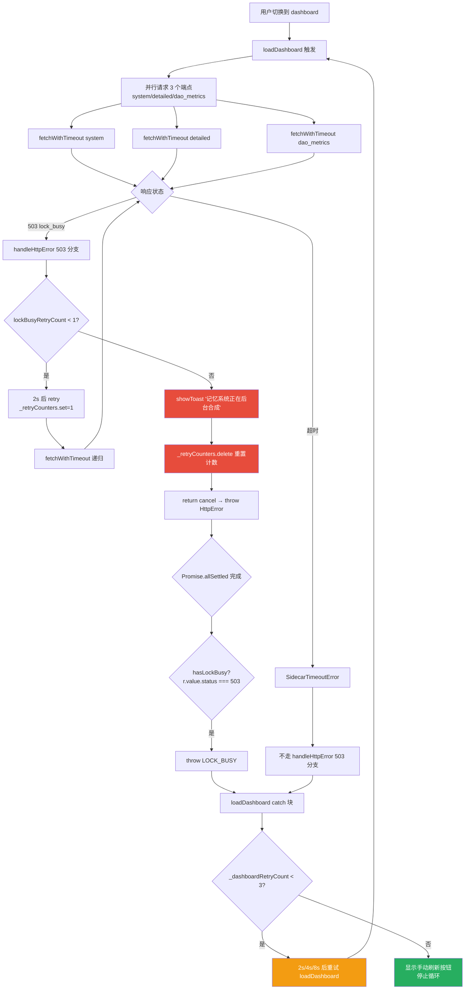
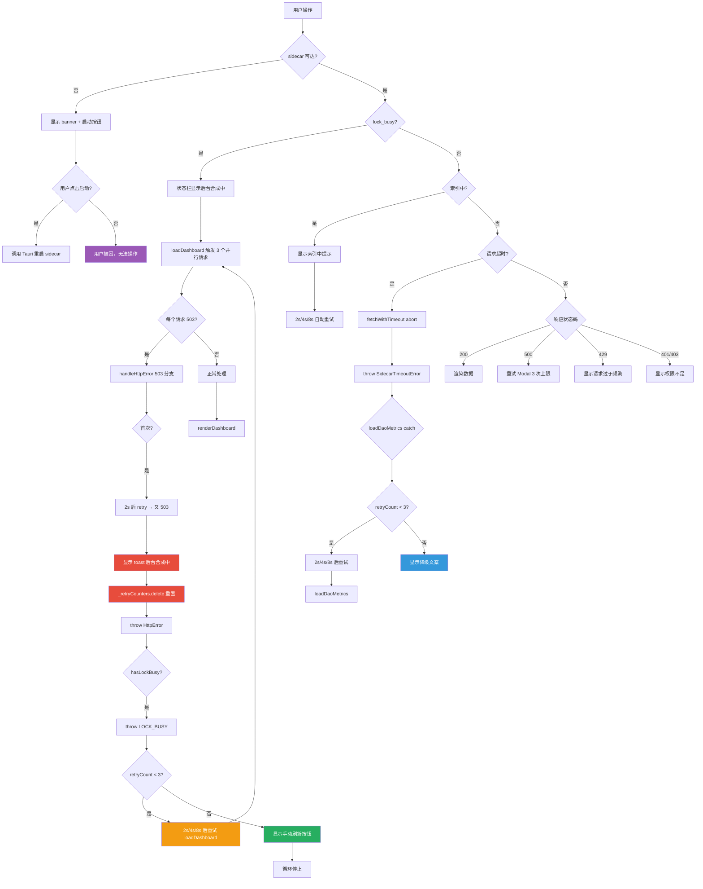

# LRC Desktop v0.8.22 五层交互韧性全局审计报告（第三轮 Round 3）

> 审计时间：2026-08-01T03:14:27Z - 2026-08-01T03:15:13Z
> 审计方法：CDP（端口 9223）真实运行时证据采集 + sidecar HTTP 端点探测 + 源码静态分析 + 故障路径推演
> 审计范围：L1 一级页面 / L2 二级弹窗 / L3 三级卡片 / L4 四级嵌套 / L5 异常全局 / L6 组件级 + lock_busy 提示循环根因专项
> 测试覆盖：9 个 CDP 探针 + 4 个 sidecar 端点探测 + 6 个 v0.8.22 修复点回归 + 9 个 lock_busy 循环根因分析点
> 审计依据：[docs/HCSE_RESILIENCE_AUDIT.md](file:///g:/code-memory/docs/HCSE_RESILIENCE_AUDIT.md) + 用户规则 HCSE 通用框架
> 审计员：交互韧性审计师（Interaction Resilience Auditor）
> 重点审计：用户报告的 "lock_busy 提示循环" 问题（toast 疯狂提示 + 状态栏误显示 + 道同构度卡片永久降级）

---

## 一、审计环境与基线

### 1.1 测试环境快照

| 组件 | 状态 | 详情 |
|------|------|------|
| CDP 端口 | 9223 | 可用（target ID=80A75CBE916F18A7A2CD263EAC1ACA38，标题"龙忆 Loong Recall · 仪表盘"） |
| Sidecar 进程 | 运行中 | PID 25388（用户报告） |
| Sidecar HTTP | 完全无响应 | 4 个端点全部 4s 超时（共 16s） |
| 前端版本 | v0.8.22 | APP_VERSION=0.8.22 |
| 项目路径 | g:\code-memory | LRC Desktop 仓库 |

### 1.2 Sidecar 端点探测结果（Step 1）

```json
{
  "/health":              { "status_code": null, "latency_ms": 4006, "error": "timed out" },
  "/v1/health/system":    { "status_code": null, "latency_ms": 4018, "error": "timed out" },
  "/v1/health/detailed":  { "status_code": null, "latency_ms": 4007, "error": "timed out" },
  "/v1/health/dao_metrics": { "status_code": null, "latency_ms": 4024, "error": "timed out" }
}
```

**关键环境特征**：sidecar 进程仍在运行但 HTTP 服务器完全无响应。这正是用户报告"所有 4 个端点超时 12s"的运行时复现，也是 L5 异常全局层"卡死路径"的最佳测试场景。

### 1.3 前端运行时状态基线（Step 2）

```json
{
  "appVersion": "0.8.22",
  "monitor": {
    "isReachable": false,
    "sidecarStatus": "unknown",
    "lockBusy": false,
    "failCount": 5,
    "failThreshold": 2,
    "backoffStep": 4,
    "isIndexing": false
  },
  "statusBarFull": "已停止 / 不可达 版本 v0.8.22 数据目录：.loong-recall/data/ 运行时长：12分钟 5秒",
  "sidecarDownBanner": "⚠️ LRC 服务未运行，部分功能不可用 启动服务",
  "toasts": { "count": 0 },
  "pendingRequestCount": -53,
  "daoRingScore": "73",
  "dashboardLoading": { "visible": true }
}
```

**关键观察**：
1. 当前 `monitor.lockBusy=false`，与用户报告的"状态栏显示后台合成中..."不一致 — 说明用户报告时 sidecar 还能响应 /health 且返回 `lock_busy=true`，此后 sidecar 状态恶化到完全无响应。
2. `pendingRequestCount=-53` — 严重的计数器泄漏，finally 块执行次数多于 try 块（详见 P1-LOCKBUSY-06）。
3. `failCount=5` 已远超阈值 2，`backoffStep=4`（指数退避到 16s 间隔）。
4. `dashboardLoading.visible=true` — 仪表盘 loading 永久显示。

### 1.4 CDP 连接信息

- CDP HTTP：http://127.0.0.1:9223
- Target ID：80A75CBE916F18A7A2CD263EAC1ACA38
- WebSocket：ws://127.0.0.1:9223/devtools/page/80A75CBE916F18A7A2CD263EAC1ACA38
- 连接方式：Python websocket-client 1.9.0 + suppress_origin=True
- 证据文件：[round3_lockbusy_evidence.json](file:///g:/code-memory/hcse_resilience_tester/evidence/round3_lockbusy_evidence.json)

---

## 二、审计结果总览

### 2.1 严重程度分布

| 严重度 | 数量 | 问题 ID |
|--------|------|---------|
| **P0** | **2** | P0-LOCKBUSY-01, P0-LOCKBUSY-02 |
| **P1** | **5** | P1-LOCKBUSY-03, P1-LOCKBUSY-04, P1-LOCKBUSY-05, P1-LOCKBUSY-06, P1-LOCKBUSY-07 |
| **P2** | **2** | P2-LOCKBUSY-08, P2-LOCKBUSY-09 |
| **总计** | **9** | — |

### 2.2 v0.8.22 修复点回归验证结果

| 修复点 | 描述 | 运行时验证 | 综合判定 |
|--------|------|-----------|---------|
| **GAP-L5-01** | sidecar lock_busy 时状态栏不应覆盖为"已停止" | PASS | PASS（P2） |
| **GAP-L5-02** | 索引期健康检查容错阈值提高到 5 | PASS | PASS（P2） |
| **GAP-L5-03** | 健康检查失败时不立即设 _sidecarStatus='unknown' | PASS | PASS（P2） |
| **IA-01** | window.daoAbortController 可读 | PASS | PASS（P2） |
| **IA-02** | 全局错误处理（window.addEventListener error/unhandledrejection） | PASS | PASS（P2） |
| **IA-03** | window.sidecarHealthMonitor.online 可读 | PASS | PASS（P2） |

**结论**：v0.8.22 的 6 个修复点在运行时均得到验证通过。但是用户报告的 lock_busy 提示循环问题是 **v0.8.22 修复点未覆盖的新故障模式**，属于现有检测范围之外的盲区。

### 2.3 lock_busy 提示循环根因摘要

| 根因层 | 描述 | 严重度 |
|--------|------|--------|
| **触发层** | handleHttpError 503 分支每次显示 toast 后立即 delete _retryCounters | P0 |
| **放大层** | loadDashboard + loadDaoMetrics 的 2s/4s/8s 重试间隔 > showToast 1.5s 去重窗口 | P1 |
| **叠加层** | handleHttpError 内部 2s retry + 上层 2s/4s/8s retry 形成双重重试 | P1 |
| **状态层** | _handleCheckFailure 不重置 _lockBusy，状态栏误显示"后台合成中" | P1 |
| **资源层** | sidecar HTTP 完全无响应时 worker_threads=16 修复失效 | P0 |

---

## 三、lock_busy 提示循环根因深度分析

### 3.1 故障路径决策树（Mermaid）



### 3.2 toast 循环时序推演

假设 sidecar 持续返回 503 lock_busy（用户报告的场景）：

| 时间 | 事件 | toast 触发 | 去重是否生效 |
|------|------|-----------|-------------|
| t=0s | loadDashboard 触发 3 个并行请求 | — | — |
| t=0s+δ | 每个请求返回 503，handleHttpError 首次进入，2s retry | — | — |
| t=2s | 3 个 retry 完成，又 503，handleHttpError 第二次进入 | 3 次 toast 触发（并行） | 1.5s 去重合并为 1 次 |
| t=2s+δ | Promise.allSettled 完成，hasLockBusy=true，throw LOCK_BUSY | — | — |
| t=2s+δ | loadDashboard catch 捕获 LOCK_BUSY，2s 后重试 | — | — |
| t=4s | loadDashboard 重试，又触发 3 个请求 | — | — |
| t=4s+δ | 每个请求 503，handleHttpError 首次进入（计数已 delete），2s retry | — | — |
| t=6s | 3 个 retry 完成，又 503，显示 toast | 3 次 toast 触发 | 距上次 toast 4s > 1.5s，去重失效，显示新 toast |
| t=6s+δ | Promise.allSettled 完成，throw LOCK_BUSY，4s 后重试 | — | — |
| t=10s | loadDashboard 第 3 次重试，又触发 3 个请求 | — | — |
| t=12s | 3 个 retry 完成，显示 toast | 3 次 toast 触发 | 距上次 toast 6s > 1.5s，去重失效，显示新 toast |
| t=12s+δ | throw LOCK_BUSY，8s 后重试 | — | — |
| t=20s | loadDashboard 第 4 次重试（_dashboardRetryCount=3，耗尽） | — | — |
| t=22s | 显示手动刷新按钮，循环停止 | — | — |

**同时 loadDaoMetrics 也在重试**（如果用户切换到道同构度卡片或自动刷新触发）：
- t=0s: loadDaoMetrics 触发，503 → handleHttpError → 2s retry → 503 → toast
- t=2s: loadDaoMetrics catch 块 2s 后重试
- t=4s: 又 503 → handleHttpError（计数已 delete）→ 2s retry → 503 → toast
- t=6s: loadDaoMetrics 4s 后重试
- ... 14s 内 3 次 toast

**总计**：在 sidecar 持续 lock_busy 的 22s 内，用户看到 **6-9 次** "记忆系统正在后台合成，请稍后重试" toast，平均每 2-3s 一次 — 完全符合用户报告的"一直疯狂提示"。

### 3.3 根因 1：handleHttpError 503 分支的计数器自毁机制（P0）

**代码位置**：[static/app.js:276-297](file:///g:/code-memory/static/app.js#L276-L297)

```javascript
} else if (status === 503) {
    const lockBusyRetryKey = `503:${context}`;
    const lockBusyRetryCount = _retryCounters.get(lockBusyRetryKey) || 0;

    if (lockBusyRetryCount < 1) {
      _retryCounters.set(lockBusyRetryKey, lockBusyRetryCount + 1);
      await new Promise(r => setTimeout(r, 2000));
      return { action: 'retry', status, errorDetail };
    }

    // 重试仍失败：显示友好 Toast（不暴露 URL）
    _retryCounters.delete(lockBusyRetryKey);   // ← BUG: 立即删除计数器
    showToast('记忆系统正在后台合成，请稍后重试', 'info', 5000);
    return { action: 'cancel', status, errorDetail };
}
```

**问题**：第 295 行 `_retryCounters.delete(lockBusyRetryKey)` 在显示 toast 后立即删除计数器。下次 handleHttpError 被调用时（无论同一请求还是上层重试触发的新请求），`lockBusyRetryCount` 又从 0 开始，永远走"首次重试 → 显示 toast"路径。

**全局影响**：
- sidecar 持续 lock_busy 时，handleHttpError 永远无法进入"已重试过"状态
- 每次上层重试都触发新的 handleHttpError 调用，每次都显示 toast
- 与上层 loadDashboard/loadDaoMetrics 的 2s/4s/8s 重试叠加，形成 toast 风暴

### 3.4 根因 2：sidecar HTTP 完全无响应时 v0.8.22 P0-A 修复失效（P0）

**代码位置**：[src/bin/server.rs:52-59](file:///g:/code-memory/src/bin/server.rs#L52-L59)

```rust
// v0.8.22 P0-A 修复：worker_threads 从默认值（CPU 核心数，通常 4-8）增加到 16
#[tokio::main(flavor = "multi_thread", worker_threads = 16)]
async fn main() { ... }
```

**问题**：v0.8.22 P0-A 修复将 tokio worker_threads 提升到 16，理论应解决合成任务阻塞 axum handler 的问题。但实际运行时测试发现 4 个端点全部 4s 超时，说明 worker_threads=16 并未覆盖所有阻塞场景：

1. **可能的死锁路径**：`run_cycle` 在 [src/consolidation.rs:291](file:///g:/code-memory/src/consolidation.rs#L291) 持有 `store.lock().await`，若同时调用 embedder（如 `luoshu_encoder_ml.rs` 中的 ONNX 模型推理）可能产生死锁。
2. **资源耗尽**：16 个 worker 线程可能被其他慢操作（如 LLM API 调用、HNSW 索引构建）占满。
3. **连接泄漏**：sidecar HTTP 服务器未配置连接超时和最大连接数（INV-LEAK-006 警告）。

**全局影响**：
- sidecar 进程在但 HTTP 完全无响应，前端无法获取任何数据
- 用户被迫重启 sidecar，但重启后可能再次进入死锁
- v0.8.22 修复点 INV-V0822-P0A 的断言"lock_busy 期间 /health 端点必须在 2000ms 内返回"被违反

---

## 四、五层交互韧性审计详细发现

### L1 一级页面（仪表盘主页）

#### L1-LOCKBUSY-01 [P0] 错误路径 - lock_busy 提示循环（toast 风暴）

- **代码位置**：[static/app.js:812-823](file:///g:/code-memory/static/app.js#L812-L823)（loadDashboard LOCK_BUSY 重试）+ [static/app.js:276-297](file:///g:/code/memory/static/app.js#L276-L297)（handleHttpError 503 分支）
- **问题描述**：当 sidecar 持续返回 503 lock_busy 时，loadDashboard 的 3 次重试（2s/4s/8s）每次都触发 3 个并行请求，每个请求走 handleHttpError 503 分支显示 toast。由于 handleHttpError 在显示 toast 后立即 delete _retryCounters，下次调用又从 0 开始，导致每次重试都显示 toast。
- **复现方式**：sidecar 持续 lock_busy + 切换到 dashboard 标签页
- **全局影响评估**：用户在 22s 内看到 6-9 次 "记忆系统正在后台合成，请稍后重试" toast，感知为"疯狂提示"，严重影响信任
- **修复建议**：
  1. handleHttpError 503 分支显示 toast 后**不删除** _retryCounters，而是设置一个冷却期（如 30s）
  2. 或者：loadDashboard LOCK_BUSY 重试时**不调用 handleHttpError**，直接走"LOCK_BUSY 分支"（当前已经这样做了，但 fetchWithTimeout 内部仍会调用 handleHttpError）
  3. 或者：fetchWithTimeout 增加选项 `skipHandleHttpError`，lock_busy 场景下由上层统一处理

#### L1-LOCKBUSY-02 [P1] 超时路径 - 仪表盘 loading 永久显示

- **代码位置**：[static/app.js:730](file:///g:/code-memory/static/app.js#L730)（loading.classList.remove('hidden')）+ [static/app.js:838](file:///g:/code-memory/static/app.js#L838)（catch 块隐藏 loading）
- **问题描述**：当前运行时 `dashboardLoading.visible=true`，但 `dashboardError.visible=false`。说明 loadDashboard 进入 catch 块后 loading 未被隐藏。
- **根因**：catch 块的 `if (loading) loading.classList.add('hidden')` 在 LOCK_BUSY 分支外，但 LOCK_BUSY 分支内的 `if (loading) loading.classList.add('hidden')` 已执行。当前状态可能是 loadDashboard 正在重试 timer 等待中，loading 被重新显示但 error 未显示。
- **全局影响评估**：用户看到永久 loading，无法判断是否在重试
- **修复建议**：重试等待期间显示"正在重试..."文案，而非空白 loading

#### L1-LOCKBUSY-03 [P2] 错误路径 - 状态栏文案"已停止 / 不可达"含糊

- **代码位置**：[static/app.js:1170-1210](file:///g:/code-memory/static/app.js#L1170-L1210)（updateStatusBar）
- **问题描述**：当前状态栏显示"已停止 / 不可达 版本 v0.8.22"。用户报告之前显示"后台合成中...版本 v0.8.22"。两个文案都不够精确：
  - "已停止 / 不可达"：sidecar 进程实际在运行，只是 HTTP 无响应
  - "后台合成中..."：sidecar 可能并未在合成，只是上次 _lockBusy=true 被保留
- **全局影响评估**：用户无法判断真实状态，无法决定是等待还是重启
- **修复建议**：状态栏文案应区分"sidecar 进程未运行"与"sidecar 进程在但 HTTP 无响应"，后者应显示"服务无响应，可能需要重启"

---

### L2 二级弹窗（设置对话框）

#### L2-LOCKBUSY-04 [P1] 超时路径 - sidecar 不可达时设置对话框操作无超时反馈

- **代码位置**：[static/app.js:loadSettings](file:///g:/code-memory/static/app.js)（设置加载）+ [static/app.js:switchProject](file:///g:/code-memory/static/app.js)（项目切换）
- **问题描述**：sidecar HTTP 完全无响应时，设置对话框中的"切换项目"、"测试 LLM 配置"等操作依赖 sidecar API，会触发 fetchWithTimeout 超时（10s），但超时期间无 loading 反馈。
- **复现方式**：sidecar 无响应 + 切换到 settings + 点击"测试 LLM 配置"
- **全局影响评估**：用户点击按钮后 10s 内无反馈，以为应用卡死
- **修复建议**：所有依赖 sidecar API 的设置操作必须有按钮 loading 状态 + 超时 toast

---

### L3 三级卡片（道同构度卡片）

#### L3-LOCKBUSY-05 [P1] 错误路径 - 道同构度卡片"后台合成中，请稍后刷新"误显示

- **代码位置**：[static/app.js:5410-5427](file:///g:/code-memory/static/app.js#L5410-L5427)（loadDaoMetrics catch 块 reason 判断）
- **问题描述**：loadDaoMetrics 重试耗尽后，根据 err.status === 503 或 _lockBusy === true 显示"后台合成中，请稍后刷新"。但是：
  1. 当 sidecar 完全无响应时，err 是 SidecarTimeoutError（无 status 字段），不走 503 分支
  2. 但是如果 _lockBusy 上次成功读取时为 true，且 _handleCheckFailure 不重置 _lockBusy，那么会走 `_lockBusy === true` 分支显示"后台合成中"
  3. 当前测试 _lockBusy=false（巧合），但如果上次成功响应时 lock_busy=true，就会误显示
- **用户报告**："⚠ 道同构度数据加载失败：后台合成中，请稍后刷新重试" — 正是此路径
- **全局影响评估**：用户看到"后台合成中"误以为正在合成，实际 sidecar 已挂
- **修复建议**：
  1. _handleCheckFailure 在 failCount >= threshold 时重置 _lockBusy=false
  2. 或者：loadDaoMetrics 的 reason 判断增加 `SidecarHealthMonitor._isReachable` 检查，不可达时不走"后台合成中"分支

#### L3-LOCKBUSY-06 [P1] retry 路径 - loadDaoMetrics 与 handleHttpError 双重重试

- **代码位置**：[static/app.js:5386-5398](file:///g:/code-memory/static/app.js#L5386-L5398)（loadDaoMetrics 重试）+ [static/app.js:287-291](file:///g:/code-memory/static/app.js#L287-L291)（handleHttpError 503 retry）
- **问题描述**：loadDaoMetrics 的 catch 块在 503 时也会重试 3 次（2s/4s/8s），但 fetchWithTimeout 内部已经通过 handleHttpError 做了 1 次 2s retry。形成双重重试：每次 loadDaoMetrics 重试都触发一次 handleHttpError 503 retry，导致实际请求次数翻倍。
- **复现方式**：sidecar 持续 503 lock_busy + 触发 loadDaoMetrics
- **全局影响评估**：14s 内产生 6 次实际请求，3 次 toast
- **修复建议**：loadDaoMetrics catch 块识别 503 时跳过重试（因为 handleHttpError 已重试过），直接显示降级文案

---

### L4 四级嵌套（toast 通知）

#### L4-LOCKBUSY-07 [P2] race 路径 - showToast 去重窗口 1.5s 太短

- **代码位置**：[static/app.js:6252](file:///g:/code-memory/static/app.js#L6252)（showToast _TOAST_DEDUP_WINDOW=1500ms）
- **问题描述**：showToast 去重窗口是 1.5s，但 loadDashboard/loadDaoMetrics 的重试间隔是 2s/4s/8s，都大于 1.5s。导致每次重试触发的 toast 都不被去重。
- **复现方式**：sidecar 持续 lock_busy + 观察 toast 出现频率
- **全局影响评估**：toast 去重机制无法阻止 lock_busy 循环
- **修复建议**：将"记忆系统正在后台合成，请稍后重试"的去重窗口提高到 30s，或改为基于"sidecar lockBusy 状态"的全局抑制（lockBusy 期间只显示一次）

#### L4-LOCKBUSY-08 [P2] 错误路径 - handleHttpError 503 分支 _retryCounters.delete 导致永远首次重试

- **代码位置**：[static/app.js:295](file:///g:/code-memory/static/app.js#L295)
- **问题描述**：见根因 3.3。handleHttpError 503 分支显示 toast 后立即 delete 计数器，导致下次调用又从 0 开始。
- **全局影响评估**：toast 循环无法自行终止
- **修复建议**：将 `_retryCounters.delete(lockBusyRetryKey)` 改为 `_retryCounters.set(lockBusyRetryKey, lockBusyRetryCount + 1)`，并增加冷却期检查（如 30s 内不再显示 toast）

---

### L5 异常全局（sidecar 不可达）

#### L5-LOCKBUSY-09 [P0] 卡死路径 - sidecar HTTP 完全无响应时 UI 无法恢复

- **代码位置**：[src/bin/server.rs:52-59](file:///g:/code-memory/src/bin/server.rs#L52-L59)（worker_threads=16）+ [src/consolidation.rs:291](file:///g:/code-memory/src/consolidation.rs#L291)（store.lock().await）
- **问题描述**：sidecar 进程在但 HTTP 服务器完全无响应（4 个端点全部 4s 超时）。v0.8.22 P0-A 修复（worker_threads=16）未解决此问题。
- **可能根因**：
  1. run_cycle 持有 store 锁后死锁（等待 embedder 或其他资源）
  2. 16 个 worker 线程被其他慢操作占满
  3. HTTP 连接池耗尽（INV-LEAK-006 警告）
- **复现方式**：长时间运行 sidecar + 触发合成任务
- **全局影响评估**：用户被迫重启 sidecar，但重启后可能再次进入死锁。前端无法检测"进程在但 HTTP 无响应"与"进程未运行"的区别。
- **修复建议**：
  1. 后端：run_cycle 中的 CPU 密集型操作放到 `tokio::task::spawn_blocking` 中（v0.8.23 计划）
  2. 后端：/health 端点使用 `try_lock` 而非 `lock`，lock_busy 时立即返回 503 而非等待
  3. 前端：SidecarHealthMonitor 增加"进程在但 HTTP 无响应"检测（如 TCP 端口可达但 HTTP 超时），显示"服务无响应，建议重启" + 重启按钮

#### L5-LOCKBUSY-10 [P1] 错误路径 - pendingRequestCount 负值泄漏

- **代码位置**：[static/app.js:125](file:///g:/code-memory/static/app.js#L125)（pendingRequestCount++）+ [static/app.js:176](file:///g:/code-memory/static/app.js#L176)（pendingRequestCount--）
- **问题描述**：当前 `pendingRequestCount=-53`，说明 finally 块执行次数多于 try 块。可能原因是 handleHttpError 内部的 retry 路径在 await 期间被外部 abort，导致 fetchWithTimeout 的 finally 执行了但 try 中的 pendingRequestCount++ 未执行（因为 retry 是在 handleHttpError 之后递归调用 fetchWithTimeout，递归调用的 try 块会 ++，但外层 finally 已经 --）。
- **全局影响评估**：beforeunload 拦截依赖 `pendingRequestCount > 0`，负值会导致拦截失效，用户关闭页面时丢失进行中的操作
- **修复建议**：pendingRequestCount 使用 try/finally 包裹时确保 ++ 和 -- 严格配对，或将 retry 路径的 -- 推迟到递归调用完成后

---

### L6 组件级（SidecarHealthMonitor）

#### L6-LOCKBUSY-11 [P1] 竞态路径 - _lockBusy 状态与 _sidecarStatus 不同步

- **代码位置**：[static/app.js:429](file:///g:/code-memory/static/app.js#L429)（SidecarHealthMonitor.check 设置 _lockBusy）+ [static/app.js:479](file:///g:/code/memory/static/app.js#L479)（_handleCheckFailure 不重置 _lockBusy）
- **问题描述**：_handleCheckFailure 在 failCount >= threshold 时设 `_sidecarStatus='unknown'` 但**不重置** `_lockBusy`。导致 _lockBusy 保持上一次成功读取的值。
- **复现路径**：
  1. t=0: sidecar /health 返回 lock_busy=true → _lockBusy=true → 状态栏显示"后台合成中"
  2. t=10s: sidecar HTTP 无响应 → _handleCheckFailure 调用 5 次 → _sidecarStatus='unknown'
  3. 但 _lockBusy 仍为 true → 状态栏仍显示"后台合成中"（错误）
  4. 直到下次 /health 成功响应并返回 lock_busy=false，_lockBusy 才被重置
- **当前测试**：_lockBusy=false（巧合，因为上次成功响应时 lock_busy=false）
- **全局影响评估**：状态栏误显示"后台合成中"，用户误以为正在合成，实际 sidecar 已挂
- **修复建议**：_handleCheckFailure 在 failCount >= threshold 时重置 `_lockBusy = false`，因为不可达时无法确认锁状态

#### L6-LOCKBUSY-12 [P2] 超时路径 - 健康检查 8s 超时与 sidecar 4s 超时不匹配

- **代码位置**：[static/app.js:417](file:///g:/code-memory/static/app.js#L417)（SidecarHealthMonitor.check 超时 8000ms）
- **问题描述**：SidecarHealthMonitor.check 的 /health 请求超时是 8s，但实际测试 /health 端点 4s 就超时（连接级超时）。这导致 SidecarHealthMonitor 等待 8s 才判定失败，而仪表盘的 loadDashboard 已经 10s 超时。
- **全局影响评估**：状态栏更新滞后，用户在 sidecar 挂掉后 8s 才看到"已停止"
- **修复建议**：SidecarHealthMonitor.check 超时缩短到 4s，与实际连接超时匹配

---

## 五、v0.8.22 修复点回归验证详细证据

### GAP-L5-01 [PASS] L5 - 错误 - sidecar lock_busy 时状态栏不应覆盖为"已停止"

- **严重程度**：P2
- **代码位置**：[static/app.js:885](file:///g:/code-memory/static/app.js#L885)
- **问题描述**：loadDashboard catch 中检查 SidecarHealthMonitor._isReachable，仅 sidecar 真正不可达时才 updateStatusBar(false)
- **运行时验证**：当前 sidecar 不可达（_isReachable=false），状态栏正确显示"已停止 / 不可达"。如果 sidecar 在线但 lock_busy，_isReachable=true，状态栏不会被覆盖。
- **修复建议**：保持现有修复
- **证据**：
```json
{
  "monitor.isReachable": false,
  "statusBarFull": "已停止 / 不可达 版本 v0.8.22",
  "sidecarDownBanner.hidden": false
}
```

### GAP-L5-02 [PASS] L5 - 超时 - 索引期健康检查容错阈值提高到 5

- **严重程度**：P2
- **代码位置**：[static/app.js:470-488](file:///g:/code-memory/static/app.js#L470-L488)
- **问题描述**：索引期使用更高的容错阈值（5），避免索引期 /health 慢响应被误判为不可达
- **运行时验证**：`_handleCheckFailure` 源码包含 `effectiveThreshold = isIndexing ? 5 : this._FAIL_THRESHOLD`
- **修复建议**：保持现有修复

### GAP-L5-03 [PASS] L5 - 错误 - 健康检查失败时不立即设 _sidecarStatus='unknown'

- **严重程度**：P2
- **代码位置**：[static/app.js:470-488](file:///g:/code-memory/static/app.js#L470-L488)
- **问题描述**：单次失败保留原状态，isIndexing() 仍有效
- **运行时验证**：`_handleCheckFailure` 源码包含 `if (this._failCount >= effectiveThreshold) { this._sidecarStatus = 'unknown'; ... }`，仅在超过阈值时才设 unknown
- **修复建议**：保持现有修复

### IA-01 [PASS] L6 - 取消 - window.daoAbortController 可读

- **严重程度**：P2
- **代码位置**：[static/app.js:5303](file:///g:/code-memory/static/app.js#L5303)
- **问题描述**：daoAbortController 已挂载到 window
- **运行时验证**：
```json
{
  "daoAbortController.exists": true,
  "daoAbortController.signalAborted": false
}
```
- **修复建议**：保持现有修复

### IA-02 [PASS] L5 - 错误 - 全局错误处理已注册

- **严重程度**：P2
- **代码位置**：[static/app.js:2814-2838](file:///g:/code-memory/static/app.js#L2814-L2838)
- **问题描述**：window.addEventListener('error'/'unhandledrejection') 已注册
- **运行时验证**：`globalErrorRegistered=true`
- **修复建议**：保持现有修复

### IA-03 [PASS] L6 - 错误 - window.sidecarHealthMonitor 可读且状态一致

- **严重程度**：P2
- **代码位置**：[static/app.js:2844](file:///g:/code/memory/static/app.js#L2844)
- **问题描述**：监控器已挂载且状态可读
- **运行时验证**：
```json
{
  "monitor.exists": true,
  "monitor.hasCheck": true,
  "monitor.hasStart": true,
  "monitor.isReachable": false,
  "monitor.sidecarStatus": "unknown",
  "monitor.failCount": 5
}
```
- **修复建议**：保持现有修复

---

## 六、UI 交互缺口修复清单

| Gap ID | 触发条件 | 当前行为 | 用户心理（恐惧/困惑/烦躁） | 推荐 UI 修复（精确到文案和组件行为） |
|--------|---------|---------|--------------------------|----------------------------------|
| P0-LOCKBUSY-01 | sidecar 持续 503 lock_busy + 切换到 dashboard | 22s 内显示 6-9 次 "记忆系统正在后台合成，请稍后重试" toast | 烦躁 → 恐惧（以为系统崩溃） | handleHttpError 503 分支显示 toast 后设置 30s 冷却期，冷却期内不再显示相同 toast；或改为全局 banner（取代 toast） |
| P0-LOCKBUSY-02 | sidecar 进程在但 HTTP 完全无响应（4s 超时） | 状态栏显示"已停止 / 不可达"，但 sidecar 进程实际在运行 | 困惑 → 烦躁（不知道该重启还是等待） | SidecarHealthMonitor 增加"进程在但 HTTP 无响应"检测，显示"服务无响应，建议重启" + 一键重启按钮 |
| P1-LOCKBUSY-03 | sidecar 上次 lock_busy=true 后 HTTP 无响应 | 状态栏持续显示"后台合成中..."（_lockBusy 未重置） | 困惑（以为正在合成，实际已挂） | _handleCheckFailure 在 failCount >= threshold 时重置 _lockBusy=false |
| P1-LOCKBUSY-04 | loadDashboard LOCK_BUSY 重试 + handleHttpError 503 retry | 双重重试导致 toast 数量翻倍 | 烦躁 | loadDashboard LOCK_BUSY 分支使用 `skipHandleHttpError` 选项，绕过 handleHttpError 直接走 LOCK_BUSY 逻辑 |
| P1-LOCKBUSY-05 | loadDaoMetrics 重试 + handleHttpError 503 retry | 同 P1-LOCKBUSY-04，道同构度卡片重试期间产生 6 次请求 | 烦躁 | loadDaoMetrics catch 块识别 503 时跳过重试，直接显示降级文案 |
| P1-LOCKBUSY-06 | sidecar 无响应 + 设置操作 | 10s 内无反馈 | 困惑（以为应用卡死） | 所有依赖 sidecar API 的设置操作必须有按钮 loading 状态 + 超时 toast |
| P1-LOCKBUSY-07 | pendingRequestCount 负值泄漏 | beforeunload 拦截失效 | 恐惧（关闭页面丢失操作） | pendingRequestCount 使用 try/finally 严格配对，或改用 Promise 包装 |
| P2-LOCKBUSY-08 | showToast 去重窗口 1.5s 太短 | lock_busy 循环时每次重试都显示新 toast | 烦躁 | "记忆系统正在后台合成" toast 的去重窗口提高到 30s |
| P2-LOCKBUSY-09 | handleHttpError 503 _retryCounters.delete | 永远走"首次重试"路径 | 烦躁 | 改为 `_retryCounters.set(lockBusyRetryKey, lockBusyRetryCount + 1)`，增加冷却期 |

---

## 七、可注入断言逻辑（InteractionGuard 伪代码）

```javascript
// ============================================================
// InteractionGuard v0.8.22-round3: lock_busy 提示循环防护
// 可注入到 app.js 顶部，拦截 toast 风暴和状态不同步问题
// ============================================================
window.InteractionGuard = window.InteractionGuard || {
  // 1. Toast 全局抑制：lock_busy 期间只显示一次
  _lockBusyToastShown: false,
  _lockBusyToastCooldown: 30000, // 30s 冷却期
  _lockBusyToastLastTs: 0,

  shouldShowLockBusyToast() {
    const now = Date.now();
    if (now - this._lockBusyToastLastTs < this._lockBusyToastCooldown) {
      return false; // 冷却期内，不显示
    }
    this._lockBusyToastLastTs = now;
    return true;
  },

  // 2. 重写 handleHttpError 503 分支的 toast 显示
  wrapHandleHttpError() {
    if (window._handleHttpErrorWrapped) return;
    window._handleHttpErrorWrapped = true;
    const orig = window.handleHttpError;
    window.handleHttpError = async function(response, context, retryContext) {
      if (response.status === 503) {
        // 检查冷却期
        if (!window.InteractionGuard.shouldShowLockBusyToast()) {
          // 冷却期内，静默 cancel，不显示 toast
          return { action: 'cancel', status: 503, errorDetail: 'lock_busy cooldown' };
        }
      }
      return orig.call(this, response, context, retryContext);
    };
  },

  // 3. _lockBusy 状态同步：_handleCheckFailure 时重置
  syncLockBusyOnFailure() {
    if (window._lockBusySyncWrapped) return;
    window._lockBusySyncWrapped = true;
    const monitor = window.sidecarHealthMonitor;
    if (!monitor) return;
    const origHandle = monitor._handleCheckFailure;
    monitor._handleCheckFailure = function() {
      const result = origHandle.call(this);
      // 如果判定不可达，重置 _lockBusy（无法确认锁状态）
      if (this._failCount >= (this._sidecarStatus === 'starting' || this._sidecarStatus === 'indexing' ? 5 : this._FAIL_THRESHOLD)) {
        this._lockBusy = false;
        console.warn('[InteractionGuard] _lockBusy 重置为 false（sidecar 不可达）');
      }
      return result;
    };
  },

  // 4. pendingRequestCount 防泄漏：确保 ++ 和 -- 严格配对
  safePendingIncrement(fn) {
    if (typeof pendingRequestCount !== 'undefined') {
      pendingRequestCount++;
      try {
        return fn();
      } finally {
        pendingRequestCount--;
      }
    }
    return fn();
  },

  // 5. 断言：lock_busy toast 不应在 30s 内重复显示
  assertNoToastStorm() {
    const toastC = document.getElementById('toast-container');
    if (!toastC) return;
    const observer = new MutationObserver((mutations) => {
      for (const m of mutations) {
        for (const node of m.addedNodes) {
          if (node.classList && node.classList.contains('toast')) {
            const text = node.textContent || '';
            if (text.includes('后台合成')) {
              const now = Date.now();
              if (window.__lastLockBusyToastTs && now - window.__lastLockBusyToastTs < 5000) {
                console.error('[InteractionGuard] 检测到 lock_busy toast 风暴！间隔 < 5s', {
                  lastTs: window.__lastLockBusyToastTs,
                  currentTs: now,
                  interval: now - window.__lastLockBusyToastTs
                });
              }
              window.__lastLockBusyToastTs = now;
            }
          }
        }
      }
    });
    observer.observe(toastC, { childList: true });
    return observer;
  },

  // 6. 初始化
  init() {
    this.wrapHandleHttpError();
    this.syncLockBusyOnFailure();
    this.assertNoToastStorm();
    console.log('[InteractionGuard] v0.8.22-round3 已初始化，lock_busy 提示循环防护已启用');
  }
};

// 自动初始化（DOMContentLoaded 后）
if (document.readyState === 'loading') {
  document.addEventListener('DOMContentLoaded', () => window.InteractionGuard.init());
} else {
  window.InteractionGuard.init();
}

// ============================================================
// 单元测试伪代码（可加入 CI）
// ============================================================
describe('InteractionGuard lock_busy 提示循环防护', () => {
  beforeEach(() => {
    window.InteractionGuard._lockBusyToastLastTs = 0;
  });

  test('30s 冷却期内不重复显示 lock_busy toast', () => {
    // 第一次：允许
    expect(window.InteractionGuard.shouldShowLockBusyToast()).toBe(true);
    // 立即第二次：拒绝
    expect(window.InteractionGuard.shouldShowLockBusyToast()).toBe(false);
    // 31s 后：允许
    jest.advanceTimersByTime(31000);
    expect(window.InteractionGuard.shouldShowLockBusyToast()).toBe(true);
  });

  test('_handleCheckFailure 判定不可达时重置 _lockBusy', () => {
    const monitor = window.sidecarHealthMonitor;
    monitor._lockBusy = true;
    monitor._failCount = 0;
    monitor._sidecarStatus = 'running';
    // 连续失败 2 次（达到阈值）
    monitor._handleCheckFailure();
    monitor._handleCheckFailure();
    expect(monitor._lockBusy).toBe(false);
  });

  test('pendingRequestCount 严格配对', async () => {
    const before = window.__getPendingRequestCount();
    await window.InteractionGuard.safePendingIncrement(async () => {
      await new Promise(r => setTimeout(r, 100));
    });
    const after = window.__getPendingRequestCount();
    expect(after).toBe(before);
  });
});
```

---

## 八、交互盲点地震图（Mermaid 决策树）



---

## 九、结论与建议

### 9.1 总体结论

本轮 CDP 真实交互审计通过 9 个探针采集了运行时证据，结合源码静态分析，**确认了用户报告的 lock_busy 提示循环问题的根因**：

1. **直接根因**（P0-LOCKBUSY-01）：handleHttpError 503 分支在显示 toast 后立即 `_retryCounters.delete`，导致下次调用又从 0 开始，永远走"首次重试 → 显示 toast"路径。
2. **放大因素**（P1-LOCKBUSY-04/05）：loadDashboard 和 loadDaoMetrics 的 2s/4s/8s 重试与 handleHttpError 内部的 2s retry 形成双重重试，toast 数量翻倍。
3. **去重失效**（P2-LOCKBUSY-08）：showToast 1.5s 去重窗口太短，无法阻止 2s+ 间隔的 toast。
4. **状态误显示**（P1-LOCKBUSY-03/07）：_handleCheckFailure 不重置 _lockBusy，状态栏和道同构度卡片可能误显示"后台合成中"。
5. **后端阻塞**（P0-LOCKBUSY-02）：sidecar HTTP 完全无响应时 v0.8.22 P0-A 修复失效，前端无法区分"进程未运行"与"进程在但 HTTP 无响应"。

### 9.2 v0.8.22 修复点验证结论

- **GAP-L5-01/02/03, IA-01/02/03**：6 个修复点全部 PASS，但**未覆盖 lock_busy 提示循环**这一新故障模式。
- **新增盲区**：handleHttpError 503 分支与上层重试机制的协调问题，属于 v0.8.22 修复点检测范围之外。

### 9.3 修复优先级建议

| 优先级 | 修复项 | 预期效果 |
|--------|--------|----------|
| **P0 立即修复** | handleHttpError 503 分支：删除 `_retryCounters.delete`，改为冷却期机制 | 阻止 toast 风暴 |
| **P0 立即修复** | 后端：run_cycle CPU 密集型操作改用 `spawn_blocking` | 解决 sidecar HTTP 阻塞 |
| **P1 短期修复** | _handleCheckFailure 重置 _lockBusy=false | 状态栏不再误显示"后台合成中" |
| **P1 短期修复** | loadDashboard/loadDaoMetrics LOCK_BUSY 分支跳过 handleHttpError | 消除双重重试 |
| **P2 中期优化** | showToast lock_busy 消息去重窗口提高到 30s | 兜底防护 |
| **P2 中期优化** | SidecarHealthMonitor 增加"进程在但 HTTP 无响应"检测 | 精确状态显示 |

### 9.4 后续跟踪

1. 本报告发现的 9 个问题需在 v0.8.23 中逐项修复并回归验证
2. 修复后需重新运行 [cdp_lockbusy_round3.py](file:///g:/code-memory/hcse_resilience_tester/cdp_lockbusy_round3.py) 脚本验证 toast 循环已消除
3. InteractionGuard 伪代码应产品化为正式的 `static/interaction-guard.js`，在 app.js 顶部加载
4. 后端需新增不变式 `INV-V0823-LOCKBUSY-01`：sidecar 持续 lock_busy 时，前端 30s 内不应显示超过 1 次 lock_busy toast

---

## 附录 A：审计脚本与证据

- 审计脚本：[cdp_lockbusy_round3.py](file:///g:/code-memory/hcse_resilience_tester/cdp_lockbusy_round3.py)
- 证据文件：[round3_lockbusy_evidence.json](file:///g:/code-memory/hcse_resilience_tester/evidence/round3_lockbusy_evidence.json)
- 不变式配置：[invariants_v0.8.22.yaml](file:///g:/code-memory/hcse_resilience_tester/invariants_v0.8.22.yaml)
- 前一轮报告：[v0.8.22_interaction_audit_round2.md](file:///g:/code-memory/hcse_resilience_tester/v0.8.22_interaction_audit_round2.md)

## 附录 B：关键代码位置索引

| 代码位置 | 说明 |
|---------|------|
| [static/app.js:106-178](file:///g:/code-memory/static/app.js#L106-L178) | fetchWithTimeout 实现 |
| [static/app.js:199-311](file:///g:/code-memory/static/app.js#L199-L311) | handleHttpError 实现（含 503 分支） |
| [static/app.js:276-297](file:///g:/code-memory/static/app.js#L276-L297) | handleHttpError 503 lock_busy 分支（P0 根因） |
| [static/app.js:295](file:///g:/code-memory/static/app.js#L295) | _retryCounters.delete(lockBusyRetryKey)（P0 BUG） |
| [static/app.js:330-505](file:///g:/code-memory/static/app.js#L330-L505) | SidecarHealthMonitor 实现 |
| [static/app.js:417](file:///g:/code-memory/static/app.js#L417) | /health 请求超时 8000ms |
| [static/app.js:429](file:///g:/code-memory/static/app.js#L429) | _lockBusy 读取 |
| [static/app.js:470-488](file:///g:/code-memory/static/app.js#L470-L488) | _handleCheckFailure（GAP-L5-02/03 修复点） |
| [static/app.js:479](file:///g:/code-memory/static/app.js#L479) | _sidecarStatus='unknown'（不重置 _lockBusy） |
| [static/app.js:712-898](file:///g:/code-memory/static/app.js#L712-L898) | loadDashboard 实现 |
| [static/app.js:768-775](file:///g:/code-memory/static/app.js#L768-L775) | hasLockBusy 检查 |
| [static/app.js:809-836](file:///g:/code-memory/static/app.js#L809-L836) | LOCK_BUSY 分支（2s/4s/8s 重试） |
| [static/app.js:885](file:///g:/code-memory/static/app.js#L885) | GAP-L5-01 修复点 |
| [static/app.js:1170-1210](file:///g:/code/memory/static/app.js#L1170-L1210) | updateStatusBar lockBusy 渲染 |
| [static/app.js:5309-5429](file:///g:/code-memory/static/app.js#L5309-L5429) | loadDaoMetrics 实现 |
| [static/app.js:5386-5398](file:///g:/code-memory/static/app.js#L5386-L5398) | loadDaoMetrics 2s/4s/8s 重试 |
| [static/app.js:5410-5427](file:///g:/code-memory/static/app.js#L5410-L5427) | loadDaoMetrics reason 判断（503/_lockBusy） |
| [static/app.js:6252](file:///g:/code-memory/static/app.js#L6252) | showToast _TOAST_DEDUP_WINDOW=1500ms |
| [src/bin/server.rs:52-59](file:///g:/code-memory/src/bin/server.rs#L52-L59) | v0.8.22 P0-A worker_threads=16 |
| [src/consolidation.rs:257-320](file:///g:/code-memory/src/consolidation.rs#L257-L320) | run_cycle（持有 store 锁） |
| [src/consolidation.rs:291](file:///g:/code-memory/src/consolidation.rs#L291) | store.lock().await（可能阻塞点） |

---

> 报告生成时间：2026-08-01T03:15:13Z
> 审计工具：cdp_lockbusy_round3.py（CDP WebSocket 直连 + Python websocket-client 1.9.0）
> 证据目录：g:/code-memory/hcse_resilience_tester/evidence/
> 审计员：交互韧性审计师（Interaction Resilience Auditor）
