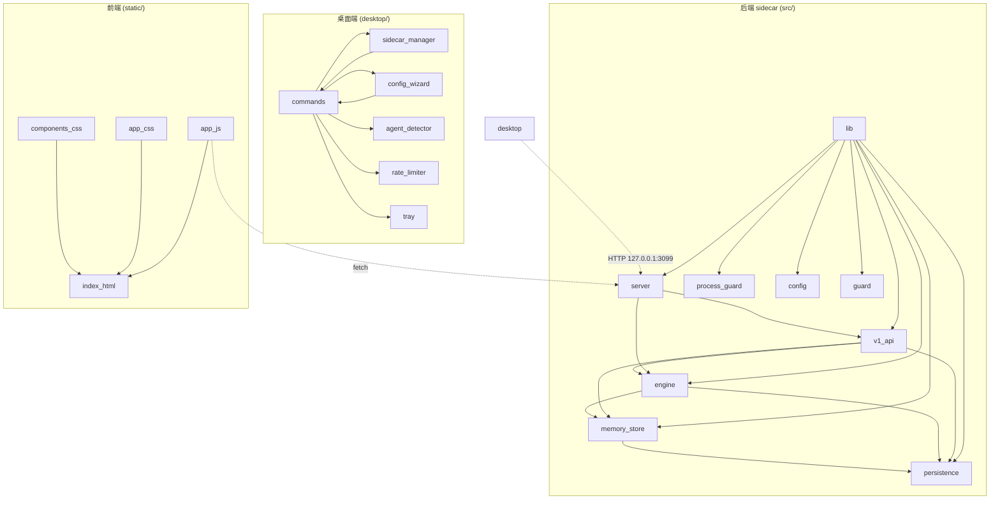
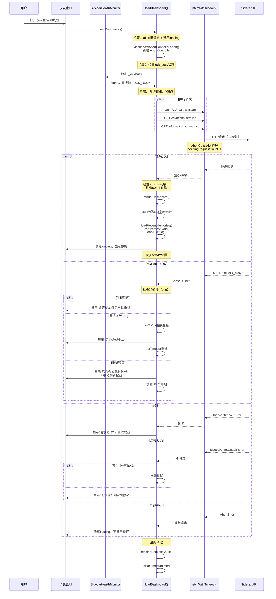
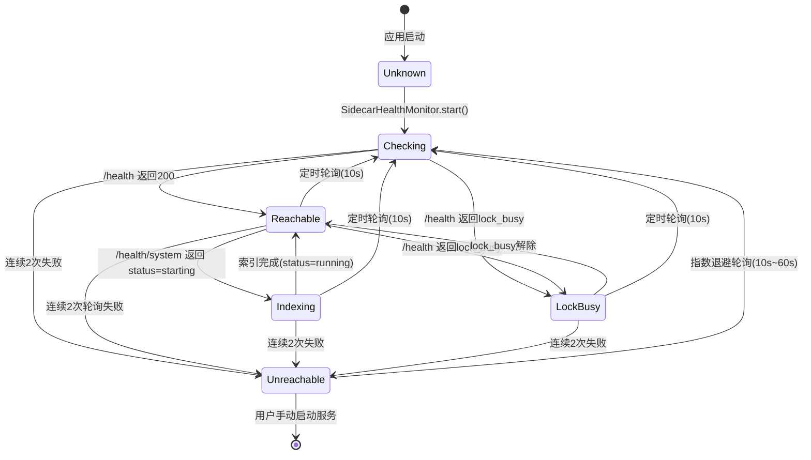

# LRC Desktop v0.8.22 项目入职审计报告

> 审计日期: 2026-08-01
> 审计范围: 后端 sidecar (Rust) + 前端仪表盘 (JS/HTML/CSS) + 桌面端 (Tauri)
> 审计目标: 为 v0.8.23 优化提供基线分析

---

## 阶段一：宏观概览（项目身份卡）

### 1.1 项目定位

**Loong Recall (LRC / 龙忆)** 是一个为 AI 助手提供跨项目、跨语言永久记忆能力的本地优先语义记忆引擎。

核心业务目标：
- 为 AI 编码助手（Trae、Cursor、Windsurf 等）提供持续性的代码记忆
- 支持多语言代码的自动切分、语义编码、向量检索
- 提供桌面端可视化管理面板（仪表盘）

业务痛点：
- AI 助手会话之间无记忆，同项目反复丢失上下文
- 多 IDE 切换时记忆碎片化
- 代码搜索依赖全文匹配，缺乏语义理解

### 1.2 技术雷达

| 层级 | 技术 | 版本 | 说明 | 风险 |
|------|------|------|------|------|
| 语言 | Rust | 2021 edition, MSRV 1.80 | 后端 sidecar | 无 |
| 语言 | JavaScript | ES2020+ | 前端仪表盘 | 无 |
| 框架 | axum | 0.7 | HTTP API 框架 | 无 |
| 框架 | tokio | 1.x | 异步运行时 | 无 |
| 框架 | Tauri | 2.x | 桌面端框架 | 无 |
| 序列化 | serde / serde_json | 1.x | 数据序列化 | 无 |
| 数据库 | JSON 文件 | 无 | 默认持久化 | 无 |
| 数据库 | PostgreSQL | 可选 | 后端存储 | 需配置 |
| 向量存储 | Qdrant | 可选 | 向量检索 | 需配置 |
| 图存储 | Neo4j | 可选 | 图关系存储 | 需配置 |
| 加密 | aes-gcm | 0.10 | API Key 加密 | 无 |
| 前端 | 原生 JS + CSS | 无框架 | 静态页面 | 无 |

**已知过时风险**：无。所有依赖版本均处于活跃维护期。

### 1.3 物理目录映射

```
G:\code-memory/
├── src/                       # Rust 后端 sidecar 源码
│   ├── bin/                   # 可执行文件入口（server.rs, benchmark.rs）
│   ├── engine/                # 核心引擎（编码器、检索器、合成器、健康报告等）
│   ├── persistence/           # 持久化后端（JSON/PostgreSQL/Qdrant/Neo4j）
│   ├── lib.rs                 # 库入口，模块声明
│   ├── v1_api.rs              # REST v1 API 端点（~2100+ 行）
│   ├── server.rs              # MCP 服务端 + HTTP 路由构建
│   ├── config.rs              # 配置持久化（LrcConfig）
│   ├── process_guard.rs       # 进程守护（单例锁、端口自适应）
│   ├── guard.rs               # 运行时防护（反调试、完整性校验）
│   ├── memory_store.rs        # 记忆存储核心
│   ├── dashboard.rs           # 桌面仪表盘
│   └── ...                    # 其他模块
├── static/                    # 前端静态资源
│   ├── index.html             # 主页面（~1300+ 行）
│   ├── app.js                 # 主应用脚本（~7400+ 行）
│   ├── app.css                # 业务样式
│   ├── colors_and_type.css    # 设计系统：色阶+排版
│   ├── components.css         # 设计系统：组件库
│   └── assets/                # 图标、Logo
├── desktop/                   # Tauri 桌面端
│   ├── src-tauri/             # Tauri Rust 后端
│   │   ├── src/               # 桌面端 Rust 源码
│   │   │   ├── main.rs        # 入口
│   │   │   ├── lib.rs         # 库入口
│   │   │   ├── commands.rs    # IPC 命令处理
│   │   │   ├── sidecar_manager.rs  # Sidecar 进程管理
│   │   │   ├── config_wizard.rs    # 配置向导
│   │   │   ├── agent_detector.rs   # Agent 检测器
│   │   │   ├── rate_limiter.rs     # 速率限制器
│   │   │   ├── tray.rs             # 系统托盘
│   │   │   ├── crypto.rs           # 加密
│   │   │   └── integrity.rs        # 完整性校验
│   │   ├── tauri.conf.json    # Tauri 配置
│   │   └── Cargo.toml         # 桌面端依赖
│   └── package.json           # 前端包管理
├── docs/                      # 项目文档
│   ├── PRE_PUSH_CHECKLIST.md  # 推送前预检清单
│   ├── HCSE_RELEASE_PROTOCOL.md  # 发布规范协议
│   ├── HCSE_RESILIENCE_AUDIT.md  # 韧性审计文档
│   └── v0.8.23_comprehensive_optimization_plan.md  # 优化计划
├── hcse_resilience_tester/    # 韧性测试脚本
├── benchmarks/                # 基准测试
├── evidence/                  # 证据目录
├── Cargo.toml                 # 主项目依赖
└── Cargo.lock                 # 依赖锁定
```

---

## 阶段二：静态架构与设计理念（中层视角）

### 2.1 架构风格判定

**判定：分层单体架构（Layered Monolith）**，附带可选的微服务组件（sidecar）。

判断依据：
1. 后端 sidecar 是一个单体 Rust 二进制，通过 HTTP API 提供服务
2. 前端是静态 HTML/JS/CSS，通过 HTTP 与后端通信
3. Tauri 桌面端作为包装层，管理 sidecar 进程生命周期
4. 代码结构分层清晰：`lib.rs` 中明确分为 Layer 1 (Public) / Layer 2 (Protected) / Layer 3 (Binary)
5. 非微服务架构：所有模块在同一进程内运行，无服务间 RPC

```
┌─────────────────────────────────────────────────────┐
│                    Tauri Desktop                     │
│  ┌───────────────────────────────────────────────┐  │
│  │         WebView (静态仪表盘)                    │  │
│  │  index.html + app.js + app.css + components.css │  │
│  └──────────────┬────────────────────────────────┘  │
│                 │ HTTP (127.0.0.1:3099)              │
│  ┌──────────────▼────────────────────────────────┐  │
│  │            Sidecar 进程                         │  │
│  │  ┌──────────┬──────────┬───────────────────┐   │  │
│  │  │  MCP API  │ v1 REST │ 静态文件服务       │   │  │
│  │  │  /mcp    │ /v1/*   │ /dashboard /app.js │   │  │
│  │  └────┬─────┴──┬───────┴───────────────────┘   │  │
│  │       │        │                                │  │
│  │  ┌────▼────────▼────────────────────────────┐   │  │
│  │  │        核心引擎 (engine/)                  │   │  │
│  │  │  Chunker → Encoder → Retriever → Manager  │   │  │
│  │  └───────────────────────────────────────────┘   │  │
│  │  ┌───────────────────────────────────────────┐   │  │
│  │  │        持久化层 (persistence/)             │   │  │
│  │  │  JSON / PostgreSQL / Qdrant / Neo4j       │   │  │
│  │  └───────────────────────────────────────────┘   │  │
│  └─────────────────────────────────────────────────┘  │
└─────────────────────────────────────────────────────┘
```

### 2.2 关键设计模式

| 模式 | 位置 | 解决的问题 |
|------|------|-----------|
| **AbortController 模式** | [app.js 第957行](file:///G:/code-memory/static/app.js#L957-L974) | 仪表盘刷新时取消旧请求，避免竞态；标签切换时取消旧标签页请求 |
| **三阶段锁安全模式** | [desktop lib.rs 第38行](file:///G:/code-memory/desktop/src-tauri/src/lib.rs#L38-L43) | 避免持有 Mutex 时执行 I/O 操作：Phase1 持锁收集状态 → 释放锁 → Phase2 执行 I/O → Phase3 重新获取锁更新状态 |
| **指数退避重试** | [app.js 第393-394行](file:///G:/code-memory/static/app.js#L393-L394) | HTTP 503/500/502/504 错误时按 1s/2s/4s 指数退避重试，最大 3 次 |
| **SidecarHealthMonitor 观察者模式** | [app.js 第528-591行](file:///G:/code-memory/static/app.js#L528-L591) | 每 10 秒轮询 sidecar 健康状态，不可达时指数退避，状态变化时广播到 UI |
| **try_lock 降级模式** | [v1_api.rs 第620-647行](file:///G:/code-memory/src/v1_api.rs#L620-L647) | 后台合成持锁时返回 200 + 降级数据 + lock_busy 标记，而非 503 阻塞 |
| **Toast 去重 + 队列管理** | [app.js 第6715-6810行](file:///G:/code-memory/static/app.js#L6715-L6810) | 1.5s 去重窗口 + 最多 3 个可见 Toast + error 独立计数 2 个上限 |

### 2.3 模块依赖关系



**循环依赖风险**：无。`server.rs` 引用 `v1_api`，但 `v1_api` 不引用 `server`。所有模块依赖方向一致（lib → 各模块）。

---

## 阶段三：动态追踪（核心业务流程）

### 3.1 选定用例：仪表盘加载（loadDashboard）

仪表盘加载是项目最核心的使用场景，涉及 3 个并行 API 调用、错误恢复、锁状态处理、自动重试、滚动位置恢复等完整流程。

### 3.2 序列图



### 3.3 关键分支

**分支1：503 lock_busy（后台合成持锁）**
- 触发条件：`/v1/health/system` 返回 503 或 `lock_busy: true` 字段
- 处理流程：
  1. loadDashboard 先检查 `SidecarHealthMonitor._lockBusy`，若 true 直接抛 LOCK_BUSY 避免浪费 3 个并行请求
  2. 响应解析后检查 `hasLockBusy503` 和 `hasLockBusy200`，若有则抛 LOCK_BUSY
  3. 进入 `catch(e.message === 'LOCK_BUSY')` 分支
  4. 检查 30s 冷却期 `_lockBusyCooldown`，冷却期内跳过自动重试
  5. 非冷却期：`_dashboardRetryCount < 3` 时指数退避重试 (2s/4s/8s)
  6. 重试耗尽：显示"后台合成耗时较长" + 手动刷新按钮，设置 30s 冷却期

**分支2：外部 Abort（标签页切换）**
- 触发条件：用户快速切换标签页，`dashboardAbortController.abort()` 触发
- 处理流程：
  1. `fetchWithTimeout` 检测到 `externalSignal.aborted`，抛 `AbortError`
  2. `loadDashboard` catch 中检查 `e.name === 'AbortError' && currentSignal.aborted`
  3. 隐藏 loading，不显示任何错误提示
  4. 立即 return，不触发重试

---

## 阶段四：数据流与状态管理

### 4.1 实体关系抽象

```mermaid
erDiagram
    Memory {
        string id UUID
        string content
        string memory_type "fact|decision|preference"
        int importance "1-10"
        string project
        array tags
        string privacy_level
        string session_id
        string user_id
        datetime created_at
        int version
    }
    
    MemoryStore {
        string data_dir
        int total_memories
        int active_memories
        int crystallized_memories
    }
    
    DaoMetrics {
        atomic encodings_total
        atomic compositions_total
        atomic recalls_total
        atomic corrections_total
        float dao_isomorphism_score
    }
    
    LrcConfig {
        int default_port "3099"
        string default_host
        string llm_api
        string encrypted_api_key
        int max_multi_window
        bool auto_start_on_boot
        bool minimize_to_tray
        bool auto_open_dashboard
    }
    
    SidecarInstance {
        string project_dir
        enum state "Stopped|Starting|Running|Error"
        bool running
        int port
        int pid
    }
    
    HealthReport {
        string system_mode "healthy|degraded|oscillating|drifting|frozen|overloaded"
        bool lock_busy
        object memory_stats
        object dao_metrics
        object feedback_stats
    }
    
    MemoryStore ||--o{ Memory : contains
    MemoryStore ||--|| DaoMetrics : tracks
    SidecarInstance ||--|| LrcConfig : configured_by
    HealthReport ||--|| DaoMetrics : reports
    HealthReport ||--|| MemoryStore : monitors
```

### 4.2 状态机

**SidecarHealthMonitor 状态机**



**触发类/方法**：
- `SidecarHealthMonitor.check()` — 执行一次健康检测
- `SidecarHealthMonitor._setReachable(bool)` — 设置可达状态，触发 UI 更新
- `SidecarHealthMonitor._scheduleNextCheck()` — 调度下一次检查（支持指数退避）
- `SidecarHealthMonitor._failCount` — 失败容错计数（连续 2 次才判定不可达）

---

## 阶段五：环境配置与启动指南

### 5.1 配置地形图

| 配置文件 | 路径 | 用途 | 环境差异 |
|---------|------|------|---------|
| `Cargo.toml` | 项目根目录 | Rust 依赖与 feature 配置 | 开发/CI 一致 |
| `tauri.conf.json` | `desktop/src-tauri/` | Tauri 桌面端配置 | 开发/发布一致 |
| `LrcConfig` | 运行时内存 | 端口、LLM API、桌面端偏好 | 自动保存到 `%APPDATA%/LoongRecall/config.json` |
| `index.html` CSP | `static/index.html` 第7行 | 内容安全策略 | 开发/生产一致 |
| `.github/workflows/` | `.github/workflows/` | CI/CD 配置 | 仅 CI 环境使用 |

### 5.2 启动前置依赖

| 依赖 | 要求 | 说明 |
|------|------|------|
| Rust 工具链 | 1.80+ | `rustup install 1.80` |
| 端口 3099 | 未被占用 | sidecar 默认端口，被占用时自动扫描 3099-3198 |
| 无特殊 | — | 零外部依赖，无需数据库/中间件 |

### 5.3 敏感参数提取

| 环境变量/参数 | 位置 | 用途 | 本地开发模拟值 |
|--------------|------|------|-------------|
| `API_BASE` | [app.js 第29行](file:///G:/code-memory/static/app.js#L29) | 后端 API 地址 | `http://127.0.0.1:3099` |
| `LLM API Key` | [config.rs 第37行](file:///G:/code-memory/src/config.rs#L37) | 加密存储的 API Key | 可选，不填不影响核心功能 |
| `encrypted_api_key` | [config.rs 第37行](file:///G:/code-memory/src/config.rs#L37) | AES-256-GCM 加密 | 留空 |
| 数据目录 | `%APPDATA%/LoongRecall/` | 记忆数据存储 | 自动创建 |

### 5.4 启动命令序列

```powershell
# 1. 编译并启动 sidecar（开发模式）
cd G:\code-memory
cargo run --features server

# 2. 浏览器访问仪表盘
# 打开 http://127.0.0.1:3099/dashboard

# 3. 编译桌面端（需要先编译 sidecar）
cd desktop/src-tauri
cargo build

# 4. 运行桌面端
cargo run
```

### 5.5 常见故障排查清单

| 故障 | 表现 | 根因 | 解决方案 |
|------|------|------|---------|
| **锁文件残留** | 启动报 "当前项目已有 LRC 在运行" | 上次异常退出导致 `.loong-recall/run/lrc.lock` 残留 | 删除锁文件或 kill 旧进程，[process_guard.rs](file:///G:/code-memory/src/process_guard.rs) 有自愈机制 |
| **端口被占用** | 启动报 "端口 3099 被占用" | 其他服务占用了 3099 | sidecar 自动扫描 3099-3198，等待即可；或关闭占用程序 |
| **前端显示白屏** | 浏览器打开后空白 | 后端未正确提供静态文件 | 确认 `cargo run --features server` 成功启动，访问 `http://127.0.0.1:3099/health` 确认服务可达 |
| **CORS 错误** | 浏览器控制台报 CORS | 前端地址不在白名单内 | 确认访问地址是 `localhost` 或 `127.0.0.1`，[server.rs 第3254-3285行](file:///G:/code-memory/src/server.rs#L3254-L3285) 定义了白名单 |

---

## 深度审计：四维度风险评估

### 维度一：用户体验 (UX)

#### 已解决的良好实践

| 问题 | 状态 | 位置 |
|------|------|------|
| loading/error/empty 三态处理 | 完整实现 | [loadDashboard](file:///G:/code-memory/static/app.js#L965-L1164) |
| Toast 通知系统（去重+队列上限） | 完整实现 | [showToast](file:///G:/code-memory/static/app.js#L6715-L6810) |
| 全局未捕获错误处理 | 已修复 v0.8.22 | [init 第3228-3276行](file:///G:/code-memory/static/app.js#L3228-L3276) |
| 标签页切换时取消旧请求 | 已修复 v0.8.3 | [switchTab 第6837-6846行](file:///G:/code-memory/static/app.js#L6837-L6846) |
| 自动刷新保留滚动位置 | 已修复 v0.8.3 | [startAutoRefresh 第2910行](file:///G:/code-memory/static/app.js#L2910-L2912) |
| 首次使用欢迎横幅 | 已实现 | [initWelcomeBanner](file:///G:/code-memory/static/app.js#L7016-L7028) |
| Prompt 模态框（替代同步 prompt） | 已实现 | [showPrompt](file:///G:/code-memory/static/app.js#L4635+) |
| 按钮状态机（loading/success/error） | 已实现 v0.8.22 | [setButtonState](file:///G:/code-memory/static/app.js#L98-L138) |
| Modal 嵌套 z-index 管理 | 已修复 v0.8.22 | [processConfirmQueue 第4517行](file:///G:/code-memory/static/app.js#L4517-L4519) |

#### 待解决 / 改进建议

| # | 问题 | 严重程度 | 说明 | 位置 |
|---|------|---------|------|------|
| UX-01 | 部分 tab 页无 loading 状态 | P2 | `tab-memory-search`、`tab-captain-log`、`tab-api-docs` 在 HTML 中存在但 [TAB_LOADERS](file:///G:/code-memory/static/app.js#L6825-L6834) 未定义加载函数，切换时无数据加载也无 loading 状态 | [app.js 第6825行](file:///G:/code-memory/static/app.js#L6825-L6834) |
| UX-02 | lock_busy 冷却期文案缺少倒计时 | P2 | 用户只知道"等待 30 秒"，但不知道还剩多少秒。建议显示实时倒计时 | [app.js 第1106-1113行](file:///G:/code-memory/static/app.js#L1106-L1113) |
| UX-03 | 手动刷新按钮在冷却期内仍可点击 | P2 | `manualRefreshDashboard` 重置 `_dashboardRetryCount`，但冷却期 `_lockBusyCooldown` 仍为 true，导致重试后立即再次进入冷却期分支 | [app.js 第1219-1241行](file:///G:/code-memory/static/app.js#L1219-L1241) |
| UX-04 | 信任中心缓存过期后无刷新按钮 | P2 | `_applyTrustCenterData` 显示缓存数据后，如果后端状态变化，用户无途径手动刷新，只能切换标签页 | [app.js 第2488-2510行](file:///G:/code-memory/static/app.js#L2488-L2510) |
| UX-05 | 响应式布局缺失 mobile tabbar | P3 | `initMobileTabbar` 已定义，但 HTML 中缺少对应的 `.mobile-tabbar` DOM 元素，移动端无底部导航 | [app.js 第6981-6996行](file:///G:/code-memory/static/app.js#L6981-L6996) |

### 维度二：代码功能 (Functionality)

#### API 端点完整性检查

| 端点 | 后端 | 前端调用 | 状态 |
|------|------|---------|------|
| POST /v1/encode | [v1_api.rs 第333行](file:///G:/code-memory/src/v1_api.rs#L333) | 未直接调用 | 功能完整 |
| POST /v1/memories/consolidate | [v1_api.rs 第368行](file:///G:/code-memory/src/v1_api.rs#L368) | 未直接调用 | 功能完整 |
| POST /v1/memories/enrich | [v1_api.rs 第456行](file:///G:/code-memory/src/v1_api.rs#L456) | 未直接调用 | 功能完整 |
| GET /v1/health/dao_metrics | [v1_api.rs 第613行](file:///G:/code-memory/src/v1_api.rs#L613) | [loadDaoMetrics](file:///G:/code-memory/static/app.js#L5743) | 功能完整 |
| GET /v1/health/system | [v1_api.rs 第712行](file:///G:/code-memory/src/v1_api.rs#L712) | [loadDashboard](file:///G:/code-memory/static/app.js#L1002) | 功能完整 |
| GET /v1/health/detailed | [v1_api.rs 第763行](file:///G:/code-memory/src/v1_api.rs#L763) | [loadDashboard](file:///G:/code-memory/static/app.js#L1003) | 功能完整 |
| POST /v1/feedback | [v1_api.rs 第823行](file:///G:/code-memory/src/v1_api.rs#L823) | 未直接调用 | 功能完整 |
| GET /v1/audit-trail | [v1_api.rs 第1033行](file:///G:/code-memory/src/v1_api.rs#L1033) | [loadAuditLog](file:///G:/code-memory/static/app.js#L1476) | 功能完整 |
| GET /v1/memories/stats | [v1_api.rs 第1102行](file:///G:/code-memory/src/v1_api.rs#L1102) | [loadMemoryStats](file:///G:/code-memory/static/app.js#L1388) | 功能完整 |
| GET /v1/memories/recent | [v1_api.rs 第1146行](file:///G:/code-memory/src/v1_api.rs#L1146) | [loadRecentMemories](file:///G:/code-memory/static/app.js#L1305) | 功能完整 |
| POST /v1/memories/list | [v1_api.rs 第1215行](file:///G:/code-memory/src/v1_api.rs#L1215) | 未直接调用 | 功能完整 |
| POST /v1/config/llm/test | [v1_api.rs 第1997行](file:///G:/code-memory/src/v1_api.rs#L1997) | [testLlmConfig](file:///G:/code-memory/static/app.js#L7374) | 功能完整 |
| GET /api/embedder/status | [server.rs 第3246行](file:///G:/code-memory/src/server.rs#L3246) | [checkEmbedderStatus](file:///G:/code-memory/static/app.js#L7462) | 功能完整 |
| GET /api/tools/detect | [server.rs 第3251行](file:///G:/code-memory/src/server.rs#L3251) | 未直接调用 | 功能完整 |
| POST /mcp | [server.rs 第3221行](file:///G:/code-memory/src/server.rs#L3221) | 不适用（MCP协议） | 功能完整 |

#### 发现的问题

| # | 问题 | 严重程度 | 说明 | 位置 |
|---|------|---------|------|------|
| FUNC-01 | `loadRecentMemories` 中 `_isManualRefreshing` 变量声明在 IIFE 底部 | P2 | 该变量在第 1218 行定义，但 `loadRecentMemories` 在第 1305 行，因在 IIFE 内且无 `let` 变量提升向下引用问题，但可能因 `manualRefreshDashboard` 引用同一变量导致状态共享冲突 | [app.js 第1218行](file:///G:/code-memory/static/app.js#L1218) |
| FUNC-02 | `$` 函数每次调用都 console.warn | P3 | [app.js 第916行](file:///G:/code-memory/static/app.js#L916) 的 `$()` 函数在 DOM 找不到时打印 warn，生产环境可能产生大量控制台噪音 | [app.js 第916行](file:///G:/code-memory/static/app.js#L916) |
| FUNC-03 | `tab-memory-search` 和 `tab-captain-log` 在 HTML 中定义但无加载逻辑 | P2 | 存在 DOM 元素但 [TAB_LOADERS](file:///G:/code-memory/static/app.js#L6825-L6834) 未注册，切换后只有空白页面 | [index.html 第475行](file:///G:/code-memory/static/index.html#L475) |
| FUNC-04 | `TAB_LOADERS` 中 `settings` 加载器未 await | P2 | [app.js 第6832行](file:///G:/code-memory/static/app.js#L6832) `loadSettings(); loadProjectInfo();` 未 await，可能导致设置未加载完成就显示输入框 | [app.js 第6832行](file:///G:/code-memory/static/app.js#L6832) |

### 维度三：产品稳定性 (Stability)

#### 错误恢复机制

| 机制 | 状态 | 详细说明 |
|------|------|---------|
| HTTP 500 指数退避重试 | 完整 | 3 次重试 + 指数退避 (1s/2s/4s) + 用户确认弹窗 |
| HTTP 503 lock_busy 冷却期 | 完整 | 30s 冷却期 + 自动重试 + 降级数据 |
| HTTP 502/504 自动重试 | 完整 | 3 次自动重试 + 指数退避，不弹阻塞 Modal |
| HTTP 429 限流提示 | 完整 | 读取 Retry-After 头 + 倒计时 Toast |
| 索引期自动重试 | 完整 | 仪表盘/道同构度/信任中心均有索引期重试机制 |
| 崩溃自愈（桌面端） | 完整 | 心跳协程检测 + 自动恢复 + 事件通知 |
| 锁文件自愈 | 完整 | process_guard 检查 PID 是否存活，死进程自动清理 |
| 全局错误处理 | 完整 | window.onerror + onunhandledrejection 双注册 |

#### 并发控制

| 机制 | 状态 | 详细说明 |
|------|------|---------|
| AbortController 标签页管理 | 完整 | 每个标签页独立 AbortController，切换时 abort 旧请求 |
| 仪表盘防重入 | 完整 | 新请求 abort 旧请求 + scrollY 恢复 |
| 手动刷新防抖 | 完整 | `_isManualRefreshing` 标志防连点 |
| 后端 try_lock 降级 | 完整 | 后台合成持锁时返回降级数据，不阻塞 |
| 后端 ConcurrencyLimitLayer | 完整 | 最大 100 并发连接 |
| 后端 TimeoutLayer | 完整 | 30s 请求超时 |
| 桌面端锁顺序约定 | 完整 | L1-L6 锁顺序契约 + clippy 静态检查 |

#### 资源泄漏检查

| # | 问题 | 严重程度 | 说明 | 位置 |
|---|------|---------|------|------|
| STAB-01 | `_dashboardRetryTimer` 在组件卸载时未清理 | P1 | 如果仪表盘在重试等待期间被销毁（如 SPA 路由切换），timer 仍会触发 `loadDashboard`，导致已销毁的 DOM 被操作 | [app.js 第1123-1126行](file:///G:/code-memory/static/app.js#L1123-L1126) |
| STAB-02 | `_recentToastMessages` Map 无限增长风险 | P2 | 2s 后清理过期记录只清理时间戳相同的条目，如果同一 key 多次调用，旧时间戳记录未被清理，可能导致 Map 缓慢增长 | [app.js 第6769-6775行](file:///G:/code-memory/static/app.js#L6769-L6775) |
| STAB-03 | `_retryCounters` Map 无上限清理机制 | P2 | 每次 URL 不同都会新增条目，且仅在重试达到上限或成功时删除。如果大量不同 URL 请求触发重试，Map 可能积累大量条目 | [app.js 第319-320行](file:///G:/code-memory/static/app.js#L319-L320) |
| STAB-04 | `_tabAbortControllers` 在 tab 已销毁时可能残留 | P2 | 虽然 `_abortActiveTabRequests` 会清理已 abort 的 controller，但如果 tab 被直接移除（非切换），controller 可能残留 | [app.js 第6890-6918行](file:///G:/code-memory/static/app.js#L6890-L6918) |
| STAB-05 | `confirmModalQueue` 队列最大 5 个，但无超时兜底 | P2 | 如果队列中的某个 Promise 永不被 resolve，后续队列项会永久阻塞 | [app.js 第4446-4448行](file:///G:/code-memory/static/app.js#L4446-L4448) |
| STAB-06 | `_trustRetryTimer` 在组件卸载时未清理 | P1 | 同 STAB-01，信任中心重试 timer 在离开页面后仍可能触发 | [app.js 第2598-2601行](file:///G:/code-memory/static/app.js#L2598-L2601) |

### 维度四：工程文化 (Engineering Culture)

#### 代码注释

| 维度 | 评价 |
|------|------|
| 后端 Rust | 优秀。几乎所有模块都有详细的模块级文档注释，关键函数有 doc comment，复杂逻辑有行内注释 |
| 前端 JS | 优秀。`app.js` 7400+ 行中大量注释，每个修复都有 `v0.x.x` 标记 + 根因分析 + 修复说明 |
| 桌面端 Rust | 良好。有锁顺序约定、模块职责说明，但部分命令函数缺少 doc comment |
| 配置文件 | 良好。Cargo.toml 有依赖用途注释，tauri.conf.json 有 CSP 说明 |

#### 错误处理风格

| 维度 | 评价 |
|------|------|
| 统一性 | 高。后端使用统一的 `ApiError` 枚举 + `IntoResponse`，前端使用 `fetchWithTimeout` + `handleHttpError` |
| 分类 | 细致。前端区分 `SidecarUnreachableError` / `SidecarTimeoutError` / `AbortError` / `HttpError` |
| 用户反馈 | 友好。错误信息包含可操作建议，如"查看 LRC 服务日志"、"重启 LRC 服务" |
| 降级 | 完整。lock_busy 降级、索引期降级、API 不可用降级，均有对应 UI 状态 |

#### 配置管理

| 维度 | 评价 |
|------|------|
| 集中度 | 中。后端使用 `LrcConfig` 结构体集中管理，前端配置分散在 `app.js` 多处（`API_BASE`、`REFRESH_INTERVAL` 等） |
| 环境分离 | 好。开发/CI/生产使用同一套配置，差异通过条件编译（feature flag）控制 |
| 持久化 | 好。`config.rs` 负责配置的加载/保存/加密 |

#### HCSE 框架遵循

| 要求 | 状态 | 说明 |
|------|------|------|
| 推送前预检清单 | 已创建 | [PRE_PUSH_CHECKLIST.md](file:///G:/code-memory/docs/PRE_PUSH_CHECKLIST.md) 包含 5 大类检查项 |
| 发布规范协议 | 已创建 | [HCSE_RELEASE_PROTOCOL.md](file:///G:/code-memory/docs/HCSE_RELEASE_PROTOCOL.md) 定义了动态差异分析流程 |
| 韧性审计文档 | 已创建 | [HCSE_RESILIENCE_AUDIT.md](file:///G:/code-memory/docs/HCSE_RESILIENCE_AUDIT.md) 存在 |
| 韧性验证测试 | 已执行 | `hcse_resilience_tester/` 目录下有完整的 5 层韧性测试脚本和报告 |
| 版本号一致性检查 | 已定义 | 预检清单中明确定义了 9 处版本号检查点 |
| FMEA 矩阵 | 已创建 | `hcse_resilience_tester/fmea_matrix.md` 存在 |

#### 发现的问题

| # | 问题 | 严重程度 | 说明 | 位置 |
|---|------|---------|------|------|
| ENG-01 | `app.js` 7400+ 行，函数定义顺序混乱 | P2 | 核心函数如 `loadDashboard` (965行)、`loadTrustCenter` (2515行)、`loadBenchmarks` (3982行) 散布在文件中，与 `showToast` (6715行) 等工具函数混在一起，可读性随文件增长下降 | [app.js 全文件](file:///G:/code-memory/static/app.js) |
| ENG-02 | 部分全局变量未集中声明 | P2 | `_isManualRefreshing` (1218行)、`_dashboardRetryCount` (959行)、`_lockBusyCooldown` (963行) 等状态变量散布在 IIFE 各处，没有集中的状态管理 | [app.js 多处](file:///G:/code-memory/static/app.js) |
| ENG-03 | 前端无单元测试 | P2 | 7400+ 行的前端 JS 代码没有任何单元测试，所有验证依赖 CDP 集成测试 | 项目全局 |
| ENG-04 | 后端 `guard.rs` 中有反调试代码但无自文档 | P3 | 运行时防护模块使用 obfuscated 宏和不透明谓词混淆，但没有说明这些保护措施的具体目标场景和触发条件 | [guard.rs](file:///G:/code-memory/src/guard.rs) |
| ENG-05 | `index.html` 中 `<style>` 和 `<script>` 混用 | P3 | 部分内联样式和脚本分散在 HTML 中，未完全抽取到 CSS/JS 文件 | [index.html 多处](file:///G:/code-memory/static/index.html) |

---

## 审计总结

### 严重性分布

| 严重程度 | 数量 | 主要类别 |
|---------|------|---------|
| P0 | 0 | — |
| P1 | 2 | 资源泄漏（timer 未清理） |
| P2 | 10 | UX 体验、功能缺失、工程文化 |
| P3 | 3 | 代码质量、可维护性 |

### 核心风险归纳

1. **资源泄漏风险 (P1)**：仪表盘和信任中心的重试 timer 在组件卸载/标签页切换时未清理，可能导致死循环或已销毁 DOM 操作
2. **功能缺失 (P2)**：`tab-memory-search` 和 `tab-captain-log` 是空壳，有 DOM 无加载逻辑
3. **UX 冷却期缺口 (P2)**：lock_busy 冷却期无倒计时，用户无法预估等待时间
4. **工程文化 (P2)**：前端 7400+ 行 JS 无单元测试，全局变量散落，函数定义顺序混乱

### 建议优先修复项

1. **STAB-01/STAB-06**：统一 timer 清理机制，在 `_abortActiveTabRequests` 中覆盖所有 timer
2. **FUNC-03**：为 `tab-memory-search` 和 `tab-captain-log` 实现基础加载逻辑，或隐藏未实现的 tab
3. **UX-02**：冷却期显示实时倒计时，提升用户体验
4. **ENG-01**：将 `app.js` 拆分为多个模块文件，按功能域组织